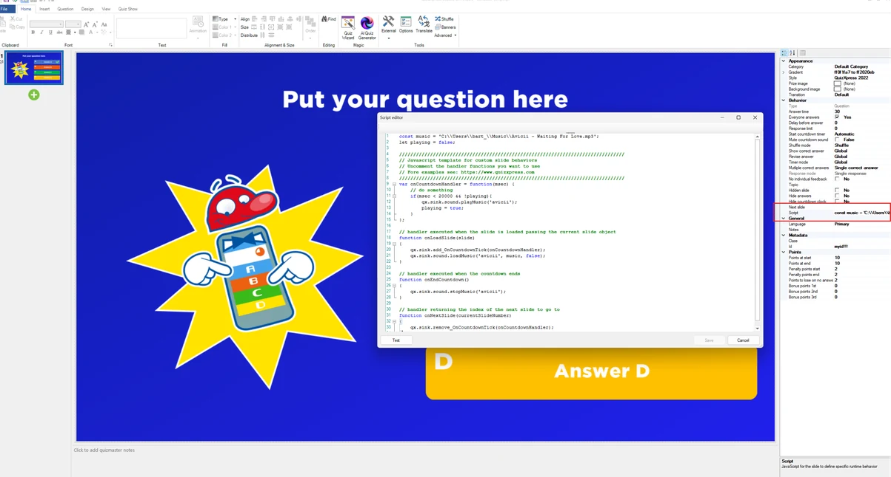
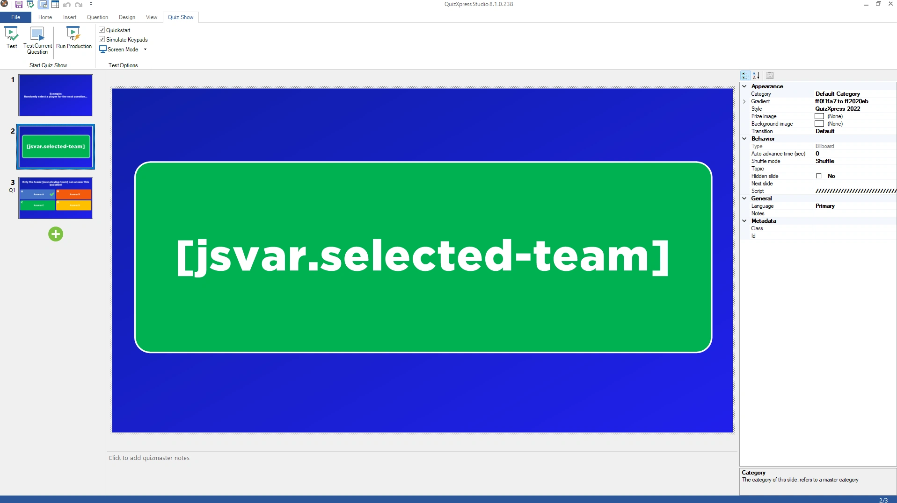
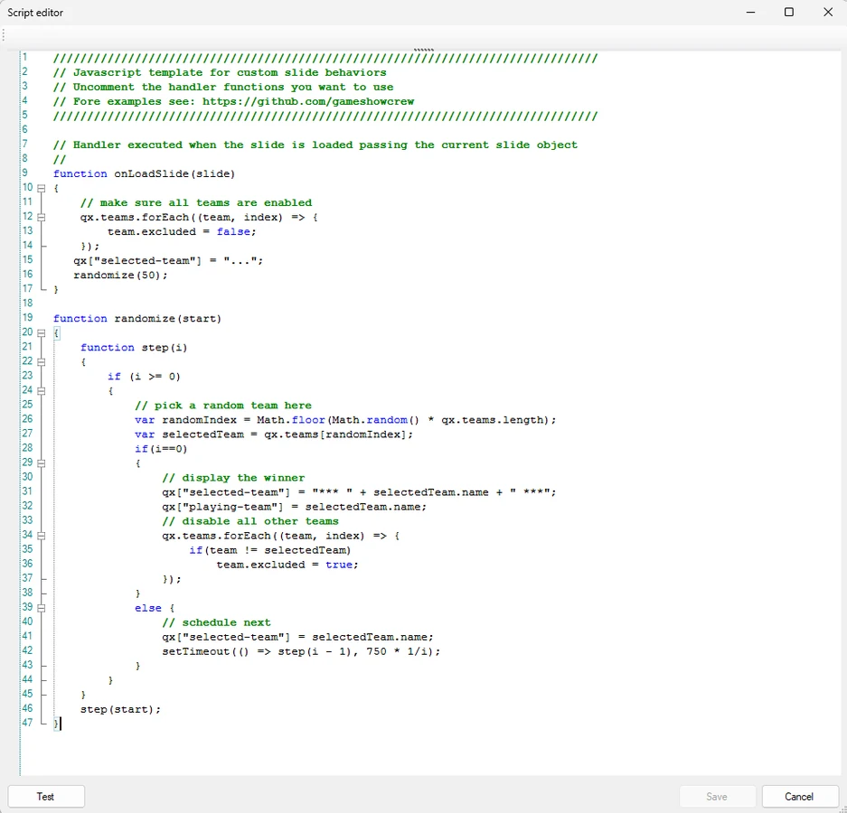
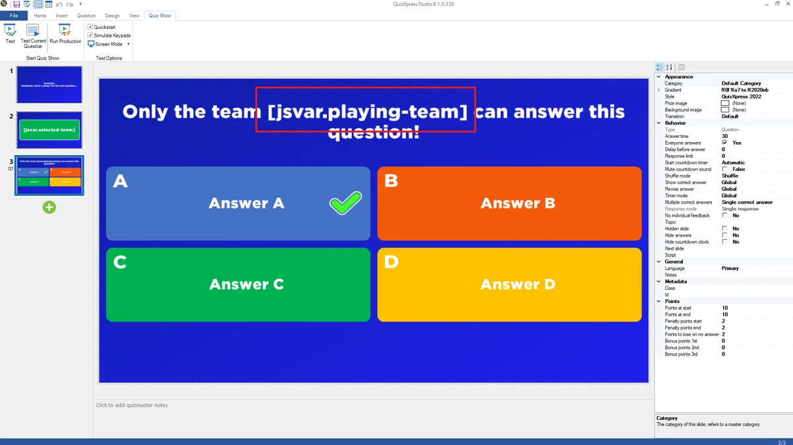

# Custom behaviors with built-in JavaScript engine

QuizXpress has a built-in JavaScript engine that can execute specific logic for quiz slides. With access to the internal QuizXpress data model, all sorts of new possibilities open up. A syntax-colored script editor and a standard template guide you in writing scripts.

*Note that this feature is for advanced use cases and technical users and is not required for running a quiz under normal conditions!*

{ loading=lazy }

With the new \[jsvar.\<varname>\] text symbol, you can present text on a slide whose values come from JavaScript code.

Here’s an example where we randomly pick a team and play the next question with only that team.

We create a slide with only one text field:

{ loading=lazy }

We add the following JavaScript on the slide:

{ width="469" loading=lazy }

Now, when the slide is loaded, it will show a random team name 50 times on the slide (going slower and slower), and when done, it will select one team. All other teams will be disabled when going to the next slide. The name of the selected team is stored in a global variable named “playing-team”. We can use and display that name on the next slide with:

{ loading=lazy }

This is just one example of what you can do with JavaScript and the \[jsvar\] text symbol.
