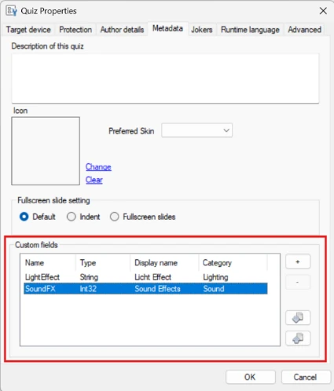
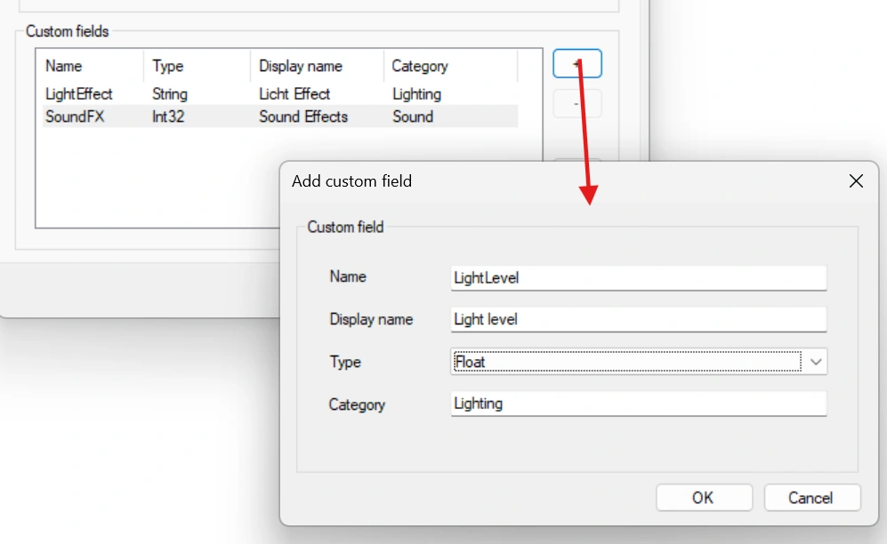
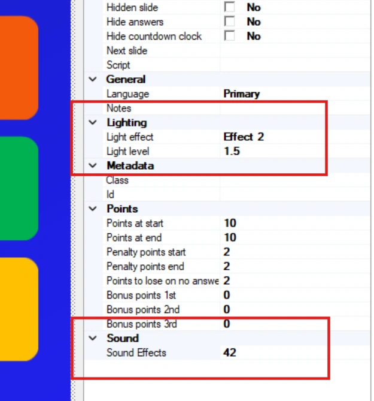
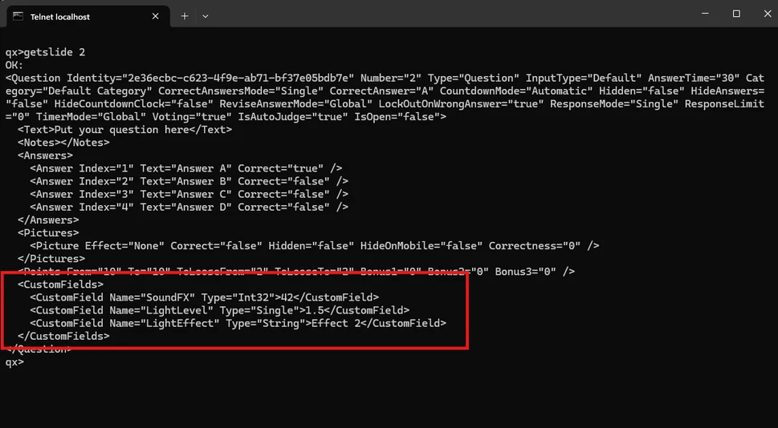

# Custom data fields

You can now define your own data dictionary in a quiz and store arbitrary pieces of data with the quiz slides. When interfacing with QuizXpress, the data can be retrieved using the TCP channel (commands getslide or getquiz) and can be used to drive external logic, such as light effects, sound effects, custom hardware, or other functionality. This logic would reside in an integration layer around QuizXpress that communicates with QX using the TCP inbound channel in MessageBroker.

You define custom fields in your quiz in the File->Options dialog, tab Metadata:

{ width="271" loading=lazy }

Here you can add fields of type: string, int, or float

{ width="462" loading=lazy }

When the fields are defined, they appear in the property grid for each slide:

{ width="235" loading=lazy }

The integration layer can retrieve data from the current slide to get the custom fields:

{ width="485" loading=lazy }

The getslide command returns the data of a single slide in human-readable XML format. You can also use getquiz to get the data of all slides in one call.
