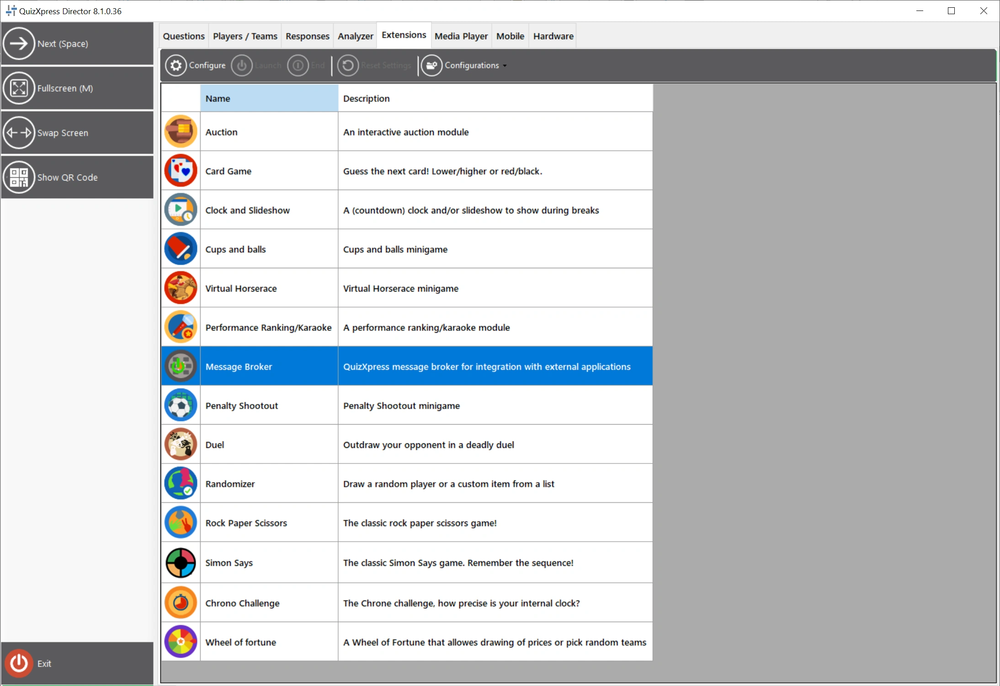
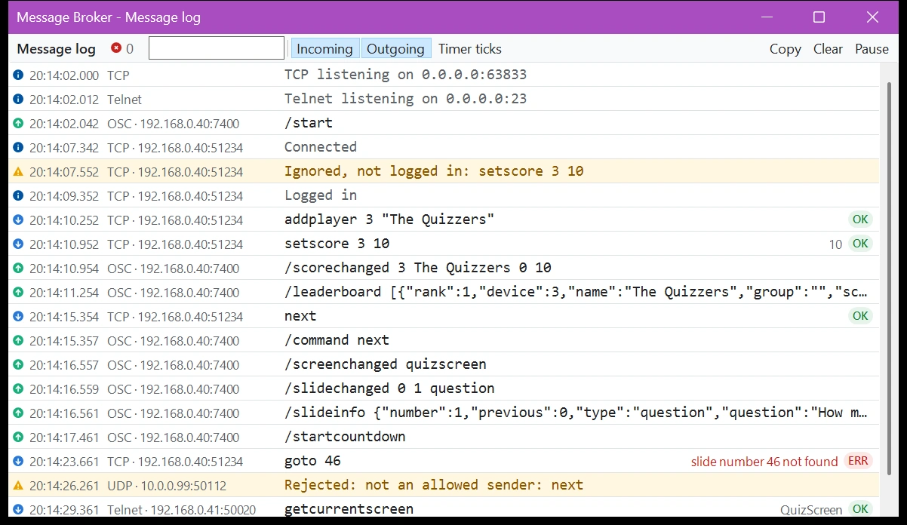

# Message Broker

Message Broker is an advanced QuizXpress plugin that exchanges data with external applications and devices, such as MIDI and DMX light controllers. Use it to build effects that respond to what happens in the quiz, set up quiz rooms, control lighting, create custom game formats, or build your own external modules in environments such as [Cycling ‘74 Max](https://cycling74.com/).

This section describes QuizXpress 8.5 and later.

!!! note
    Message Broker is a licensed add-on for QuizXpress and requires a one-time purchase.

## Data channels

- **TCP/UDP:** inbound and outbound communication using plain-text messages (ASCII or UTF-8). See [IP inbound channel](ip-inbound.md) and [IP outbound channel](ip-outbound.md).
- **Telnet:** send commands and receive data directly from a Telnet console. See [IP inbound channel](ip-inbound.md).
- **OSC:** the outbound channel can also send [Open Sound Control](ip-outbound.md#settings) messages, for tools such as Max, QLab and TouchOSC.
- **MIDI:** QuizXpress events trigger configurable MIDI messages, often used to control DMX light tables. See [MIDI and DMX](midi-and-dmx.md).

This overview shows how everything is connected:

{ loading=lazy }

## Opening the Message Broker settings

Message Broker is configured from QuizXpress Director while a quiz is running. Start a quiz, press the 'D' key to open [QuizXpress Director](../../live/quizxpress-director/index.md), and go to the 'Extensions' tab:

{ loading=lazy }

!!! warning
    Close the Message Broker settings with 'OK', not 'Cancel'. 'Cancel' discards all your changes.

## Message log

The message log shows everything Message Broker does while the quiz runs: the commands that come in with their result, the messages that go out over UDP, OSC and MIDI, and what the servers do (listening, connections, logins and rejected senders). Use it to set up and test a connection, or to find out why an external application doesn't respond as expected.

Open it with 'Message log...' at the bottom of the Message Broker settings. To open it automatically every time a quiz starts, tick 'Open the message log at start' on the 'IP Inbound' tab.

{ loading=lazy }

- The icon in front of each line shows what it is: a blue arrow down for an incoming command, a green arrow up for an outgoing message, and an information, warning or error sign for everything else.
- Incoming commands show their result on the right: 'OK' with the reply, or 'ERR' with the reason the command failed.
- Type in the filter box to show only the lines that contain that text, for example a command, a message or an IP address.
- 'Incoming' and 'Outgoing' show or hide commands and messages. 'Timer ticks' shows the countdown ticks and heartbeats, which are sent every second and are hidden by default.
- 'Pause' stops new lines from appearing so you can read the list; it counts the new lines, which appear when you click 'Pause' again.
- Click a line to see its full text and reply below the list. 'Copy' copies the visible lines, for example to send to support. 'Clear' empties the log.

The log keeps the last 5000 lines. Passwords never appear in it: they are shown as `****`.

!!! note
    The message log opens on the screen of QuizXpress Director, never on the projection screen, so you can keep it open during a live show.
