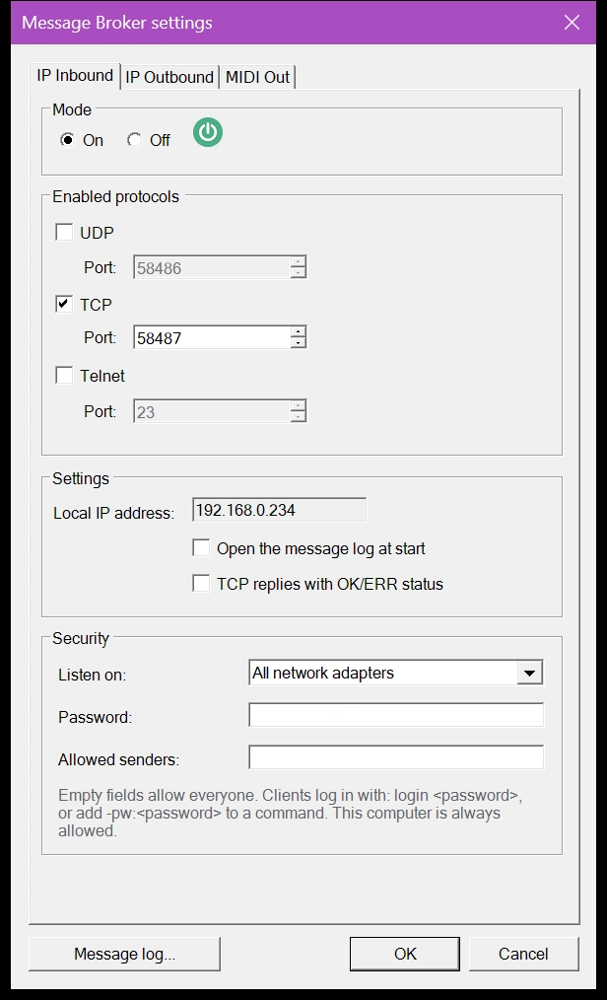
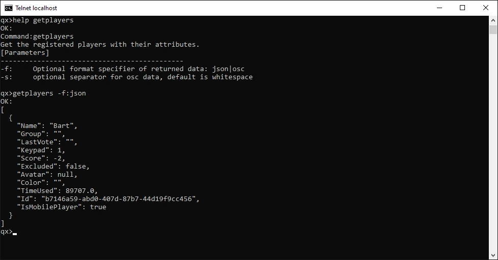
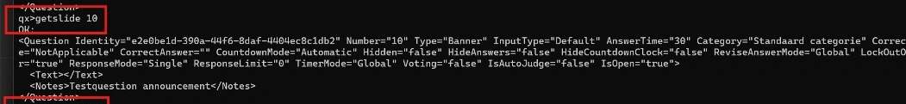
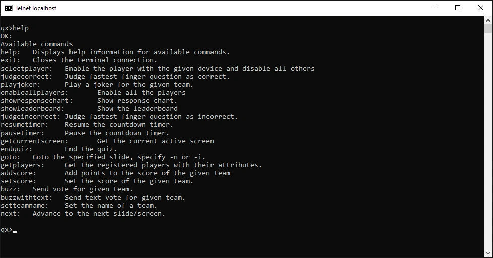

# IP inbound channel

With the inbound channel, external applications send text commands to QuizXpress, for example to advance to the next slide, judge an answer or change a score. Commands can arrive over UDP, TCP or Telnet.

Configure it on the 'IP Inbound' tab of the [Message Broker settings](index.md#opening-the-message-broker-settings):

{ width="320" loading=lazy }

## Settings

**On/Off**
:   Turns inbound messages on or off.

**Protocol**
:   Endpoints for UDP, TCP and Telnet. You can enable all three at the same time, but each needs its own port number. The default Telnet port is 23.

**Settings**
:   - 'Local IP address' shows this computer's IP address, which the sending side needs.
    - 'Open the message log at start' opens the [message log](index.md#message-log) every time a quiz starts, so you can follow every incoming command.
    - 'TCP replies with OK/ERR status' makes every TCP command answer with its result. See [Replies](#replies).

## Security

By default, anyone on the network can send commands to QuizXpress. At a venue with a public Wi-Fi network, use the 'Security' settings to keep control of the show. Leave a field empty to keep it open.

**Listen on**
:   The network adapter that receives commands:

    - 'All network adapters': every network this computer is connected to (the default).
    - 'This computer only (127.0.0.1)': only applications on this computer can send commands.
    - An IP address of this computer: only the network of that adapter.

    If you choose an address and the computer later gets another one, for example on another network, the list shows the saved address as '(not available)' and the [message log](index.md#message-log) shows an error that the inbound channel could not start.

**Password**
:   When you set a password, commands are only accepted after the sender proves it knows the password:

    - **TCP:** send `login <password>` once after connecting. After three wrong passwords QuizXpress closes the connection.
    - **Telnet:** Telnet asks for the password as soon as you connect.
    - **Any command, also over UDP:** add `-pw:<password>` to the command, for example `next -pw:quiz123`. UDP has no connection to log in on, so over UDP every command needs it.

    Commands without the right password are ignored and shown as a warning in the message log.

**Allowed senders**
:   The IP addresses that may send commands, separated by commas. A range is written with a prefix length: `192.168.1.0/24` allows `192.168.1.0` to `192.168.1.255`. Example: `192.168.1.20, 192.168.1.30, 10.0.0.0/8`. QuizXpress ignores everything from other addresses and shows it as 'Rejected' in the message log. If an entry isn't a valid address or range, the hint turns red and 'OK' stays disabled until you correct it.

!!! note
    This computer is always allowed, whatever you enter in 'Allowed senders'.

!!! warning
    The password protects the show against people who don't know it, but it is sent as plain text over the network, just like the commands. The password is stored as plain text in the Message Broker settings.

## Commands

These commands work over Telnet, TCP and UDP. Telnet and TCP send a reply; UDP never does.

| Command | What it does |
|---|---|
| `next` | Advance, for example to the next slide. |
| `showleaderboard` | Show the general scoreboard. |
| `showresponsechart` | Show the response chart after a multiple-choice question. |
| `judgecorrect` | Judge an open or manual question as correct. |
| `judgeincorrect` | Judge an open or manual question as incorrect. |
| `pausetimer` | Pause the countdown timer. When the timer is already paused, nothing happens. |
| `resumetimer` | Resume the countdown timer. When the timer is already running, nothing happens. |
| `endquiz` | End the quiz and go to the final score screen. |
| `restart` | Restart the quiz. |
| `goto` | Go to a slide by number or by slide id, for example `goto 10` or `goto #banner1`. Slide numbers start at 1, as in Studio. The id is a unique text value you can set on a slide. Pause the countdown first: while the countdown runs, the jump is ignored. |
| `enableallplayers` | Enable all registered players. |
| `selectplayer` | Enable the player on the given device number and exclude all others. |
| `selectplayers` | Enable a range of players, such as `1-5` or `1,2,10`, and exclude everyone else. |
| `addplayer` | Add a player with a device number and name, for example `addplayer 1 "John Trivialta"`. |
| `resetplayers` | Remove all players. |
| `addscore` | Add points to a player's score, by device number or team name, for example `addscore 3 5` or `addscore "The Quizzers" -2`. |
| `setscore` | Set a player's score, by device number or team name, for example `setscore 3 0`. |
| `setteamname` | Set the team name for a device, for example `setteamname 1 "John Trivialta"`. |
| `setvolume` | Set the quiz player volume (0–100). |
| `buzz` | Send a vote for a player, for example `buzz 1 FF` or `buzz 1 A`. Add `-f` to force the vote even when the slide blocks buzzers. |
| `buzzwithtext` | Send a text vote, for numeric, letter or full-text questions, for example `buzzwithtext 3 "Paris"`. Add `-f` to force it. |
| `playjoker` | Play a joker for a player: `playjoker <device> <joker>`, where the joker is `FreeRide`, `PointBooster` or `TimeWarp`. |
| `sendkey` | Press a key in the quiz player, as if it was typed on the keyboard, for example `sendkey Space` or `sendkey Up`. |
| `getcurrentscreen` | Return the current screen: `WelcomeScreen`, `SignOnScreen`, `CountdownScreen`, `QuizScreen` or `FinalScoreScreen`. |
| `getplayers` | Return all players with their attributes (score, name, device and so on). Add `-f json` or `-f osc` to choose the format. |
| `getquiz` | Return a full export of the quiz in XML, without pictures, sound or video. This can be a lot of data. |
| `getslide` | Return the details of one slide in XML, without pictures, sound or video, for example `getslide 10`. Without a number it returns the current slide. |
| `login` | Log in on a TCP connection when a [password](#security) is set: `login <password>`. |

Put text with spaces between double quotes: `setteamname 1 "The Quizzers"`. Single quotes work too: `setteamname 1 'The Quizzers'`. Team names may contain apostrophes and colons, such as `"Bart's Team"` or `12:30`. The command itself is not case-sensitive; team names and answers keep their capitals.

Example output of `getplayers`:

{ loading=lazy }

Example output of `getslide 10`:

{ loading=lazy }

## Replies

Telnet always answers with `OK:` or `FAILED:`, followed by the reply.

Over TCP, QuizXpress sends only the reply text of a command that succeeded, and nothing when it fails or has no reply. That makes it hard for an application to know when a reply is complete. Tick 'TCP replies with OK/ERR status' to get a reply to every command, in this format:

- a first line `OK`, or `ERR` followed by the reason the command failed;
- for `OK`, the lines of the reply;
- a last line with only a full stop (`.`).

A reply line that starts with a full stop gets an extra full stop in front, so your application can read lines until it receives a single `.`. For example, `setscore 3 0` followed by `setscore 9 5` (there is no device 9) gives:

```
OK
0
.
ERR team 9 not found
.
```

## Trying commands with Telnet

Telnet is the easiest way to try commands by hand or to debug. Windows doesn't include the Telnet client by default; to install it:

1. Open 'Control Panel'.
2. Open 'Programs'.
3. Select 'Turn Windows features on or off'.
4. Tick 'Telnet Client'.
5. Click 'OK'. Windows searches for the required files and installs the client.

Then open a command prompt and type `telnet localhost` (assuming QuizXpress uses the default port 23). A Telnet window opens with the prompt `qx>`. Type `help` to see all commands, or `help <command>` for help on one command:

{ loading=lazy }

!!! tip
    Open the [message log](index.md#message-log) next to your Telnet window: it shows every command QuizXpress receives and the result.
