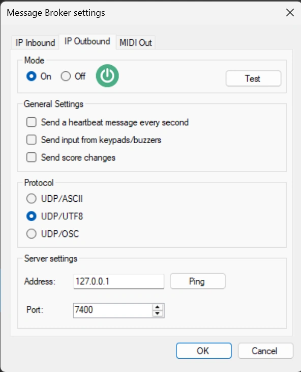
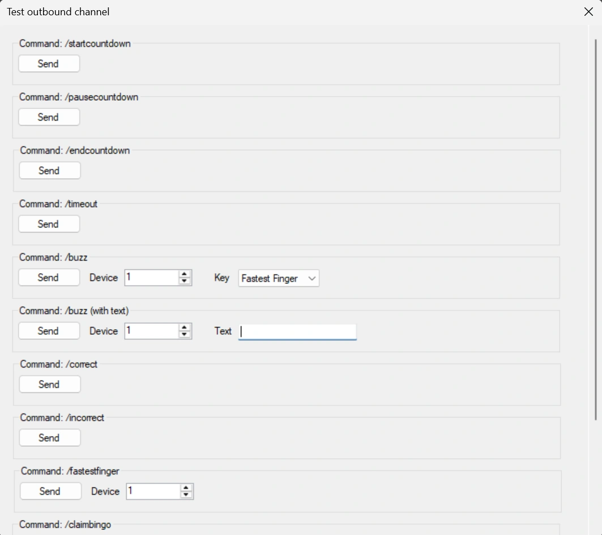
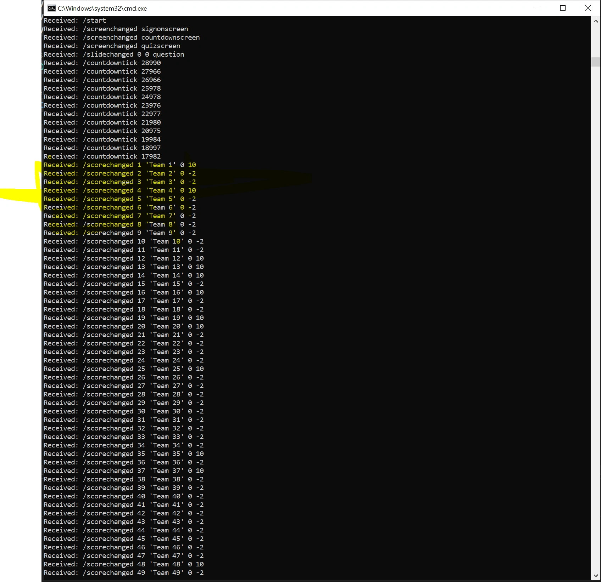

# IP outbound channel

With the outbound channel, QuizXpress sends a message whenever something happens in the quiz, such as a slide change, a buzzer press or a score change. Your own application listens for these messages and responds, for example by driving an external scoreboard or a light show.

Turn it on in the 'IP Outbound' tab of the [Message Broker settings](index.md#opening-the-message-broker-settings):

{ width="320" loading=lazy }

## Settings

**On/Off**
:   Turns the outbound channel on or off.

**Test**
:   Opens a test form where you can trigger events by hand:

    { width="560" loading=lazy }

**Send heartbeat**
:   Sends a heartbeat message every second, so the receiving side can tell that the quiz player is still running. Use it to detect a connection that dropped unexpectedly; a normal session always starts with `/start` and ends with `/close`.

**Send keypad/buzzers input**
:   Relays every keypad and buzzer press. This is optional because it can produce a lot of messages.

**Send score changes**
:   Sends a message whenever a player's score changes, for example to drive external scoreboards.

**Protocol**
:   - **UDP/ASCII:** plain ASCII text, parameters separated by spaces.
    - **UDP/UTF8:** the same, encoded as UTF-8.
    - **UDP/OSC:** messages in [Open Sound Control (OSC)](https://en.wikipedia.org/wiki/Open_Sound_Control) format, which [Max](https://cycling74.com/) and similar tools can process directly.

**Server address**
:   The IP address of the computer that receives the messages. Use `127.0.0.1` if it's the same computer.

**Server port**
:   The port number the receiving application listens on.

## Messages

The receiving side opens a UDP socket. Messages are plain strings in the format `/message {parameter1} {parameter2} …`. Every session starts with `/start` and ends with `/close`.

| Message | Meaning |
|---|---|
| `/start` | Start of the session. |
| `/close` | End of the session: QuizXpress Live is closing. |
| `/heartbeat {counter}` | Sent every second with an increasing counter, for example `/heartbeat 2345`. |
| `/countdowntick {remainingtimeMs}` | Sent every second while the countdown runs, with the remaining time in milliseconds, for example `/countdowntick 23100`. |
| `/slidechanged {old#} {new#} {questiontype} {slide class} {slide id}` | A new slide is shown. The class and id are optional and set in the slide's metadata in Studio, so you can react to a class or id instead of a slide number that changes when slides are reordered. Example: `/slidechanged 6 7 question MySpecialSlideType banner1`. |
| `/command {command}` | A command from the quizmaster remote control: `power`, `scores`, `chart`, `leaderboard`, `groupchart`, `up`, `down`, `pause`, `questionmark`, `next`, `wrong` or `right`. Example: `/command up`. |
| `/buzz {device} {key}` | A key press on a device, for example `/buzz 10 A`, or `/buzz 8 RED` for the fastest-finger button. |
| `/screenchanged {screentype}` | The quiz player switched screens: `welcomescreen`, `signonscreen`, `countdownscreen`, `quizscreen` or `finalscorescreen`. Example: `/screenchanged countdownscreen`. |
| `/timeout` | The question timed out without a correct answer. |
| `/startcountdown` | The question countdown started. |
| `/pausecountdown` | The countdown is paused; the system is idle. |
| `/endcountdown` | The countdown stopped; the question is over. |
| `/correct` | An answer to the current question was judged correct. |
| `/incorrect` | An answer to the current question was judged wrong. |
| `/restart` | The quiz was restarted from the final score screen. |
| `/scorechanged {device} {teamname} {old score} {new score}` | A team's score changed. Example: `/scorechanged 10 'John Trivialta' 5 10` means team 'John Trivialta' on device 10 went from 5 to 10 points. |

Example of the messages during a quiz:

{ loading=lazy }

## Example: a simple UDP listener

This C# console application (.NET Framework 4.8) listens on port 12345 and prints every message it receives. Set the 'Server port' in Message Broker to the same number.

```csharp
using System;
using System.Net;
using System.Net.Sockets;
using System.Text;

class UDPServer
{
    static void Main(string[] args)
    {
        int port = 12345; // The port to listen on
        UdpClient udpListener = new UdpClient(port);
        Console.WriteLine($"UDP server is listening on port {port}");

        try
        {
            while (true)
            {
                IPEndPoint senderEndPoint = new IPEndPoint(IPAddress.Any, port);
                byte[] receivedBytes = udpListener.Receive(ref senderEndPoint);
                string receivedText = Encoding.UTF8.GetString(receivedBytes);
                Console.WriteLine($"Received: {receivedText}");
            }
        }
        catch (Exception e)
        {
            Console.WriteLine($"An error occurred: {e.Message}");
        }
        finally
        {
            udpListener.Close();
        }
    }
}
```
