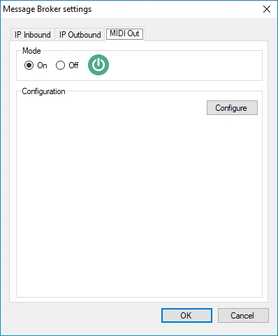
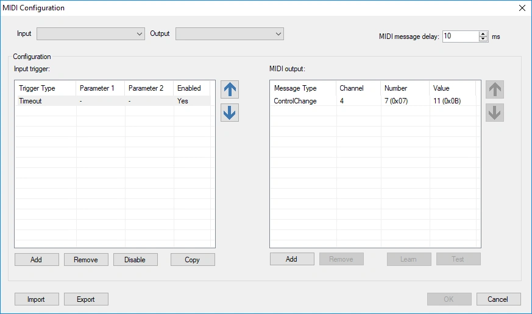
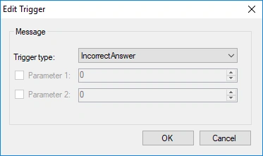
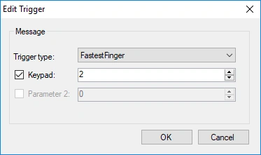
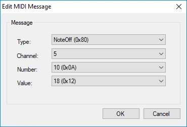
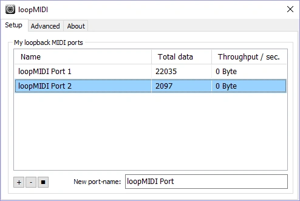
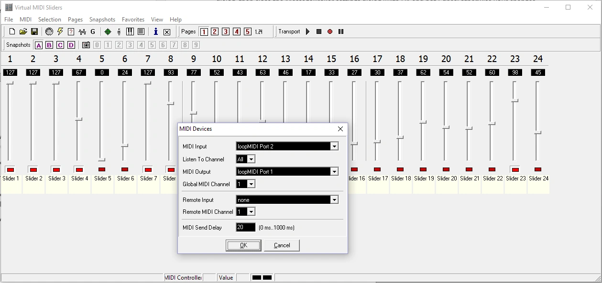

# MIDI and DMX

QuizXpress can control external devices over MIDI. A typical example is a DMX light controller: when something happens in the quiz, such as a correct answer or the countdown ending, QuizXpress sends MIDI messages that switch the lights to a matching scene.

## Turning on MIDI support

Open the [Message Broker settings](index.md#opening-the-message-broker-settings), turn on MIDI support and click 'Configure':

{ width="300" loading=lazy }

The MIDI configuration screen opens:

{ loading=lazy }

- **Top:** select the MIDI input and output device. The input device is only used for the 'Learn' function (see below). The output device receives the MIDI messages that QuizXpress sends when events happen in the quiz.
- **Middle, left:** the triggers, which are events that happen inside QuizXpress.
- **Middle, right:** the MIDI messages that are sent for the selected trigger.

## Adding a trigger

Click the left 'Add' button and choose the trigger type:

{ width="300" loading=lazy }

Some triggers have an optional parameter that narrows down when they fire. In this example, the trigger only fires when buzzer 2 wins a fastest-finger question:

{ width="300" loading=lazy }

### Available triggers

| Trigger | Fires when… |
|---|---|
| Timeout | The current question times out, for example because nobody answered in time. |
| Correct Answer | The quizmaster judges an answer correct. |
| Incorrect Answer | The quizmaster judges an answer incorrect. |
| Start Countdown | The countdown timer starts. |
| End Countdown | The countdown timer ends. |
| Pause Countdown | The quizmaster pauses the countdown timer. |
| Countdown Tick | The countdown timer advances. You can filter on the number of seconds left. |
| Restart | The quiz restarts and goes back to the welcome screen. |
| Fastest Finger | A player is first to respond to a fastest-finger question. You can filter on the device number (keypad or buzzer). |
| Screen Changed | The screen changes, for example welcome screen → buzzer sign-on screen → quiz screen → score screen. You can filter on the type of screen. |
| Slide Changed | The quiz advances to another slide. You can filter on the from/to slide number or on the slide class. Slide numbers start at 0 (the first slide is 0), unless 'Number slides from 1' is ticked on the [IP Outbound](ip-outbound.md#settings) tab. |
| Remote Command | A command arrives from the quizmaster remote control. |
| Receive Keypad | A signal arrives from a keypad or buzzer. You can filter on the keypad number and the key (A = 1, B = 2, and so on; fastest finger = 0). |
| Claim Bingo | A player claims Bingo. |
| False Bingo | A claimed Bingo fails validation. |
| Bingo | A claimed Bingo is valid and the player wins. |

!!! tip
    Filtering 'Slide Changed' on a **slide class** is more robust than filtering on slide numbers. You assign a class to a slide in QuizXpress Studio; if you later reorder your slides, the class-based triggers keep working while number-based ones would need updating.

## Defining the MIDI messages

For each trigger, define the sequence of MIDI messages to send to the output device (the list on the right). There are two ways to do this.

**Learn them from your controller (recommended).** Click 'Learn' (it turns green), then set your light controller to the scene you want. The MIDI messages appear in the list as you go. Click 'Learn' again when you're done.

**Enter them manually.** Click the right 'Add' button:

{ width="300" loading=lazy }

Double-click a message or trigger in the list to edit it.

Click 'Test' to send the selected messages to the output device and check that the controller responds correctly.

When everything is configured, close the MIDI configuration screen and then close the Message Broker settings with 'OK'. From then on, QuizXpress sends the MIDI messages to the selected output device.

## Testing without MIDI hardware

Two free tools let you test without any physical MIDI devices:

1. **[loopMIDI](https://www.tobias-erichsen.de/software/loopmidi.html)** creates a virtual MIDI device, so programs can talk MIDI to each other without hardware.

    { width="500" loading=lazy }

2. **[Virtual MIDI Sliders](http://www.granucon.com/SoftwarePages/Vms.aspx)** shows how QuizXpress drives a generic MIDI controller. The 'Learn' function also works with this virtual device.

    { loading=lazy }
