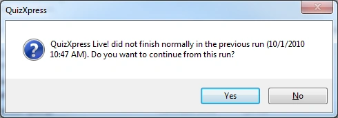

# QuizXpress Live recovery mode

To prevent loss of data or having to restart the quiz in case of a system failure, QuizXpress Live has a built-in recovery mechanism. After every completed question, the system saves its entire internal state to disk in a snapshot file, including scores, buzzer assignment data, the current question, etc.

The snapshot file is removed if the application ends *normally*. If the system ends *abnormally* for some reason, the file remains and is detected the next time QuizXpress Live starts. It will then prompt you with a question:

{ width="395" loading=lazy }

When you answer ‘Yes’, the system reloads the snapshot and you can continue where you left off. Answering ‘No’ starts the system normally. So, whatever happens, you don’t have to bother your audience by replaying part of your quiz.

!!! note

    this recovery mode is not active when you start your quiz from QuizXpress Studio in test mode. When running your quiz for a real audience, it is therefore advised to start it by double-clicking the .qx file, by starting Quiz Show.exe and selecting a file manually, or by starting the quiz with ‘Run Production’ from within QuizXpress Studio.
