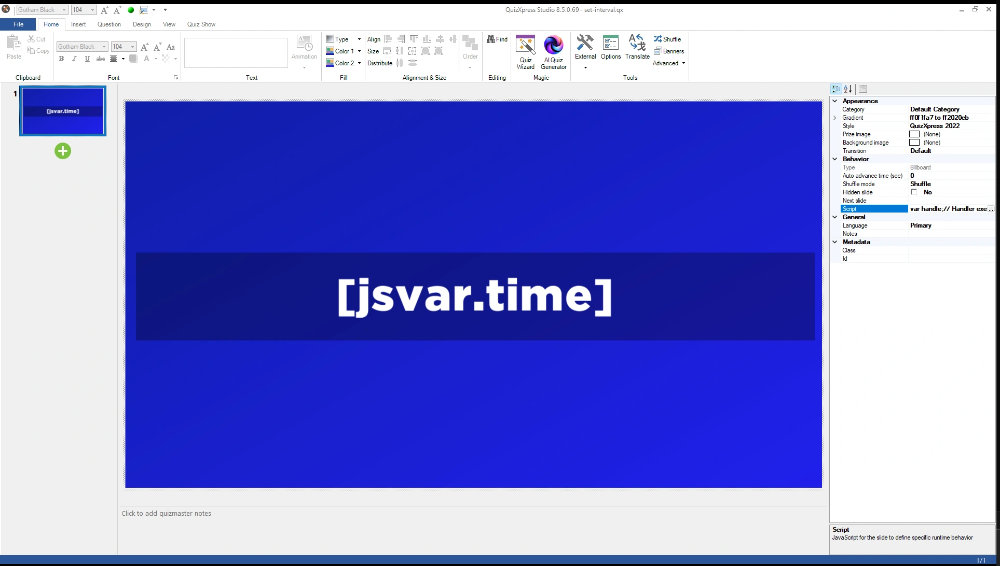
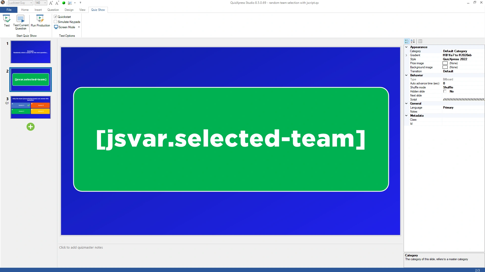

# Examples

## Example quizzes

Our [script examples on GitHub](https://github.com/gameshowcrew/samples/tree/main/script) are ready-to-run quizzes, each with its script as a separate file and an explanation. The script editor links to them too: 'Example scripts on GitHub' at the top right. From simple to more elaborate:

| Example | What it shows | Script features |
|---|---|---|
| [Live clock](https://github.com/gameshowcrew/samples/tree/main/script/live_clock) | A live clock and a countdown to the start of the quiz on a billboard slide | `setInterval()`, `[jsvar.name]` on a slide |
| [Vote counter](https://github.com/gameshowcrew/samples/tree/main/script/vote_counter) | "7 of 12 teams answered" while the countdown runs | `onVote()`, `qx.teams` |
| [Hurry up!](https://github.com/gameshowcrew/samples/tree/main/script/countdown_hurry_up) | "Hurry up!" in the last seconds, optional tension music, "Time's up!" | `onCountdownTick()`, `onTimeout()`, `qx.sink.sound` |
| [Random question order](https://github.com/gameshowcrew/samples/tree/main/script/random_question_order) | 5 random questions out of a pool, in a random order | `onNextSlide()`, values that stay between slides |
| [Questions from the web](https://github.com/gameshowcrew/samples/tree/main/script/fetching_dynamic_content) | A new question from the Open Trivia Database every time | `fetch()`, `slide.setQuestion()`/`setAnswers()` |
| [Hot streak bonus](https://github.com/gameshowcrew/samples/tree/main/script/hot_streak_bonus) | Bonus points for 3 correct answers in a row, and a streaks scoreboard | all of the above, changing scores |

To try one, download the `.qx` file, open it in Quiz Studio and look at the 'Script' property of its slides, or run it.

The examples below are short scripts to copy into your own quiz.

## Clock

Shows the current time on a slide, updated every second, using a [`[jsvar]` text symbol](working-with-quizxpress.md#showing-script-values-on-a-slide).

Create a billboard slide and replace the question text with the symbol `[jsvar.time]`:

{ loading=lazy }

Give the slide this script:

```javascript
function onLoadSlide(slide) {
    showTime();
    setInterval(showTime, 1000);     // call showTime() every second
}

function showTime() {
    qx["time"] = new Date().toLocaleTimeString();
}
```

`onLoadSlide()` shows the time and starts a timer that updates it every second. The timer stops by itself when the slide is left.

## Playing an MP3

Loads an MP3 file and plays it two seconds after the countdown ends:

```javascript
qx.sink.sound.loadMusic('levels', 'C:\\Music\\Jingles\\Levels.mp3', false);

function onEndCountdown(isPaused) {
    if (isPaused)
        return;
    // start after 2 seconds
    setTimeout(() => {
        qx.sink.sound.playMusic('levels');
    }, 2000);
}

function onUnloadSlide(slide) {
    qx.sink.sound.stopMusic('levels');
    qx.sink.sound.unloadMusic('levels');
}
```

## Jump to a slide based on votes

Uses `onNextSlide()` to continue with round A or round B, depending on which answer got the most votes. The first slide of each round has the slide class `roundA` or `roundB`.

!!! tip
    For simple cases, the built-in [slide routing](../../studio/other-functionality/slide-routing.md) does this without a script.

```javascript
// Go to the slide with class 'roundA' or 'roundB',
// depending on which answer got the most votes
function onNextSlide(currentSlideNumber) {
    let slides = qx.slides;
    let roundA = slides.find((slide) => slide.class === 'roundA');
    let roundB = slides.find((slide) => slide.class === 'roundB');

    if (!roundA || !roundB) {
        console.error('round A or round B not found!');
        return;     // just the next slide
    }

    let teams = qx.teams;
    let votedA = teams.filter(t => t.lastVote === 'A').length;
    let votedB = teams.filter(t => t.lastVote === 'B').length;

    if (votedB > votedA)
        return roundB.slideNumber;
    else
        return roundA.slideNumber;
}
```

## Questions from the web

Uses `fetch()` to get a new question from the [Open Trivia Database](https://opentdb.com) every time the slide is shown, and puts it on the slide. Give a multiple choice slide with 4 answers this script; what you typed in Studio is used when there's no internet connection.

```javascript
async function onLoadSlide(slide) {
    let response;
    try {
        response = await fetch('https://opentdb.com/api.php?amount=1&type=multiple&encode=url3986');
    } catch (error) {
        console.warn('No question, the slide stays as it is.', error.message);
        return;
    }

    const trivia = JSON.parse(response.text).results[0];
    const answers = trivia.incorrect_answers.map(answer => decodeURIComponent(answer));

    // the correct answer at a random position
    const position = Math.floor(Math.random() * 4);
    answers.splice(position, 0, decodeURIComponent(trivia.correct_answer));

    slide.setQuestion(decodeURIComponent(trivia.question));
    slide.setAnswers(answers);
    slide.setCorrectAnswer('ABCD'[position]);

    console.log('Correct answer: ' + 'ABCD'[position]);   // for the quizmaster
}
```

QuizXpress Live waits for the download before it shows the slide, at most 10 seconds. The [full example](https://github.com/gameshowcrew/samples/tree/main/script/fetching_dynamic_content) also chooses a category and a difficulty, and handles the errors of the service.

## Selecting a team at random

Picks a random team, shows the selection on screen like a lottery, and then excludes all other teams for the next question.

Create a slide with the text symbol `[jsvar.selected-team]`, which shows the selection as it happens:

{ loading=lazy }

Give the slide this script:

```javascript
function onLoadSlide(slide) {
    // make sure all teams are enabled
    qx.teams.forEach((team) => {
        team.excluded = false;
    });
    qx["selected-team"] = "...";
    randomize(50);
}

function randomize(start) {
    function step(i) {
        if (i >= 0) {
            // pick a random team
            var randomIndex = Math.floor(Math.random() * qx.teams.length);
            var selectedTeam = qx.teams[randomIndex];

            if (i === 0) {
                // show the winner
                qx["selected-team"] = "*** " + selectedTeam.name + " ***";
                qx["playing-team"] = selectedTeam.name;

                // exclude all other teams
                qx.teams.forEach((team) => {
                    if (team != selectedTeam)
                        team.excluded = true;
                });
            }
            else {
                // show this team and schedule the next step
                qx["selected-team"] = selectedTeam.name;
                setTimeout(() => step(i - 1), 750 * 1 / i);
            }
        }
    }
    step(start);
}
```

The slide shows a team name 50 times, slowing down as it goes, then shows the chosen team between `***` and excludes all other players for the next question. The chosen team's name is also stored in `playing-team`, so you can show it on the next slide with `[jsvar.playing-team]`.
