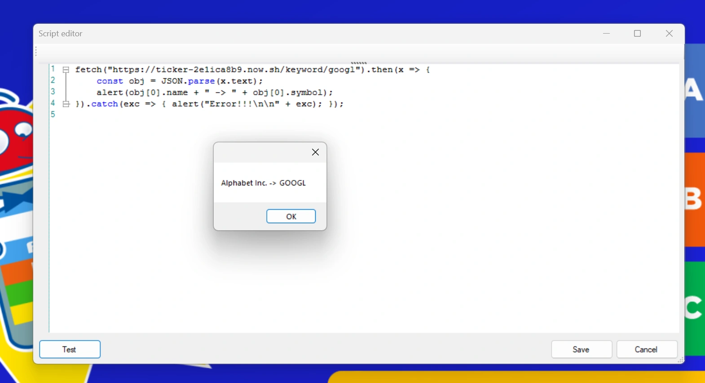

# Examples

## Clock

Shows the current time on a slide, updated every second, using a [`[jsvar]` text symbol](working-with-quizxpress.md#showing-script-values-on-a-slide).

Create a billboard slide and replace the question text with the symbol `[jsvar.time]`:

{ loading=lazy }

Give the slide this script:

```javascript
var handle;

function onLoadSlide(slide) {
    handle = setInterval(time, 1000);   // call time() every second
}

function onNextSlide(currentSlideNumber) {
    clearInterval(handle);              // important: stop the timer
}

function time() {
    var d = new Date();
    qx["time"] = d;
}
```

`onLoadSlide()` starts a one-second timer and `onNextSlide()` stops it again; always stop timers you start. Every second, `time()` updates the `time` variable, so the slide shows the current time (unformatted):

{ loading=lazy }

## Playing an MP3

Loads an MP3 file and plays it two seconds after the countdown ends:

```javascript
qx.sink.sound.loadMusic('avicii', 'C:\\Music\\Jingles\\Avicii_-_Levels.mp3', false);

function onEndCountdown() {
    // start after 2 seconds
    setTimeout(() => {
        qx.sink.sound.playMusic('avicii');
    }, 2000);
}
```

## Jump to a slide based on votes

Uses `onNextSlide()` to continue with round A or round B, depending on which answer got the most votes. The first slide of each round has the slide class `roundA` or `roundB`.

!!! tip
    For simple cases, the built-in [slide routing](../../studio/other-functionality/slide-routing.md) does this without a script.

```javascript
// Go to the slide with class 'roundA' or 'roundB',
// depending on which answer got the most votes
function onNextSlide(currentSlideNumber) {
    let slides = qx.slides;
    let roundA = slides.find((slide) => slide.class === 'roundA');
    let roundB = slides.find((slide) => slide.class === 'roundB');

    if (!roundA || !roundB)
        throw new Error('round A or round B not found!');

    let teams = qx.teams;
    let votedA = teams.filter(t => t.lastVote === 'A').length;
    let votedB = teams.filter(t => t.lastVote === 'B').length;

    if (votedB > votedA)
        return roundB.slideNumber;
    else
        return roundA.slideNumber;
}
```

## Get data from a web service

Uses `fetch()` to get data from a web server, parses the JSON response and shows the result with `alert()`. If something goes wrong, the error is shown instead.

```javascript
// The service returns JSON like: [{"symbol":"GOOGL","name":"Alphabet Inc."}]
fetch("https://ticker-2e1ica8b9.now.sh/keyword/googl").then(x => {
    const obj = JSON.parse(x.text);
    alert(obj[0].name + " -> " + obj[0].symbol);
}).catch(exc => { alert("Error!!!\n\n" + exc); });
```

{ loading=lazy }

## Selecting a team at random

Picks a random team, shows the selection on screen like a lottery, and then excludes all other teams for the next question.

Create a slide with the text symbol `[jsvar.selected-team]`, which shows the selection as it happens:

{ loading=lazy }

Give the slide this script:

```javascript
function onLoadSlide(slide) {
    // make sure all teams are enabled
    qx.teams.forEach((team) => {
        team.excluded = false;
    });
    qx["selected-team"] = "...";
    randomize(50);
}

function randomize(start) {
    function step(i) {
        if (i >= 0) {
            // pick a random team
            var randomIndex = Math.floor(Math.random() * qx.teams.length);
            var selectedTeam = qx.teams[randomIndex];

            if (i === 0) {
                // show the winner
                qx["selected-team"] = "*** " + selectedTeam.name + " ***";
                qx["playing-team"] = selectedTeam.name;

                // exclude all other teams
                qx.teams.forEach((team) => {
                    if (team != selectedTeam)
                        team.excluded = true;
                });
            }
            else {
                // show this team and schedule the next step
                qx["selected-team"] = selectedTeam.name;
                setTimeout(() => step(i - 1), 750 * 1 / i);
            }
        }
    }
    step(start);
}
```

The slide shows a team name 50 times, slowing down as it goes, then shows the chosen team between `***` and excludes all other players for the next question. The chosen team's name is also stored in `playing-team`, so you can show it on the next slide with `[jsvar.playing-team]`.
