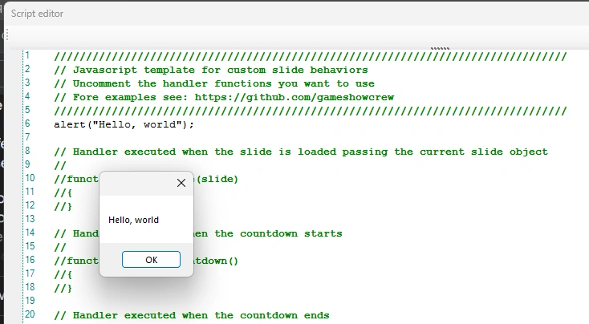

# Scripting

Since version 8.5, QuizXpress has a built-in JavaScript engine. With scripts you can build custom behaviour and game elements that aren't possible otherwise. Besides everything the JavaScript language offers, a script can read information about the current slide, the players, the scores and the buzzers, respond to quiz events, communicate with the outside world, and change data and behaviour inside QuizXpress.

This section explains how scripting works in QuizXpress. It doesn't teach JavaScript itself: there's plenty of information on the web, and AI assistants are good at helping you write scripts. Basic programming knowledge is assumed. For details on exactly what the engine supports, see [Jint](https://github.com/sebastienros/jint), the JavaScript engine QuizXpress uses.

!!! warning "Use with care"
    Scripting is for advanced users and isn't needed for normal use of QuizXpress. A script can easily break the system, corrupt scores or make the quiz player hang. Debugging tools are limited (essentially `alert("hello world")`), and during a show all script errors are written to the quiz player's log file and otherwise ignored, because the show must go on. Test thoroughly before using a script in a live show.

    We don't offer (free) support for writing scripts.

## The script editor

Every slide has a 'Script' property. In QuizXpress Studio, click the three dots on the 'Script' property to open the script editor. When a slide has no script yet, the editor shows a template in which all handlers are commented out (shown in green):

{ width="560" loading=lazy }

**Handlers** are functions with a specific name that QuizXpress calls automatically when something happens, if they exist in the script. For example, `onLoadSlide(slide)` runs when the slide is loaded; use it for initialisation and to read information about the slide through the `slide` argument. The template lists all available handlers.

You can also put code outside the handlers. It runs as soon as the script is loaded, which is useful for declaring global variables, loading music, or testing code in Studio.

- **'Save'** stores the script in the slide, and so in your quiz.
- **'Test'** parses and runs the script in a limited sandbox. It reports syntax errors but doesn't call any of the `on…` handlers, so put code you want to test outside the handlers.

For example:

{ width="560" loading=lazy }

Clicking 'Test' shows a message box through `alert()`.

!!! warning
    Don't use `alert()` in a live show: the message box halts the whole quiz until someone closes it. It's only meant for printing values while you debug.

## Next steps

- [Working with QuizXpress](working-with-quizxpress.md): the `qx` object, sharing data between slides, and showing script values on a slide.
- [Reference](reference.md): all objects, properties and functions available to scripts.
- [Examples](examples.md): ready-to-use scripts, such as a live clock and a random team picker.
