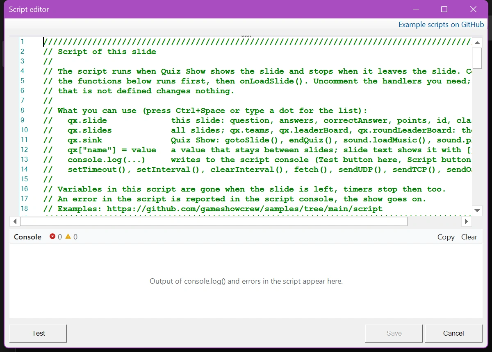
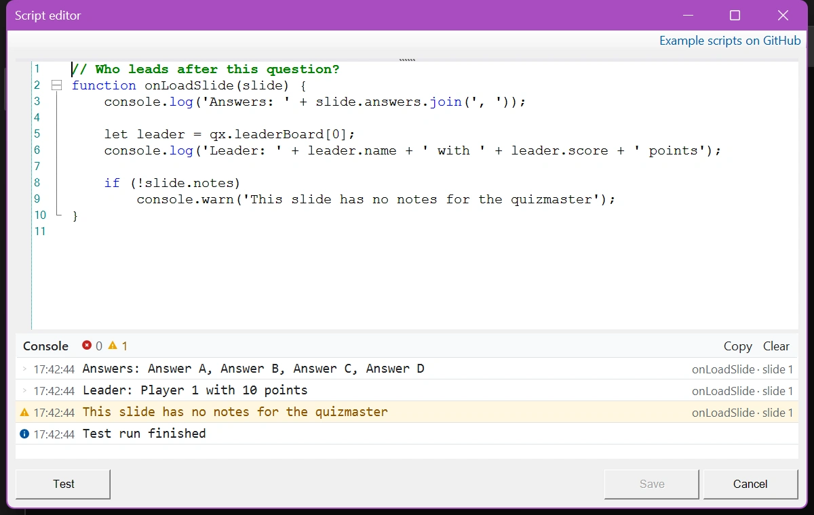

# Scripting

Since version 8.5, QuizXpress has a built-in JavaScript engine. With scripts you can build custom behaviour and game elements that aren't possible otherwise. Besides everything the JavaScript language offers, a script can read information about the current slide, the players, the scores and the buzzers, respond to quiz events, change the question and the scores during the show, get data from the internet, and communicate with other equipment.

This section explains how scripting works in QuizXpress. It doesn't teach JavaScript itself: there's plenty of information on the web, and AI assistants are good at helping you write scripts. Basic programming knowledge is assumed. For details on exactly what the engine supports, see [Jint](https://github.com/sebastienros/jint), the JavaScript engine QuizXpress uses.

!!! warning "Use with care"
    Scripting is for advanced users and isn't needed for normal use of QuizXpress. A script can corrupt scores or confuse the flow of your quiz. An error in a script never stops the show, but the part of the script after the error doesn't run. Test thoroughly before using a script in a live show.

    We don't offer (free) support for writing scripts.

## How a script runs

A script belongs to a slide. When QuizXpress Live shows the slide, it runs the script: first the code outside the functions, then the `onLoadSlide()` handler. While the slide is shown, QuizXpress calls the other handlers when something happens: the countdown starts, a team votes, the time runs out… When the slide is left, `onUnloadSlide()` runs and the script stops. Its variables are gone and its `setInterval()` timers stop.

To keep information from one slide to the next, or to show a value on the slide, use the `qx` object: see [Working with QuizXpress](working-with-quizxpress.md).

## The script editor

Every slide has a 'Script' property. In QuizXpress Studio, click the three dots on the 'Script' property to open the script editor. When a slide has no script yet, the editor shows a template that explains the basics and lists all handlers, commented out (shown in green). Remove the `//` in front of a handler to use it.

{ loading=lazy }

**Handlers** are functions with a specific name that QuizXpress calls automatically when something happens, if they exist in the script. For example, `onLoadSlide(slide)` runs when the slide is shown, and `onVote(player, answer, isCorrect)` runs every time a team answers. The [Reference](reference.md#handlers) lists them all.

You can also put code outside the handlers. It runs as soon as the script is loaded, which is useful for settings at the top of the script and for loading music.

The editor helps you while you type:

- **Suggestions**: type a dot after `qx`, `slide` or a player, or press Ctrl+Space, and a list shows what you can use, with a short explanation. Between the brackets of a function, a tooltip shows its arguments.
- **Syntax check**: a typing error such as a missing bracket gets a wavy red line, and the error is shown next to the 'Test' button. Click the error to go to its line.
- **Console**: below the editor, the console shows the output of `console.log()` and the errors of a test run. See [Testing and debugging](debugging.md).
- **'Example scripts on GitHub'**, at the top right, opens our collection of ready-to-use example quizzes with their scripts.

The buttons:

- **'Save'** stores the script in the slide, and so in your quiz.
- **'Test'** runs the script the way QuizXpress Live does when it shows the slide: the code outside the functions and then `onLoadSlide()`. It runs in a sandbox with this slide and ten example teams, and leaves your quiz alone. The other handlers aren't called, because nothing happens in the sandbox.

{ loading=lazy }

## Next steps

- [Working with QuizXpress](working-with-quizxpress.md): the `qx` object, sharing data between slides, showing script values on a slide, and changing the question and the scores.
- [Testing and debugging](debugging.md): the console in Studio and in the Director.
- [Reference](reference.md): all handlers, objects, properties and functions available to scripts.
- [Examples](examples.md): ready-to-use scripts and example quizzes.
