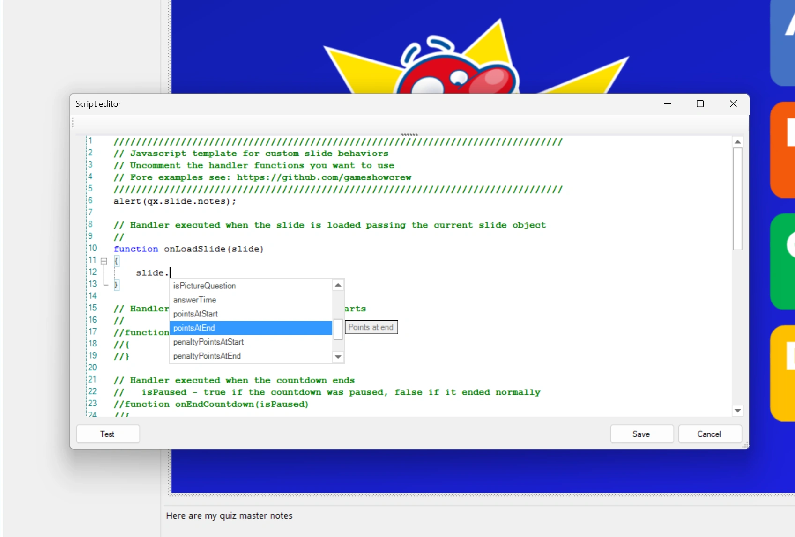
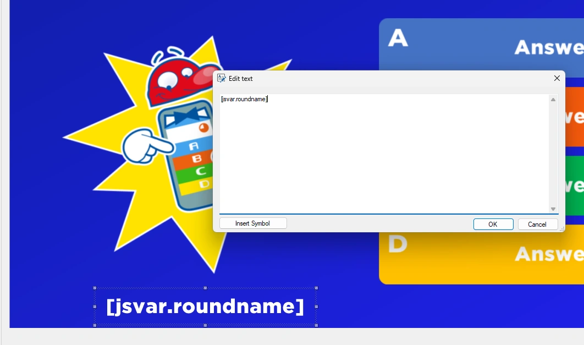
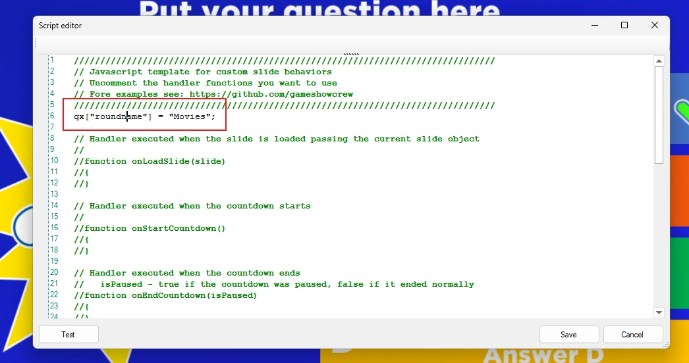
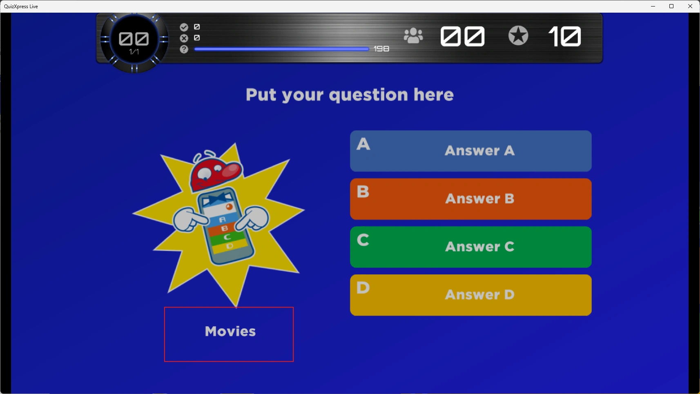

# Working with QuizXpress

## The qx object

QuizXpress exposes its internals to scripts through a global object called `qx`. For example, `qx.slide` returns the current slide, and the slide in turn has properties such as `notes`. This script writes the slide notes to the console when you click 'Test' in Studio:

```javascript
console.log(qx.slide.notes);
```

The editor helps you find properties: type `qx.` or `slide.` and a list of all available properties pops up, with a short explanation of each.

{ loading=lazy }

The most used parts of `qx`:

| | |
|---|---|
| `qx.slide` | The current slide: question, answers, correct answer, points, id, class… |
| `qx.slides` | All slides of the quiz. |
| `qx.teams` | All teams, with their name, keypad, score and last vote. |
| `qx.leaderBoard` | The teams sorted by score, the leader first. |
| `qx.roundLeaderBoard` | The scores of the current round. |
| `qx.sink` | QuizXpress Live itself: go to a slide, end the quiz, play music… |
| `qx["name"]` | A value that stays between slides, see below. |

The [Reference](reference.md) lists every object, property and function with its meaning.

## Responding to the show

Handlers are the way a script takes part in the show. Some examples:

```javascript
// every second of the countdown
function onCountdownTick(secondsLeft) {
    if (secondsLeft === 10)
        qx['message'] = 'Ten seconds left!';
}

// a team answered with its keypad
function onVote(player, answer, isCorrect) {
    console.log(player.name + ' answered ' + answer);
}

// the slide is left: clean up
function onUnloadSlide(slide) {
    qx.sink.sound.stopMusic('tension');
}
```

!!! note "The end of a question"
    Depending on the settings of the question, QuizXpress Live calls `onEndCountdown()` when the time ran out or everybody answered, or only `onTimeout()`. A script that has to do something once at the end of a question handles both, and remembers that it already did:

    ```javascript
    let done = false;

    function onTimeout() { endOfQuestion(); }
    function onEndCountdown(isPaused) { if (!isPaused) endOfQuestion(); }

    function endOfQuestion() {
        if (done)
            return;
        done = true;
        // ...
    }
    ```

## Sharing data between slides

The variables of a script are gone when its slide is left, so ordinary JavaScript variables don't survive to the next slide. To keep data across slides, use the global storage on the `qx` object.

On the first slide of a round you could write:

```javascript
qx["roundname"] = "Movies";
```

and on any later slide:

```javascript
let roundName = qx["roundname"];   // "Movies"
```

The values stay until QuizXpress Live is closed, also when the quiz is restarted. To start over with a restarted quiz, clear the values in the script of the first slide.

To keep a list or an object, store it as text with `JSON.stringify()` and turn it back with `JSON.parse()`:

```javascript
let played = JSON.parse(qx['played'] || '[]');   // an empty list the first time
played.push(qx.slide.slideNumber);
qx['played'] = JSON.stringify(played);
```

## Showing script values on a slide

You can show these named values on a slide with the `[jsvar.<name>]` text symbol. Add a text shape to the slide and enter the symbol, for example `[jsvar.roundname]`:

{ width="560" loading=lazy }

Set the variable in the script:

{ width="560" loading=lazy }

When the quiz runs, the slide shows the value:

{ loading=lazy }

This also works in real time: whenever the script changes the value, the slide shows the new value right away, also when it changes in a timer. The [Clock example](examples.md#clock) uses this to show the current time.

## Changing the question

A script can change the question, the answers and the correct answer of the current slide, for example with a question it downloaded:

```javascript
function onLoadSlide(slide) {
    slide.setQuestion('What is the capital of Australia?');
    slide.setAnswers(['Sydney', 'Canberra', 'Melbourne', 'Perth']);
    slide.setCorrectAnswer('B');
}
```

- `setAnswers()` replaces the answers in order (A, B, C…). The slide must already have that many answers; it can't add answers.
- `setCorrectAnswer()` takes the letter of the correct answer, or several letters (`'AC'`) when more answers are correct.
- Do this in `onLoadSlide()`, before the slide is shown.

These changes are for the show only: the quiz file stays as it is. With 'Test' in Studio the slide doesn't change either. See the [Questions from the web](examples.md#questions-from-the-web) example.

## Changing scores

A player's score can be read and changed:

```javascript
team.score += 50;   // 50 bonus points
```

The bonus is added to the score of the team. In Analyzer, the results of a question show the points of that question only. On a test question the score doesn't change. See the [Hot streak bonus](examples.md#example-quizzes) example.

## Choosing the next slide

`onNextSlide(currentSlideNumber)` decides which slide comes next, when the slide has no 'Next slide' set. Return a slide number (starting at 0), a slide id like `'#final'`, or a slide from `qx.slides`. Return nothing to just go to the next slide.

```javascript
function onNextSlide(currentSlideNumber) {
    let leader = qx.leaderBoard[0];
    if (leader && leader.score >= 100)
        return '#final';
}
```

Give slides an id or a class in the 'Metadata' section of the slide properties, so your script can find them. The [Random question order](examples.md#example-quizzes) example picks the next question at random.
