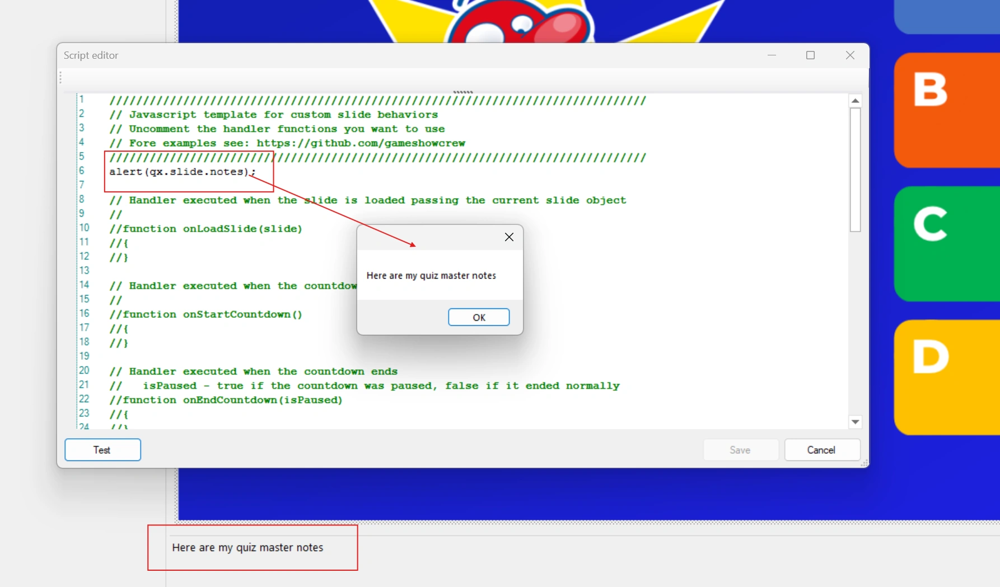

# Working with QuizXpress

## The qx object

QuizXpress exposes its internals to scripts through a global object called `qx`. For example, `qx.slide` returns the current slide, and the slide in turn has properties such as `notes`. This script shows the slide notes in a message box when you click 'Test' in Studio:

{ loading=lazy }

The editor helps you find properties: type `slide.` and a list of all available properties pops up.

{ loading=lazy }

The [Reference](reference.md) lists every object, property and function with its meaning.

## Sharing data between slides

The script engine is loaded and unloaded with every slide, so ordinary global JavaScript variables don't survive to the next slide. To keep data across slides, use the global key/value storage on the `qx` object.

On the first slide of a round you could write:

```javascript
qx["roundname"] = "Movies";
```

and on any later slide:

```javascript
let roundName = qx["roundname"];   // "Movies"
```

## Showing script values on a slide

You can show these named values on a slide with the `[jsvar.<name>]` text symbol. Add a text shape to the slide and enter the symbol, for example `[jsvar.roundname]`:

{ width="560" loading=lazy }

Set the variable in the script:

{ width="560" loading=lazy }

When the quiz runs, the slide shows the value:

{ loading=lazy }

This also works in real time: whenever the script changes the value, the slide refreshes and shows the new value. The [Clock example](examples.md#clock) uses this to show the current time.
