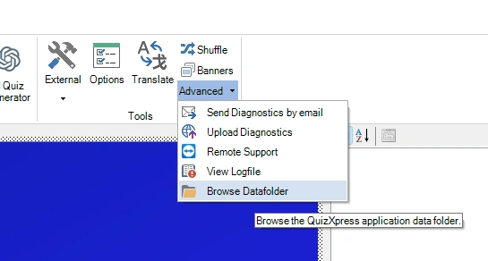
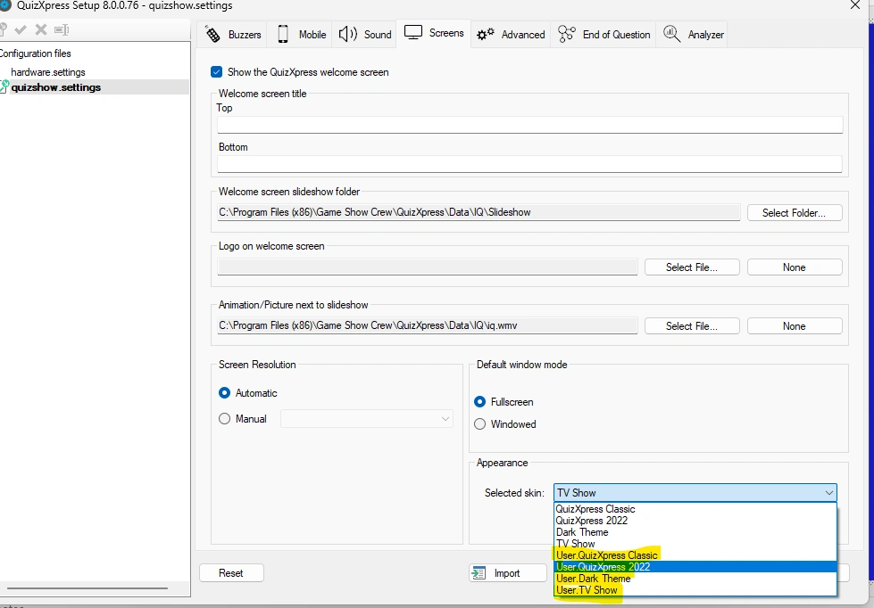
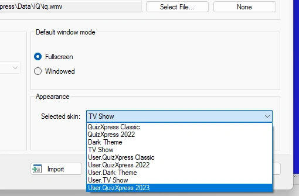
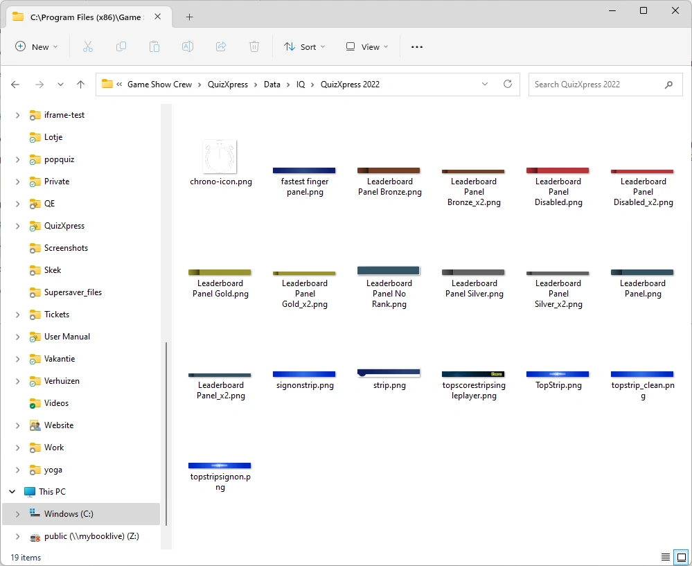

# Creating a custom skin

In the steps below we create a skin named 'QuizXpress 2023', based on the built-in skin 'QuizXpress 2022'. Replace the names with your own. If you haven't read it yet, [Skinning](index.md) explains how skins work.

## Step 1: open the QuizXpress data folder

In QuizXpress Studio, go to the 'HOME' tab, open the 'Advanced' menu and choose 'Browse Datafolder'. A Windows Explorer window opens on the data folder. You can also type `%appdata%\QuizXpress` in the address bar of Windows Explorer.

{ width="400" loading=lazy }

## Step 2: copy skin.config to the data folder

Copy `skin.config` from the installation folder (`C:\Program Files (x86)\Game Show Crew\QuizXpress`) to the data folder. Copy it; don't move it.

Open Quiz Setup, go to the 'Screens' tab and open the 'Selected skin' list in the 'Appearance' section. Every built-in skin now appears a second time with the prefix 'User.': these come from your copy.

{ loading=lazy }

!!! tip
    To keep the list tidy, add `hidden="true"` to the `<skin>` elements of the built-in skins in **your copy**. Hidden skins no longer appear in Quiz Setup, but still work as a parent for your own skin.

## Step 3: create a folder for your artwork

In the data folder, create a folder `Skins`, and in it a folder with the name of your skin: `%appdata%\QuizXpress\Skins\QuizXpress 2023`. Leave it empty for now.

## Step 4: add your skin definition

Open the copied `skin.config` (the one in the data folder) in your editor. At the bottom of the file, just above the closing `</skins>` tag, add:

```xml
<skin name="QuizXpress 2023"
      displayname="QuizXpress 2023"
      dir="Skins\QuizXpress 2023"
      parent="QuizXpress 2022">

</skin>
```

The attributes of the `<skin>` element:

| Attribute | Meaning |
|---|---|
| `name` | Internal name. Must be unique in the file; this is the name other skins use as 'parent'. |
| `displayname` | The name shown in Quiz Setup (with the prefix 'User.'). Optional; when left out, the 'name' is shown. |
| `dir` | The asset folder of the skin. Use the relative path `Skins\<your skin>`: it is found under your data folder and works unchanged on another computer or user account. A full path also works. |
| `parent` | The 'name' (not the display name) of the skin to inherit from, for example `QuizXpress 2022`, `DarkMode`, `TVShow` or `Techno`. Optional, but strongly recommended. |
| `hidden` | `true` hides the skin in Quiz Setup. Optional. |

Save the file.

## Step 5: select the skin in Quiz Setup

Reopen Quiz Setup (it reads the list of skins when it starts), select 'User.QuizXpress 2023' in the 'Selected skin' list and save the settings. From now on the quiz player uses your skin. Because the skin is still empty, it looks exactly like its parent.

{ width="400" loading=lazy }

## Step 6: override settings

Now make the changes that define your skin. Find the element you want to change in the parent skin, or in 'QuizXpress' (the root skin, which contains every setting with its documentation), copy it into your own skin and keep only the attributes you change.

For example, we want a purple background for the PIN indicator (the panel that shows the game PIN during the quiz). In the root skin we find:

```xml
<pinindicator
    background-color="#01539F"
    text-font-family="default"
    pin-font-family="default"
/>
```

We only want to change the background colour, so we add just that attribute to our skin:

```xml
<skin name="QuizXpress 2023" displayname="QuizXpress 2023"
      dir="Skins\QuizXpress 2023" parent="QuizXpress 2022">

    <pinindicator background-color="Purple" />

</skin>
```

The fonts keep the values inherited from the parent. Start a quiz, and the PIN indicator is now purple:

{ width="220" loading=lazy }

Follow the same pattern for anything else: add the element once to your skin and put all the attributes you change for that element in it.

!!! note
    The quiz player reads `skin.config` when it starts. After saving a change, stop the quiz and start it again to see the result.

## Step 7: replace images

The built-in images of a skin are in its folder under `Data\IQ` in the installation folder. The images of QuizXpress 2022, the parent in our example, are in `Data\IQ\QuizXpress 2022`:

{ loading=lazy }

There are two ways to use your own artwork.

**Replace an image by name.** This is the easiest way and needs no change in `skin.config`:

- Find the image you want to change in the parent's folder. If it isn't there, look in the folder of the grandparent, for example `Data\IQ\QuizXpress`.
- Copy it to your skin folder, `%appdata%\QuizXpress\Skins\QuizXpress 2023`, keeping the file name.
- Edit the copy in your favourite image editor. Keep the same pixel dimensions, and save it as PNG (with transparency where the original has it).

Because your skin folder is searched before the parent's folder, your image is used automatically.

**Reference an image explicitly.** If you prefer your own file names, set the attribute in your skin. For example, for the background of the info panel:

```xml
<infopanel background-image="infopanel_bg.png" />
```

The quiz player now looks for `infopanel_bg.png` in your skin folder. You can also enter a full path. To go back to the built-in image, use the value `default`.

Start a quiz and check that your images are shown. If an image can't be found, the quiz player shows the built-in image, or none: see [Troubleshooting](maintaining-a-custom-skin.md#troubleshooting).
