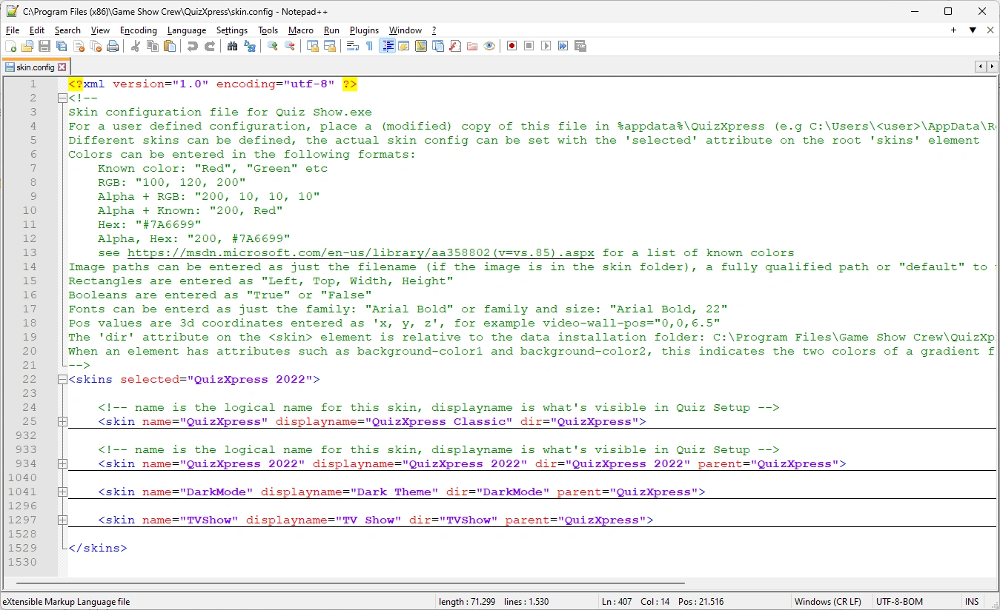
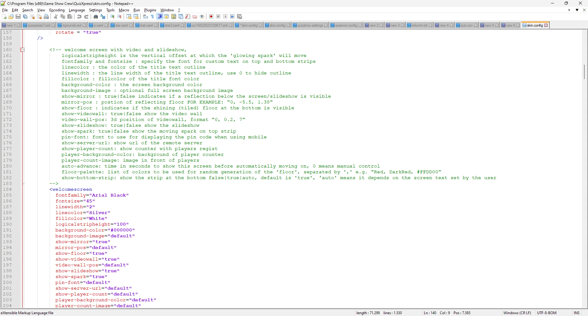

# Skinning

The look of the QuizXpress quiz player, QuizXpress Live, can be changed completely to match your preferences or house style by creating a custom 'skin'. QuizXpress comes with five built-in skins (QuizXpress Classic, QuizXpress 2022, Dark Theme, TV Show and Techno), which you can select in Quiz Setup on the 'Screens' tab, in the 'Appearance' section. See [Customizing the look](../../setup/customizing-the-look-the-screens-tab-page.md).

Creating your own skin comes down to four things:

1. copy the standard `skin.config` file to your QuizXpress data folder;
2. add your own skin definition that inherits from one of the built-in skins;
3. override only the settings you want to change;
4. put your own artwork (PNG images) in a folder that belongs to your skin.

This page explains how skins work. [Creating a custom skin](creating-a-custom-skin.md) walks you through the steps, and [Sharing, updating and troubleshooting](maintaining-a-custom-skin.md) covers what comes after.

The individual settings (colours, fonts, images, sizes) are not described in this manual: each one is documented in a comment directly above its element in `skin.config` itself.

!!! warning "Not in the Home edition"
    Custom skins are not available in the Home edition of QuizXpress. In the Home edition the quiz player always uses the built-in skins, even when a 'User.' skin is selected.

## The skin.config file

Much of the look and feel of the quiz player is defined in an XML text file named `skin.config`. Every skin you can pick in Quiz Setup is a `<skin>` element in that file. Each skin contains elements for the parts of the show, such as `<welcomescreen>`, `<quizscreen>`, `<scorescreen>`, `<infopanel>` or `<pinindicator>`, and their attributes hold the colours, fonts, images and dimensions.

{ loading=lazy }

Every element is documented in the comment (shown in green in Notepad++) directly above it. The comment at the top of the file explains how to enter values: colours (names, RGB, ARGB or hex such as `#7A6699`), fonts (`"Arial Bold"` or `"Arial Bold, 22"`), rectangles, booleans and 3D positions.

{ loading=lazy }

To edit the file we recommend [Notepad++](https://notepad-plus-plus.org/), a free editor with XML syntax colouring. Any plain-text editor will do, but never use a word processor.

## The installed file and your own copy

QuizXpress knows two locations for `skin.config`:

| Location | What it is |
|---|---|
| `C:\Program Files (x86)\Game Show Crew\QuizXpress\skin.config` | The built-in skins. **Don't edit this file**: every QuizXpress update replaces it. |
| `%appdata%\QuizXpress\skin.config` (for example `C:\Users\<you>\AppData\Roaming\QuizXpress`) | Your own copy. Quiz Setup lists every skin in this file with the prefix 'User.', so they never clash with the built-in skins. |

!!! note
    When you select a 'User.' skin, the quiz player reads **only your copy** of `skin.config`, including the built-in skins your skin inherits from. That is why you copy the whole file rather than writing a file with just your own skin in it. See [After a QuizXpress update](maintaining-a-custom-skin.md#after-a-quizxpress-update) for what this means when you update.

## Inheritance: only change what is different

A skin can name a 'parent' skin. When the quiz player loads a skin, it first loads the complete parent (and the parent's parent, and so on), and then applies the elements of the skin itself on top. This works per attribute: an attribute you include replaces the inherited value, an attribute you leave out keeps the inherited value. The value `default` also keeps the inherited value.

The built-in skins already work this way. Techno inherits from Dark Theme, which inherits from QuizXpress Classic:

```text
QuizXpress (QuizXpress Classic)   - the root skin, defines every setting
├── QuizXpress 2022
├── TVShow (TV Show)
└── DarkMode (Dark Theme)
    └── Techno
```

So pick the built-in skin that is closest to what you want as the parent of your skin, and put only the elements and attributes you want to change in your own skin. That keeps it small and easy to maintain.

## Where the quiz player looks for images

Images and other assets are referenced in `skin.config` by file name, for example `background-image="strip.png"`. Each skin has a 'dir' attribute that names its asset folder. The quiz player searches for an image in this order and uses the first file it finds:

1. If the attribute contains a full path (`C:\...\logo.png`): exactly that file.
2. The asset folder of your own skin.
3. The asset folder of its parent, then the grandparent, and so on.
4. The general default folder `Data\IQ\default` in the installation folder.

A 'dir' can be a full path or a relative one. A relative 'dir' is looked up first under `Data\IQ` in the installation folder (this is where the built-in skins keep their images, for example `Data\IQ\QuizXpress 2022`), and then under your data folder `%appdata%\QuizXpress`.

The practical result: **an image you place in your skin's folder under the same file name as an image of the parent skin automatically replaces it**, and every image you don't replace still comes from the parent.
