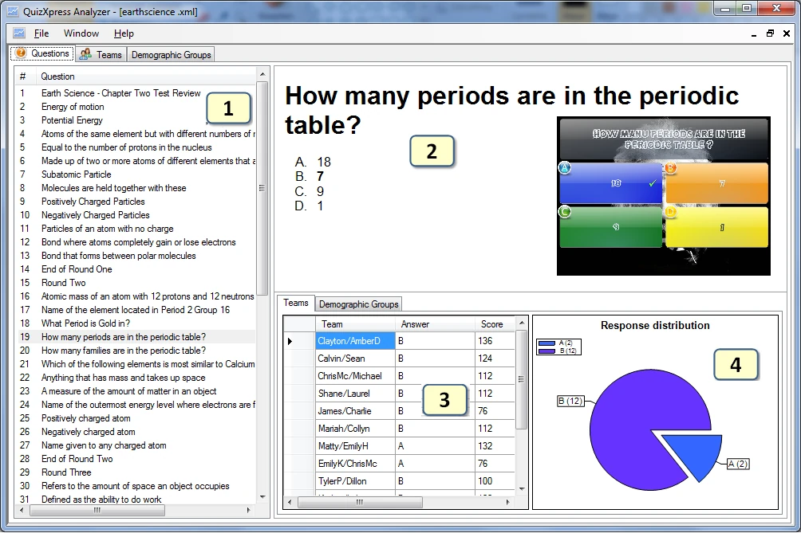
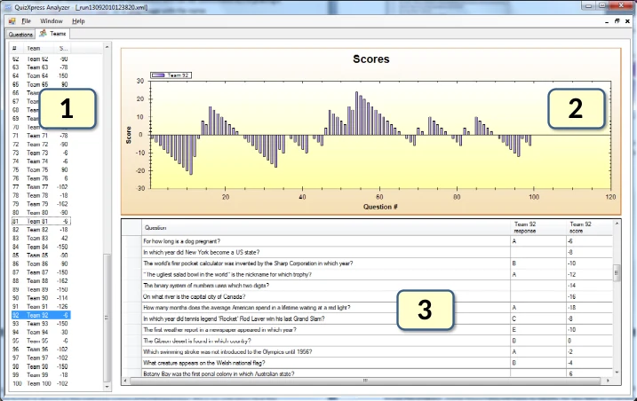

# Analyzing quiz results with QuizXpress Analyzer

QuizXpress ships with a graphical analyzer tool named Analyzer. Analyzer helps you understand and visualize the data collected during the quiz. You can open multiple datasets, allowing you to compare data collected over time. There are three views available:

- Question view

- Team view

- Demographic Groups (if demographic groups were present during a quiz)

The question-centric view looks as follows:

{ width="604" loading=lazy }

1)  The list of all questions in the dataset

2)  The question itself with the possible answers (if the .qx quiz file is available on the system, a picture of the slide is rendered; if it is no longer available, you’ll only see a textual representation)

3)  The responses and scores (for the selected question) per team/player. When demographic groups are available, a ‘Demographic Groups’ tab is shown in the bottom right. In this tab, for each group, the number of votes per answer for the selected question is shown in a table.

4)  A pie chart showing the response distribution for the selected question. When demographic groups are available, in the Demographic Groups tab, the response distribution for a group can be shown by selecting that group from the list box shown above the response distribution graph.

The team view has the following layout:

{ width="547" loading=lazy }

1)  The list of team/player names. Note that you can select multiple teams here.

2)  A chart showing the score development over time

3)  The questions and responses for the selected team(s)

The demographic group view has the same layout. In the table, for each question, all answers are displayed. For each selected group, the number of votes for each answer is displayed. The score development over time for the selected group(s) is also shown.

All data shown in Analyzer is stored during a quiz by QuizXpress Live in the form of XML documents in the QuizXpress application data folder (on Windows 7, the location of this folder is ‘C:\Users\\username>\AppData\Roaming\QuizXpress\Scores’). Please note that you can open this folder from QuizXpress Studio under the Tools->Advanced menu.
