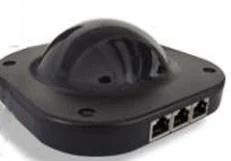
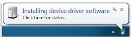
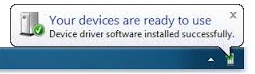

# QuizXpress keypads and buzzers

{ width="148" loading=lazy }

Please proceed as follows to install the QuizXpress receiver and configure QuizXpress to work with the buzzers.

To install the QuizXpress receiver, plug it into an available USB port. Windows will install the receiver automatically the first time it’s used. You will see the following messages in the Windows taskbar.

{ width="264" loading=lazy }{ width="261" loading=lazy }

Now you can configure QuizXpress to use the QuizXpress buzzers (please also refer to [QuizXpress basic keypads](../setup/configuring-your-hardware-the-buzzers-tab-page.md#quizxpress-basic-keypads)).

- Start Quiz Setup

- On the ‘Buzzers’ tab page of Quiz Setup, select *QuizXpress Keypad*.

- When the receiver is plugged in, you can press the ‘Test’ button, after which a connection is made. A green checkmark appears if successful.

- Now close Quiz Setup and start QuizXpress Buzzer Test, which can be found on the Start menu under QuizXpress. Pressing one of the buzzers should now light up the corresponding numbered box on the screen and show the chosen answer.

- When the preceding steps have been executed successfully, QuizXpress Live is ready to work with QuizXpress Buzzers.

!!! note

    QuizXpress keypads work with two AAA batteries.

The QuizXpress receiver has three LEDs. The red one indicates whether it has power, the yellow one indicates communication, and the green one indicates RF polling activity. During the quiz show, the green one should be blinking. If not, you should restart the device with F12.
