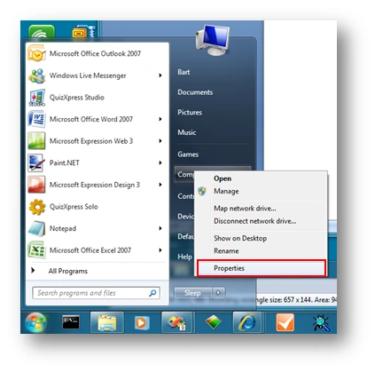
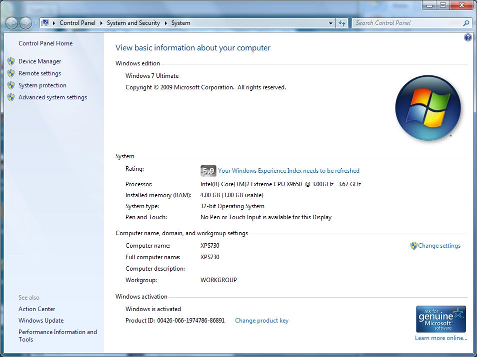
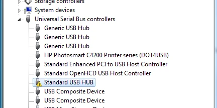
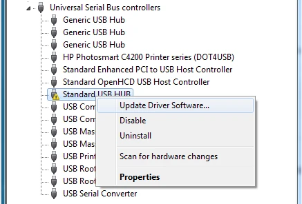
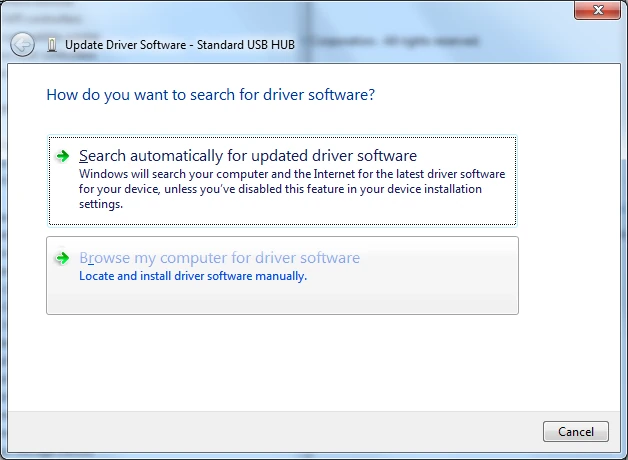
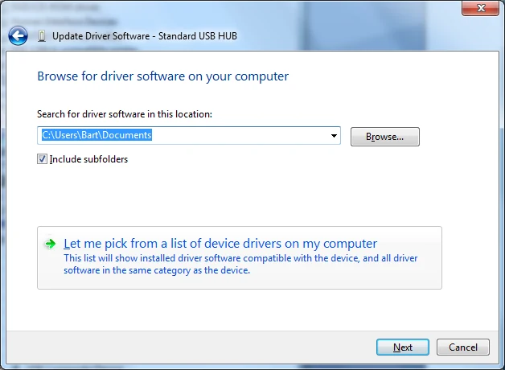
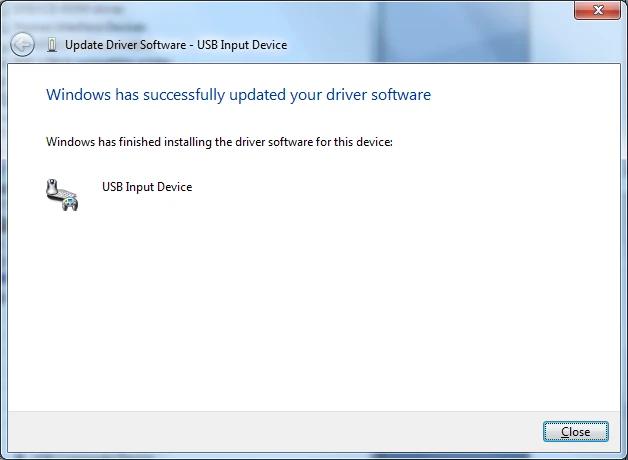
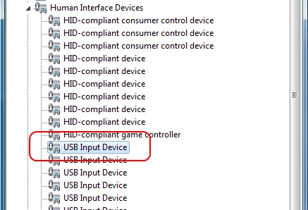
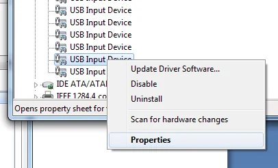
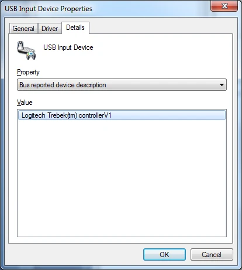

# Sony Buzz buzzers on Windows 7 and later

The latest revision of the Sony Buzz™ buzzers requires a special procedure to make them work with QuizXpress on Windows Vista or Windows 7. This appendix describes the steps to install the Sony Buzz™ USB receiver correctly on these operating systems.

You can recognize this new revision by the text “Manufactured by Logitech…” on the USB receiver. The buzzers do not have the power button on the right side, and the blue LED present on earlier revisions is missing. This model of buzzer is turned on by pressing the large red button once.

Connect the receiver to a USB port on your computer. After a while, a message appears indicating failure to install the device:

Go to the Start menu and select Computer->Properties:

{ width="330" loading=lazy }

In the window that appears, select *Device Manager*:

{ width="360" loading=lazy }

In the Device Manager window, expand the Universal Serial Bus controllers node:

{ width="364" loading=lazy }

Select the node that indicates an error, right-click it, and select Update Driver Software from the menu:

{ width="365" loading=lazy }

In the wizard, select “Browse my computer for driver software”:

{ width="362" loading=lazy }

On the next screen, select ‘Let me pick…’ and select Next:

{ width="397" loading=lazy }

On the next screen, select “USB Input Device” and press Next:

The Buzz™ receiver is now successfully installed and ready to use.

{ width="317" loading=lazy }

Close the window; in the Device Manager, the wireless buzzer receiver will now appear as “USB Input Device”.

{ width="317" loading=lazy }

To locate the buzzer device *after* it has been installed for example to uninstall it, you’d have to open the properties on each of the *USB Input Device* entries (right click; Properties)

{ width="291" loading=lazy }

Then, on the *USB Input Device Properties* window, select the ‘Details’ tab and change the ‘Property’ dropdown to *Bus reported device description*. If the ‘Value’ field shows the text *Logitech Trebek(tm) controllerV1*, you have found the Sony buzzer device.

{ width="289" loading=lazy }
