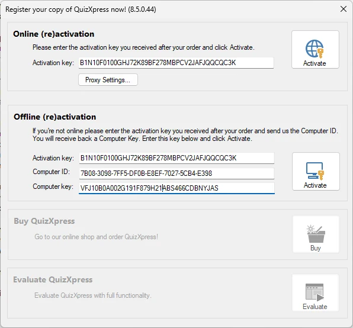
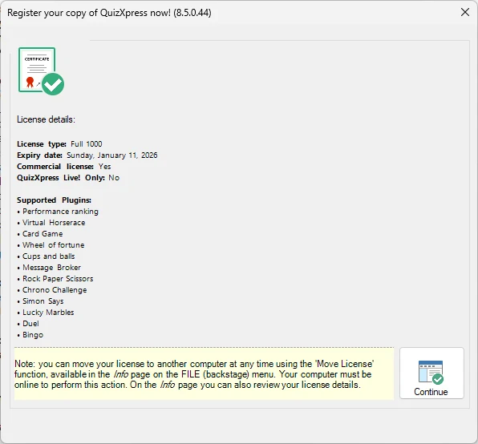
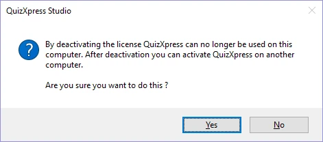
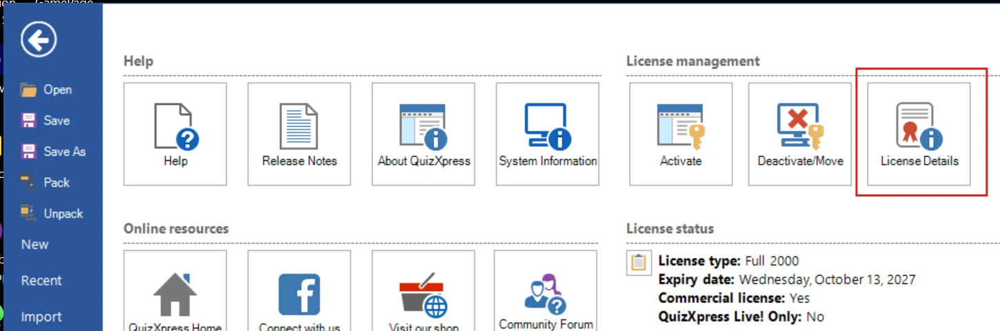

# Licensing

The QuizXpress software suite is protected by a license key. The demo version, which can be downloaded from our website, has a 2-week, fully functional trial mode. The license key contains information about the number of devices (buzzers/keypads/mobile devices) you can use and the license expiry date.

## Activation

The activation dialog appears automatically when starting QuizXpress Studio if the license has expired or isn’t present. Alternatively, you can open the dialog manually from the HOME tab by clicking ‘Info’ and then ‘Activate’.

{ width="324" loading=lazy }

QuizXpress can be activated both online and offline. Online activation is easy; simply enter the key you received after your purchase in the ‘Activation key’ textbox and click ‘Activate’. If activation is successful, the dialog will show the following:

{ width="313" loading=lazy }

After activation, this form shows what is included in your license (the supported mini games and the additional hardware such as the scoreboards and Galaxy RGB devices)

For *offline* activation (in case your PC isn’t connected to the internet), you must send your ‘Computer ID’ and ‘Computer key’ to Game Show Crew; you’ll then receive an offline activation key by email to enter in the offline activation textbox.

## Deactivating and moving licenses

It is possible to move a license to another computer. To do so, first make sure you have a copy of your key. In QuizXpress Studio, press the F1 key and then click the ‘Deactivate/Move’ button and confirm the message:

{ width="283" loading=lazy }

Now, you can go to your other machine and activate QuizXpress using the same key. Depending on the type of license, activation keys may be used on multiple machines.

## License info

To see where your license is in use (on what computers), press F1, then open the **Info** tab and click the **License Details** button:

{ loading=lazy }

This will open a new web browser (you must be online) and navigate to a page that shows the details of your license key, including the computers where the key is currently in use.
