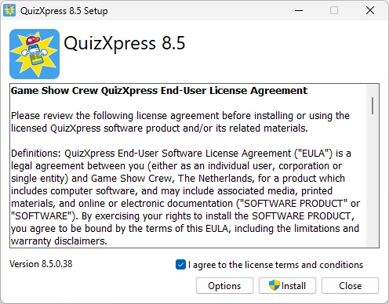

# System requirements

| Component        | Requirement                                                                                   |
|------------------|-----------------------------------------------------------------------------------------------|
| Operating system | Windows 10 or Windows 11                                                                      |
| Free disk space  | ~1 GB, SSD disk is preferred                                                                  |
| Memory           | 8 GB minimum, 16 GB recommended                                                               |
| Video card       | DirectX 9C compatible video card                                                              |
| Sound card       | Any standard sound card will do                                                               |
| CPU              | For good performance when using HD videos, we recommend an i5 processor at 2.4 GHz or higher. |

To install the software, run the QuizXpress8.exe installation package. A link to the download section on our website can be found in the email you received with your license key.

{ width="321" loading=lazy }

The installation process itself is straightforward. Please read the license agreement thoroughly, and once you agree, tick the ‘I agree…’ checkbox and click ‘Install’.
