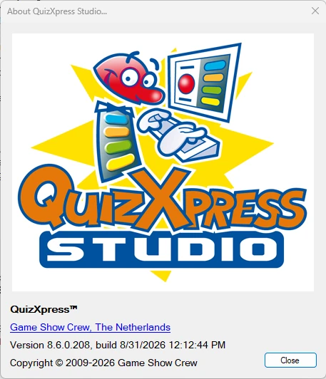
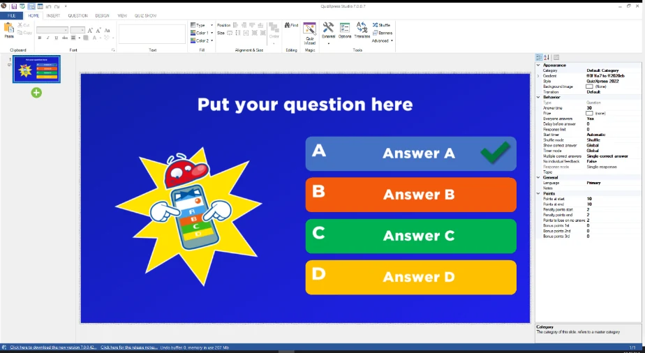
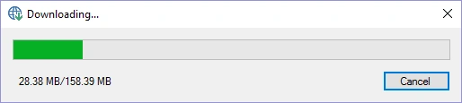

# Updates and version numbering

To check your version of QuizXpress, you can open the About box in QuizXpress Studio. This shows information about your currently installed version:

| { width="293" loading=lazy } | A QuizXpress version number consists of 4 digits, for example 8.5.0.4, made up of a major, minor, build, and revision number. The major number changes only for significant updates; the minor number indicates different releases within the major version. The build number and revision differentiate between patches (bug fixes). QuizXpress Studio checks online for updates when it starts. |
|-------------------------------------------------------------------------------|---------------------------------------------------------------------------------------------------------------------------------------------------------------------------------------------------------------------------------------------------------------------------------------------------------------------------------------------------------------------------------------------------|

If a newer version is available from our website, you will be notified:

{ width="592" loading=lazy }

To upgrade to a new version, simply click the download link in the QuizXpress Studio status bar to download the latest version:

> { width="279" loading=lazy }

After downloading, the installation program will start. It isn’t necessary to uninstall the currently installed version.

When upgrading, your license key, special settings, quizzes, and other customizations are retained, as they are stored outside the QuizXpress installation folder. You will always be able to open your old quizzes. However, when sharing your quiz with others, make sure they are on the same version.

The release notes for QuizXpress can be found in the file *ReleaseNotes.txt* in the installation folder. You can open this file from within Studio under *FILE->Info->Release Notes* or from the QuizXpress entry in the Windows Start menu.
