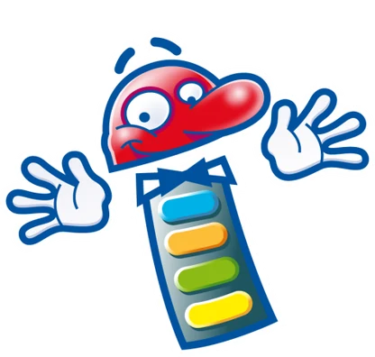

# Software License Agreement

**1. DEFINITIONS**

QuizXpress End-User Software License Agreement ("EULA") is a legal agreement between you (either as an individual user, corporation or single entity) and Game Show Crew, The Netherlands, for a product which includes computer software, and may include associated media, printed materials, and online or electronic documentation ("SOFTWARE PRODUCT" or "SOFTWARE"). By exercising your rights to install the SOFTWARE PRODUCT, you agree to be bound by the terms of this EULA, including the limitations and warranty disclaimers.

If you do NOT agree to the terms of this EULA, please return the SOFTWARE PRODUCT and immediately destroy all copies of the SOFTWARE PRODUCT in your possession.

**2. SOFTWARE PRODUCT LICENSE**

The SOFTWARE PRODUCT is protected by copyright laws and international copyright treaties, as well as other intellectual property laws and treaties.

**2.1 GRANT OF LICENSE**

This is a license agreement, and NOT an agreement for sale. Game Show Crew retains ownership of the copy of THE SOFTWARE in your possession, and all copies you may be licensed to make. Game Show Crew retains all rights not expressly granted to you in this LICENSE. Game Show Crew hereby grants to you, and you accept, a non-exclusive, non-transferable license to use, copy and modify THE SOFTWARE only as authorized below.

Provided that you have accepted the terms contained herein, this EULA grants you the following rights:

A\) Standard License: You are granted a non-transferable license to install the SOFTWARE PRODUCT on a single computer.

B\) Multiple License: You are granted a non-transferable license to install the SOFTWARE PRODUCT on multiple computers.

C\) All Licenses: Regardless of the type of license purchased, if the SOFTWARE PRODUCT includes reusable software such as controls, components, plug-ins, stylesheets, etc., you may not use any of these independently of the SOFTWARE PRODUCT.

D\) Home License: QuizXpress Home edition may only be used for personal non-commercial home use.

E\) Commercial License: You are entitled to exploit the software commercially by renting it out or organizing quiz show events.

In no case shall you rent, lease, lend, redistribute nor re-license THE SOFTWARE PRODUCT or source code to a third party individual or entity, except as outlined above. In no case shall you grant further redistribution rights for THE SOFTWARE PRODUCT to the end-users of your solution.

**2.2 TERMINATION**

Without prejudice to any other rights, Game Show Crew may terminate this EULA if you fail to comply with the terms and conditions of this EULA. In such event, you must destroy all copies of the SOFTWARE PRODUCT and all of its component parts, source code, associated documentation, and related materials.

Game Show Crew may additionally suspend or disable access to specific features of the SOFTWARE PRODUCT if such features are used in a manner that violates this EULA, applicable law, or third-party license terms.

**3. COPYRIGHT**

All title and copyrights in and to the SOFTWARE PRODUCT (excluding User Content supplied by the user) (including but not limited to any images, photographs, animations, video, audio, music, text, and "applets" incorporated into the SOFTWARE PRODUCT), the accompanying printed materials, and any copies of the SOFTWARE PRODUCT are owned by Game Show Crew except for certain portions for which Game Show Crew has obtained redistribution rights. The SOFTWARE PRODUCT is protected by European copyright laws and international treaty provisions.

QuizXpress is a protected trademark, registered under trademark number 013678537.

**3A. USER-SUPPLIED CONTENT AND COPYRIGHT RESPONSIBILITY**

The SOFTWARE PRODUCT allows users to import, reference, link to, or play audio, video, images, and other media (“User Content”).

All User Content is supplied, selected, and controlled solely by the user. Game Show Crew does not provide, license, select, verify, or control any User Content used with the SOFTWARE PRODUCT.

You acknowledge and agree that you are solely responsible for ensuring that you have obtained all necessary rights, licenses, permissions, and consents required to use, reproduce, store, perform, display, or otherwise exploit any User Content in connection with the SOFTWARE PRODUCT, including but not limited to copyright and public performance rights.

Game Show Crew does not grant any rights to third-party copyrighted works and makes no representation that use of the SOFTWARE PRODUCT with User Content complies with applicable copyright law or licensing terms.

The availability of features for importing, referencing, or playing media does not constitute encouragement, endorsement, or authorization of any specific source or use of copyrighted content.

**3B. PUBLIC PERFORMANCE AND COMMERCIAL USE**

You acknowledge that use of audio or video content in public, semi-public, or commercial quiz events may require additional licenses, including public performance licenses, from rights holders or collecting societies.

Obtaining and maintaining such licenses is solely your responsibility. Game Show Crew does not provide public performance rights and assumes no liability for unauthorized public performance of copyrighted works.

**3C. NO MONITORING OBLIGATION**

Game Show Crew has no obligation to monitor, review, or police User Content used with the SOFTWARE PRODUCT and assumes no responsibility for determining whether User Content complies with applicable laws or third-party license terms.

**3D. THIRD-PARTY SERVICES AND CONTENT**

The SOFTWARE PRODUCT may allow interaction with, linking to, or referencing content or services provided by third parties, including but not limited to music streaming platforms.

Game Show Crew is not affiliated with, endorsed by, or acting on behalf of any third-party service unless explicitly stated otherwise. Any use of third-party services is governed solely by the terms, conditions, and licenses of those third parties.

You acknowledge that Game Show Crew is not responsible for the availability, legality, licensing, or permitted use of third-party content or services accessed or referenced through the SOFTWARE PRODUCT.

**4. LIMITED WARRANTY**

NO WARRANTIES. Game Show Crew expressly disclaims any warranty for the SOFTWARE PRODUCT. The SOFTWARE PRODUCT and any related documentation is provided "as is" without warranty of any kind, either express or implied, including, without limitation, the implied warranties of merchantability, fitness for a particular purpose, or non-infringement. The entire risk arising out of use or performance of the SOFTWARE PRODUCT remains with you.

**5. LIMITATION OF LIABILITY**

NO LIABILITY FOR CONSEQUENTIAL DAMAGES. In no event shall Game Show Crew or its distributors be liable for any damages whatsoever (including, without limitation, damages for loss of business profits, business interruption, loss of business information, or any other financial loss) arising out of the use of or inability to use this QuizXpress product and related materials, even if Game Show Crew has been advised of the possibility of such damages.

**6. PRIVACY AND DATA COLLECTION**

To improve the quality, stability, and performance of the QuizXpress software, certain usage and diagnostic data may be collected. This includes anonymized error and crash reports which are automatically sent to a third-party service, Sentry (https://sentry.io/).

The collected data may include:  
- Software version information  
- Operating system details  
- Anonymized user actions leading to a crash  
- Stack traces and diagnostic logs

This information is used solely for the purpose of debugging, product improvement, and technical support. We do not collect any personally identifiable information (PII) unless explicitly provided by the user (e.g., in a support ticket).

By using the SOFTWARE PRODUCT, you consent to this data being collected and processed for the purposes described above.

**7. GOVERNING LAW AND JURISDICTION**

This agreement shall be governed by and construed in accordance with the laws of The Netherlands. You agree to submit to the exclusive jurisdiction of the courts located in The Netherlands to resolve any legal matter arising from the terms of this agreement.

**8. SEVERABILITY**

If any provision of this EULA is held to be unenforceable, the remaining provisions will remain in full force and effect.

**9. CONTACT**

If you have any questions regarding this End User License Agreement, please email: info@gameshowcrew.com

{ width="208" loading=lazy }
