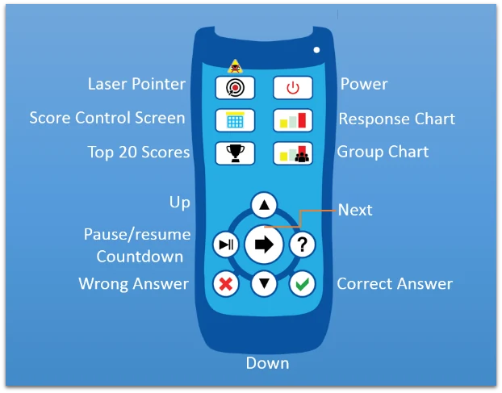
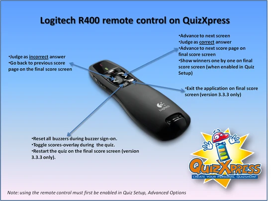
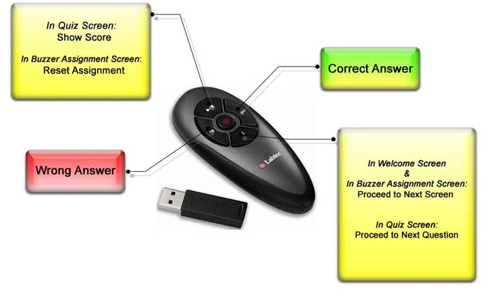
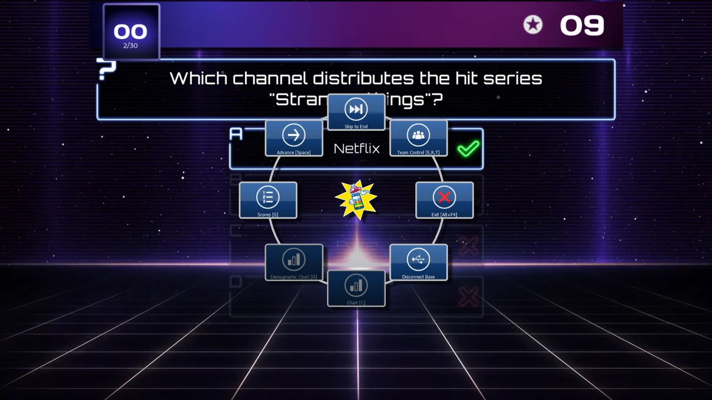

# Controlling the quiz

At different stages of a quiz, the quizmaster needs to perform (or may choose to perform) various actions, for example:

- Show a chart

- Show a score overview/scroll through the scores

- Advance to the next question

- Judge given questions (correct/incorrect)

These instructions can be given to QuizXpress Live in a couple of ways: using the keyboard, or using a wireless remote control such as a PowerPoint wireless presenter or the QuizXpress quizmaster remote.

As a learning function, quizmaster hints can be shown after each question to be configured in Quiz Setup. You can read more about quizmaster hints in [Quizmaster help menu](#quizmaster-help-menu).

## Using the keyboard

QuizXpress Live can be operated using the keyboard. The following keyboard commands are available:

<table>
<colgroup>
<col style="width: 52%" />
<col style="width: 47%" />
</colgroup>
<thead>
<tr class="header">
<th>Function</th>
<th>Key</th>
</tr>
</thead>
<tbody>
<tr class="odd">
<td>Next Question/Screen</td>
<td>Space</td>
</tr>
<tr class="even">
<td>
Buzzer Assignment Screen: Automatic Buzzer sign-in for all buzzers; Reply/QuizXpress buzzers only.

On the quiz screen, F1 shows the quizmaster help menu (only when the countdown is idle).
</td>
<td>F1</td>
</tr>
<tr class="odd">
<td>Buzzer Assignment Screen: Automatic Buzzer sign-in for all buzzers defined in the keypad string in Quiz Setup; Reply/QuizXpress buzzers only</td>
<td>F2</td>
</tr>
<tr class="even">
<td>Buzzer Assignment Screen: Reset; Sony buzzers only</td>
<td>Escape</td>
</tr>
<tr class="odd">
<td>Judge given answer to open question: correct</td>
<td>Y/J</td>
</tr>
<tr class="even">
<td>Judge given answer to open question: incorrect</td>
<td>N</td>
</tr>
<tr class="odd">
<td>Show leaderboard</td>
<td>S or Shift+S (for reversed ranking order), use arrow keys or PageUp/PageDown to scroll</td>
</tr>
<tr class="even">
<td>Show round scores</td>
<td>Ctrl-S or Shift-Ctrl-S (for reversed order), use arrow keys or PageUp/PageDown to scroll</td>
</tr>
<tr class="odd">
<td>Show round winners</td>
<td>Ctrl-E</td>
</tr>
<tr class="even">
<td>Show chart of answers</td>
<td>C (press again to dismiss the chart)</td>
</tr>
<tr class="odd">
<td>Show demographic group score chart</td>
<td>G (press again to dismiss the chart)</td>
</tr>
<tr class="even">
<td>Show right/wrong grid for everyone-answers multiple-choice questions</td>
<td>A or F6</td>
</tr>
<tr class="odd">
<td>Select participant to be dismissed in the End of Round screen</td>
<td>Arrow up-down keys</td>
</tr>
<tr class="even">
<td>Confirm participant to be dismissed in the End of Round screen</td>
<td>Space</td>
</tr>
<tr class="odd">
<td>Cancel participant to be dismissed in the End of Round screen (no one will be dismissed)</td>
<td>Escape</td>
</tr>
<tr class="even">
<td>Close QuizXpress Live (note: no confirmation will be asked!)</td>
<td>Alt – F4</td>
</tr>
<tr class="odd">
<td>Pause the countdown</td>
<td>P (when paused, you can skip the question by advancing to the next question with the spacebar)</td>
</tr>
<tr class="even">
<td>Show score control screens</td>
<td>E or F7, R or F8, T, W (‘Escape’ to cancel changes, ‘Enter’ to commit changes) use ‘+’ and ‘-‘to increase/decrease scores for the selected team. Press the ‘Control’ key with ‘+’ key or ‘-‘ key to increase/decrease by 10 points or ‘Alt’ to increase/decrease by 100 points. Press the Pause screen when a team is selected in order to dismiss the team from playing along.</td>
</tr>
<tr class="odd">
<td>Toggle full-screen exclusive/windowed mode</td>
<td>F</td>
</tr>
<tr class="even">
<td>Toggle maximized/normal when in windowed mode</td>
<td>M</td>
</tr>
<tr class="odd">
<td>Reset and reconnect the buzzer system. Use this function after accidentally unplugging the buzzer system, or in case of a general hardware malfunction</td>
<td>F12</td>
</tr>
</tbody>
</table>

## Using your mobile phone or tablet

When you own a license for using the mobile apps with QuizXpress, you can use the Mobile Director app to control the quiz from your smartphone or tablet. See [Remote control app – Mobile Director](using-mobile-keypads/using-the-mobile-apps.md#remote-control-app-mobile-director) for more details.

## Using the remote-control device

The QuizXpress hardware system includes a special wireless quizmaster remote, which lets you issue the most important commands.

The following picture shows the commands available from the QuizXpress remote control:

{ width="397" loading=lazy }

*Note that the range of the remote control differs from that of the keypads and is limited to about 10 meters.*

Alternatively, if you are not using QuizXpress hardware but, for example, the Sony buzzers, you can also use a generic PowerPoint presenter — such as a Labtec® 2.4 GHz wireless notebook presenter, a Logitech R400, or a similar device — with the following functions:

| { loading=lazy } | { width="328" loading=lazy } |
|------------------------------------------------------------------------------------------------------------------------------------------|---------------------------------------------------------------------------------|

## Quizmaster help menu

When running a quiz show in QuizXpress Live, multiple commands are available at different stages — think of showing charts, advancing to the next slide, showing score overviews, or judging questions. As seen in the previous sections, all these commands have shortcut keys on the keyboard, and some of them can also be operated using a quizmaster remote.

To guide beginning users, quizmaster hints can be shown during a quiz, displaying all available commands as they become applicable. Once the quizmaster is confident operating the system, they can switch this setting off so the audience no longer sees the hints.

By default, quizmaster hints are switched ‘on’ in the ‘Advanced’ tab in the Quiz Setup application.

See below for two examples of quizmaster hints as shown in QuizXpress Live during a quiz.

{ loading=lazy }

In the Quizmaster hints screen above, shown for example when a question has ended, we see the following buttons with the different commands and their optional ‘shortcut keys’:

- **Advance \[Space\]**: go to the next slide

- **Skip to End:** go to the end of the quiz (the final score screen)

- **Team Control \[E, R, T\]: show the team score overviews. In these overviews, team points can be modified and teams can be dismissed.**

- **Exit \[Alt-F4\]: exit QuizXpress Live**

- **Disconnect/Reconnect Base: disconnect/reconnect the wireless base station (receiver)**

- **Chart \[C\]: show a chart of all answers given (disabled here, as the question was a fastest-finger question)**

- **Demographic Chart \[G\]: show answer percentages for all groups (applicable only if demographic groups are present)**

- **Scores \[S\]: show the intermediate score screen (top 20)**

!!! note

    When QuizXpress is ‘idle’ (Paused, End of Question, or Waiting for Countdown), the Quizmaster Hints menu can always be shown by pressing ‘F1’.
