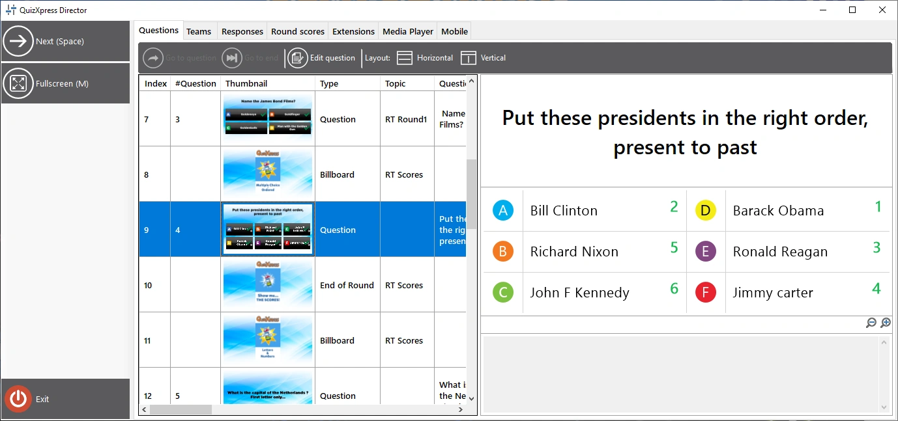

# QuizXpress Director

QuizXpress Director is a tool that gives you advanced control over the running quiz show. It has a separate user interface that can run on your primary screen while the quiz show runs on the attached beamer, TV set, or LED screen. You should set your Windows desktop to ‘extended mode’ for this (on Windows 10, press Windows key + P).

{ width="605" loading=lazy }

The QuizXpress Director user interface consists of a command area (left panel), where all the currently available command buttons are listed, and a set of tabbed views, each having a distinct function.

The available views in Director are:

| **Questions**    | Overview of the loaded quiz and controls to navigate between slides                                                                                                       |
|------------------|---------------------------------------------------------------------------------------------------------------------------------------------------------------------------|
| **Teams**        | Overview of all the teams/players and their scores                                                                                                                        |
| **Responses**    | Real-time response overview                                                                                                                                               |
| **Round scores** | Overview of the scores and winners per round *(only visible if rounds are used in the quiz file)*                                                                         |
| **Extensions**   | List of installed QuizXpress ‘plugins’ and controls to start, stop and configure these plugins                                                                            |
| **Media Player** | A list of media files (sound and video) and controls to add, start, stop, or pause a media file (you can also restart a video or sound on the current slide if available) |
| **Mobile**       | A list of connected mobile devices and various commands to control mobile connections                                                                                     |

There are two ways to open the Director window:

1)  Check the *Enable QuizXpress Director* checkbox in Quiz Setup on the Advanced tab to open Director by default on startup.

2)  At any time during the quiz show, press the ‘D’ key.

For multi-screen configurations, Director opens on the screen opposite to where the quiz show is running. So, if your quiz show runs on the beamer and you have extended your desktop in Windows, Director will open on your laptop screen. You can also explicitly set the target screen for the quiz show in Quiz Setup (‘Screens’ section).

You can always close Director if you no longer need it, and return to it with the ‘D’ key at any time (note: if you started a minigame from within Director, you first need to end that game, or you will lose control over it).

There is also a mobile phone app named QuizXpress Director with (mostly) the same functionality. It allows you to control the quiz at runtime in a similar way to the desktop Director, but gives you the freedom to move around and interact with your audience more freely.
