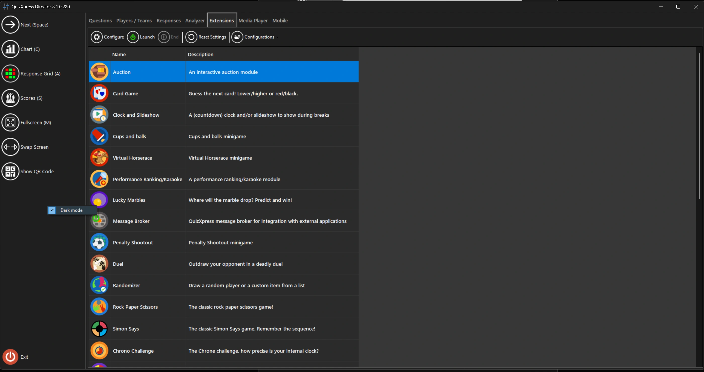

# QuizXpress Director dark mode

To reduce eye strain when running QuizXpress in a venue where it is often dark, Director can be set to dark mode. To do so, right-click the left-hand Director panel and select “Dark mode”:

{ width="602" loading=lazy }

!!! note

    you will need to re-open Director for this setting to take effect.
