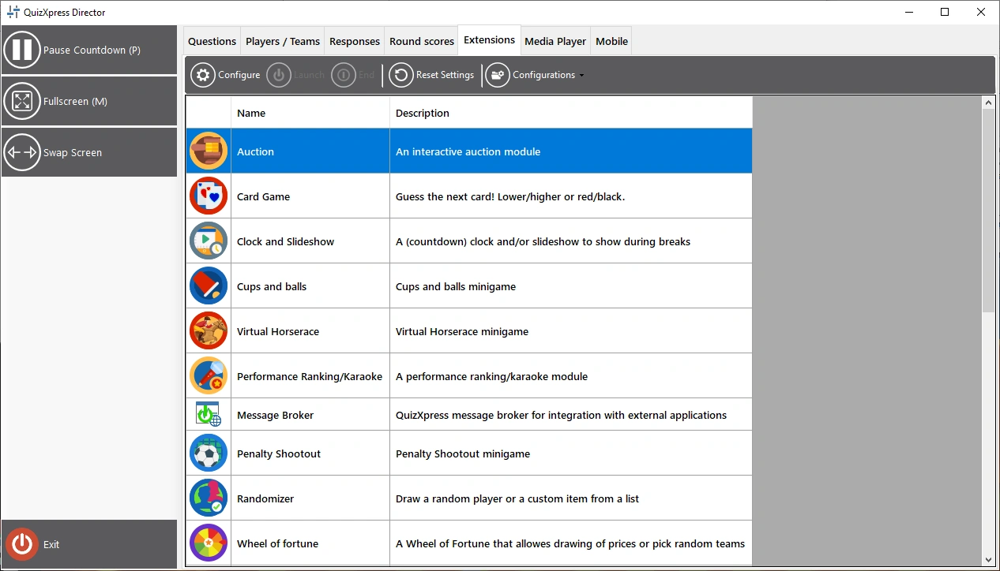
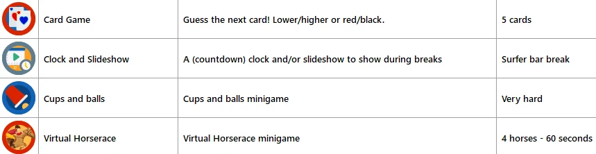

# The Extensions view (mini games and plugins)

The ‘Extensions’ view is your access point to the QuizXpress mini games which are part of your license. From here you can start mini games on the fly at any moment during your quiz when the countdown clock isn’t ticking or being paused. Alternatively, you can insert mini games into your quiz while creating a quiz. You can read more about the available mini games in [Mini games](../../studio/mini-games/index.md).

Please refer to [Majority Rules](../../studio/slide-and-game-formats/majority-rules.md) for more information about inserting mini games into your quiz.

There are three actions you can perform on an installed plugin: configure, launch, and end. ‘Configure’ opens a window to change settings for the plugin. ‘Launch’ starts the plugin on the main quiz screen for the contestants. The ‘End’ button terminates a plugin and returns you to the normal quiz screen.

{ loading=lazy }

When you click the ‘Configurations’ button, you will see that you can create, delete, or rename a configuration. Available configurations are shown in the plugins list, next to each plugin, for you to choose from. You can also clone the currently selected configuration. Press the configure button to change the details of the selected configuration. The selected configuration for a plugin is the one used once you launch the plugin.

{ width="605" loading=lazy }

Once running, the plugin may present additional buttons in the left-hand panel, allowing you to access specific functions of the plugin.

Typically, there is a Next button in the left-hand panel that advances you through the game (alternatively, you can use the spacebar or the presenter remote’s next button).
