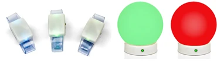
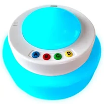
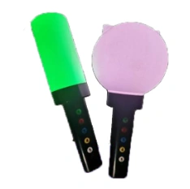

# The Galaxy tab

The Galaxy tab gives you extended control over your connected wireless Galaxy LED devices. This tab is only visible when Galaxy support is enabled in Quiz Setup. Galaxy devices come in different flavors, such as wristbands, spheres, cubes, and QuizXpress Torches.

{ width="374" loading=lazy } { width="103" loading=lazy } { width="115" loading=lazy }

During a quiz, Galaxy devices give feedback to the players by changing their color (to name a few examples: your vote is received, your answer was correct, your answer was incorrect, you are out of the game).

These changes all happen automatically. But there is more that you can do with Galaxy! On the Galaxy tab in QuizXpress Director, there are various options to use your Galaxy devices manually, in different ways:

- Set them to a fixed color (matching your event’s colors, for example)

- Choose one or more lucky winners

- Use them as a light show when playing music

On the next page, you will find a picture of the QuizXpress Director Galaxy tab and a further explanation of the options.

**General section**

- Show correct/incorrect: show whether the answer given was correct or incorrect

- Include inactive players: the Galaxy devices of players that are inactive (dropped out of the game) also participate

- High luminosity: give the lights more brightness (this implies a bit more power consumption)

- Show chosen answer: indicates whether the light will show the color of the chosen answer

- ABCD color boxes: set the colors that are shown for answers A, B, C, and D

**Fixed color section**

Here you can set all Galaxy devices to a fixed color. You could, for example, use this to set them to a color that matches your event, during breaks, or to set a certain mood — for example, when playing a video.

**Select Lucky Winner(s)**

With this section, you can choose one or more lucky winners from the audience by lighting up the Galaxy devices of the winners. The light of the lucky winner(s) moves through the audience and comes to a halt, indicating who the winner is. The options are as follows:

- Color: sets the initial color of the Galaxy devices for all players.

- Color Winner(s): sets the color of the lucky winner(s)’ Galaxy device(s).

- Number of winners: sets how many players win.

- Light speed: sets the speed, in milliseconds, at which the lucky winner(s)’ light(s) move through the crowd.

- Random selection: when enabled, the lights move through the audience randomly. Otherwise, the lights move through the Galaxy devices from number 1 upwards. Note: when the players in the audience are randomly placed, this setting has no effect. It only has an effect when the Random selection setting is off and the players are lined up (for example, in front of an audience).

- Start button: light up all Galaxy devices in the audience with the initial color.

- Choose Lucky Winner(s): let the lucky winner light(s) move through the audience.

- Stop Gradually: let the lucky winner lights come to a halt gradually.

- Stop: stops the lucky winner lights immediately; the winner(s) are known right away.

The Winners box displays the lucky winner(s) so the quizmaster can also see the keypad numbers of the player(s) who won (note: these are not necessarily the same as the Galaxy device numbers — players can have a Galaxy device with a different ID).

**Reverse Lucky Winner(s)**

The Reverse Lucky Winner(s) option lets you pick one or more winners by gradually dropping out players. So, where Lucky Winner(s) chooses one or more winners from an audience, Reverse Lucky Winner(s) drops players until one or more winners are left. The options are as follows:

- Color: sets the initial color of the Galaxy devices for all players.

- Dropout(s) Color: sets the color for the players who have dropped out.

- Number to Drop: sets the number of players to drop.

- Flash before Drop: here you can indicate whether you want the Galaxy devices to flash before the dropped players are shown. There are three options here:

  - Current color: flash all remaining player Galaxy devices in the current color

  - Random color: flash all remaining player Galaxy devices in a random color (with each flash, each Galaxy device shows a different random color).

  - Random all same color: flash all remaining player Galaxy devices in the same random color (with each flash, another random color is shown for all Galaxy devices).

- Start button: light up all Galaxy devices in the audience with the initial color.

- Drop button: drop the indicated number of players.

The *Remaining* box displays the keypad numbers that are still in the race to win.

**Lightshow**

With the light show settings, you can add an extra dimension to music being played by using the Galaxy devices as a light show. The options are as follows:

- Tempo (beats per minute): sets the frequency at which the devices light up

- Tap Tempo button: most often, you don’t know the tempo (beats per minute) of the music being played. By tapping the Tap Tempo button in time with the music a few times, the tempo is determined and shown in the Tempo (beats per minute) box.

- Start button: starts the light show

- There are three color options for the light show:

  - Fixed color: flash all Galaxy devices in the fixed color

  - Random color: flash all Galaxy devices in a random color (with each flash, each Galaxy device shows a different random color).

  - Random all same color: flash all Galaxy devices in the same random color (with each flash, another random color is shown for all Galaxy devices).
