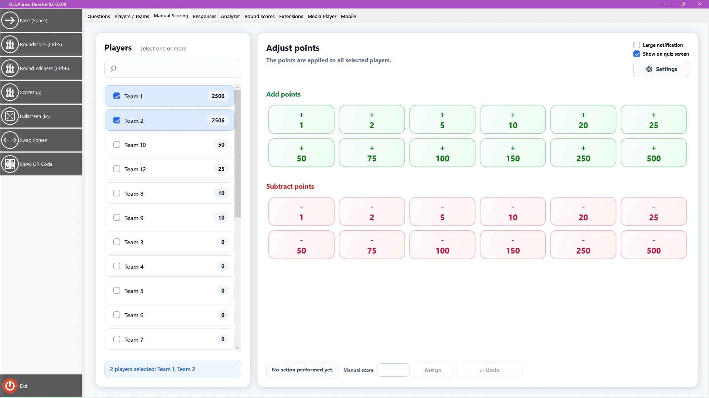

# The Manual Scoring view

This view helps you quickly add/subtract points for one or more teams, for example, for activities that happen outside of QuizXpress. The screen looks like this:

{ width="605" loading=lazy }

Select one or more players from the list on the left, then tap any of the pre-assigned buttons (you can modify the assignment with Settings). With the ‘Show on quiz screen’ toggle, you can decide whether the point change should be shown to the audience. You can undo the last change with the Undo button, and use the Assign button to add or subtract an arbitrary number of points.
