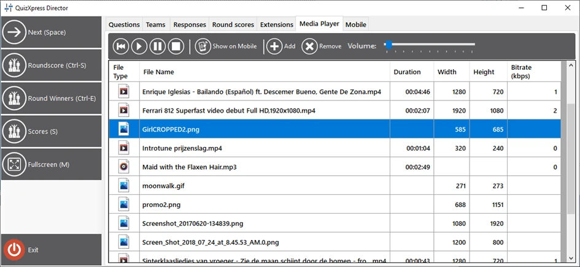
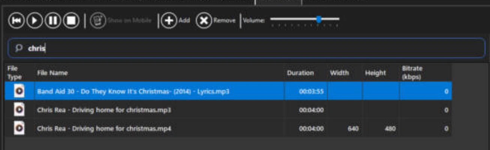
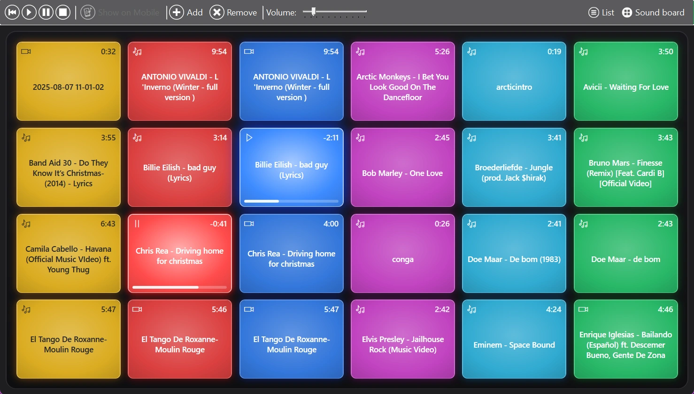
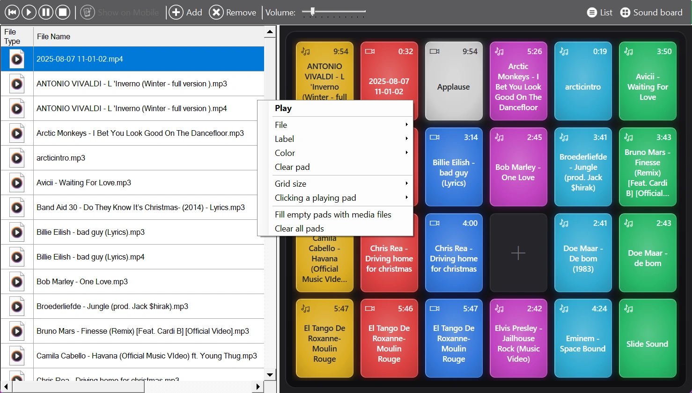

# The Media Player tab

This tab in Director shows the QuizXpress media player. Using the media player, you can:

- Launch a full-screen video on the main screen

- Show a full-screen picture on the main screen

- Start playing an MP3 file

- Present a promo image on the Smart Buzzer app

- Replay/resume the video on the current slide

- Replay/resume the sound on the current slide

- Adjust the volume of the quiz player

- Maintain a list of media files

- Play files with one click from the [sound board](#the-sound-board)

When you add files to the list, they are actually copied to the local QuizXpress application data folder (Explorer path %AppData%\QuizXpress\Media). This prevents issues when original files are moved, deleted, etc. So, if you delete a file from the list, it will be deleted from QuizXpress storage, but the original file will remain untouched.

{ width="605" loading=lazy }

## Searching the list

With many media files, use the search field above the list to find one quickly. Type part of a file name and the list only shows the files that contain it, for example 'chris' finds both 'Chris Rea - Driving home for christmas' and 'Band Aid 30 - Do They Know It's Christmas'. Upper and lower case don't matter. Press Esc or clear the field to show all files again.

{ width="605" loading=lazy }

While you type in the search field, keys such as Space, 'C' and 'S' go to the field and don't trigger the Director shortcuts. The search only filters the list; the sound board keeps all its pads.

## The sound board

Next to the list, the Media Player tab has a sound board: a grid of colorful, glowing pads, like the launch pads DJs use. One click on a pad plays its sound, video or picture, so jingles, applause and walk-on music are always at your fingertips.

{ loading=lazy }

- The pad that is playing lights up and shows the remaining time and a progress bar. A paused pad shows a pause symbol.
- Click a playing pad again to stop it.
- Idle pads show the length of their file.

Clicking a pad also selects its file in the list, so the play, pause, stop and rewind buttons in the toolbar act on that file.

### Showing the list, the sound board or both

Use the 'List' and 'Sound board' buttons on the right of the toolbar to show the list, the sound board, or both side by side. At least one of them is always shown. When both are shown, drag the divider between them to give either one more room. Director remembers your choice.

### Putting files on the pads

The first time you open the sound board, it is filled with your media files automatically. To arrange it yourself:

- Drag a file from the list onto a pad.
- Drag files straight from Windows Explorer onto a pad. They are added to the media list (copied to the media folder, just like 'Add') and put on that pad. When you drop several files, the others go to the next empty pads.
- Drag a pad onto another pad to swap them.

Once you have changed the board yourself, new media files are no longer added to it automatically. Use 'Fill empty pads with media files' (see below) to add them.

{ loading=lazy }

### Pad and board options

Right-click a pad to:

- 'Play' or 'Stop' it.
- 'File': choose which media file the pad plays. Besides your media files, a pad can also control the sound or video of the current slide ('Slide Sound' and 'Slide Video').
- 'Label': give the pad a short name, for example 'Applause' instead of a long file name. Leave it empty to show the file name again.
- 'Color': pick a color, or 'Automatic' to color the pads by column.
- 'Clear pad': remove the file from the pad. The file stays in the media list.

The same menu, also available when you right-click the board around the pads, has options for the whole board:

- 'Grid size': from 3 × 4 up to 8 × 8 pads. Pads keep their place when you change the size.
- 'Clicking a playing pad': choose whether a click on a playing pad stops it (the default), restarts it, or pauses and resumes it.
- 'Fill empty pads with media files': puts the media files that are not on the board yet on the empty pads.
- 'Clear all pads': empties the board. Your media files are kept.

!!! note
    The sound board is stored on this computer, next to the media folder (%AppData%\QuizXpress\SoundBoard.xml), so it is still there the next time you run a show. When you delete a file from the media list, it is also removed from its pads.
