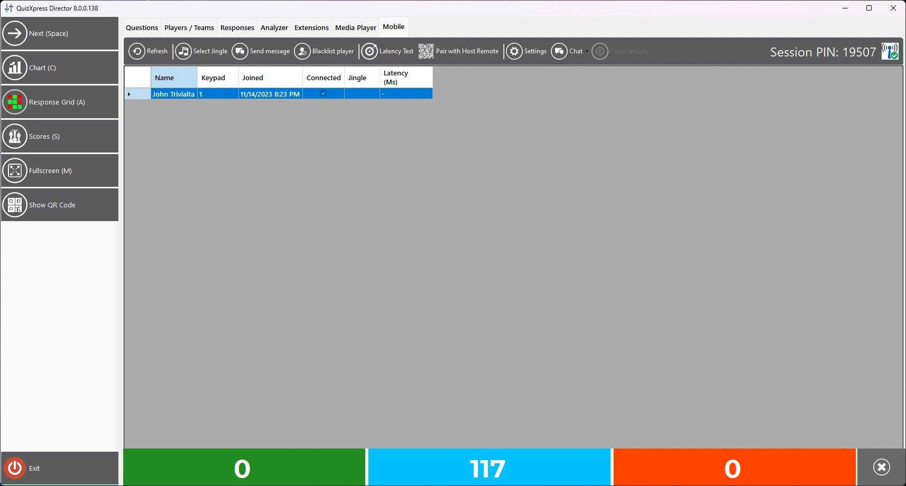
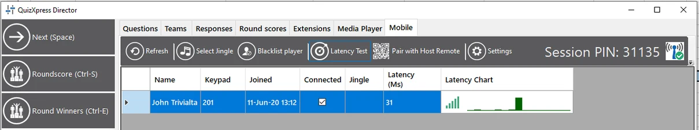
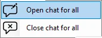
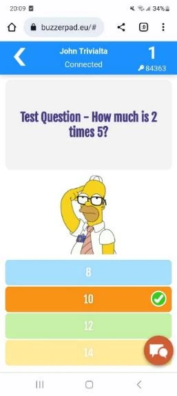
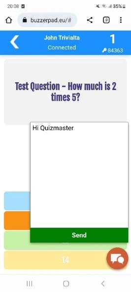
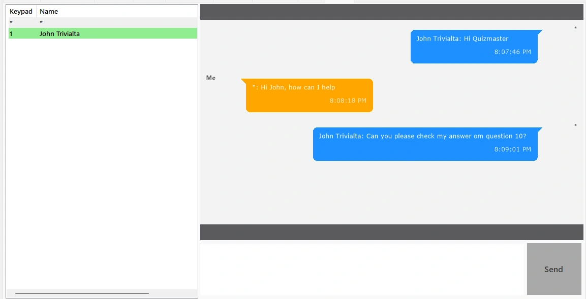
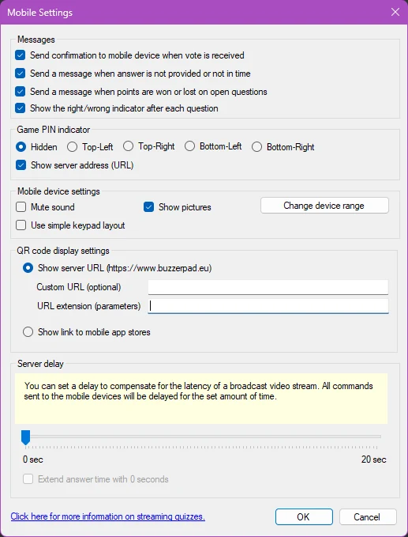
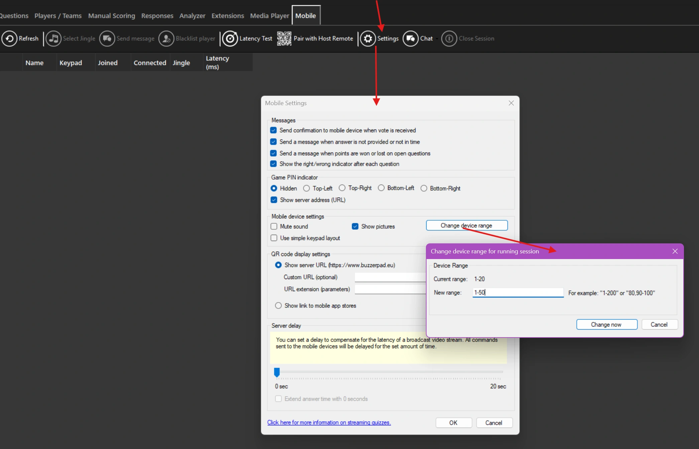

# The Mobile tab

The Mobile tab shows all currently connected mobile devices.

{ loading=lazy }

From here you can:

- Select Jingle: force **jingle selection** for all players using the Smart Buzzer app

- **Send Message:** send a message to the selected player(s)

- **Blacklist Player: block the selected player permanently so they can no longer rejoin your quiz**

- **Latency Test: check the connection quality of all devices**

- **Pair with Host Remote: show the QR code to be scanned by the Director app (mobile quizmaster remote) to add this computer to the list of computers that can be controlled.**

- Settings: open the mobile settings dialog

- Chat: open a chat session enabling you to chat with all players

- On the right, you can see the current PIN (when running in server mode)

## Latency test

The latency test is mostly used when running in local Wi-Fi mode, to test whether all your players have a solid connection to your router. It sends a ping to all devices and measures the time it takes to receive a response. This is plotted behind each mobile device in a chart like this:

{ loading=lazy }

When a device is very slow or disconnected, the chart turns red, and as quizmaster you could warn the player to move closer to the access point. Note: do not leave the latency test running during your quiz, as the test uses Wi-Fi bandwidth and server capacity.

## Instant chat

You can initiate a chat session with the players by clicking the Chat button.

{ width="171" loading=lazy }  
After initiating the chat, players see a chat button on their phone.

{ width="163" loading=lazy } { width="166" loading=lazy }

By pressing the chat button, players can send chat messages to the quizmaster, which are visible on a tab labeled ‘Chat’. The quizmaster sees all chat messages per user and can send a message back to each individual player.

{ width="416" loading=lazy }

!!! note

    currently, this feature is only available for players on the buzzerpad web buzzer. It’s not yet available in the Smart Buzzer app.*

## Settings

There are a few advanced settings that you can find under the *Settings* button:

{ width="332" loading=lazy }

The top checkboxes control optional confirmation messages sent to the connected devices. These messages help users understand what’s happening. The first option reports each received answer back to the device with a message like ‘We received answer D’. The second option only sends back a warning when no answer was received, or the answer was not processed in time (for example, due to latency in the video stream). The third option sends a message with points won/lost to the device after each question, and the last option lets you control whether the device shows if the player answered correctly or incorrectly.

With the ‘Game PIN indicator’ setting, you can configure a PIN indicator to display in four different locations on the quiz screen during the quiz. This setting does not apply when using Wi-Fi mode, since no PIN is used in that mode. The PIN indicator appears as follows:

{ width="310" loading=lazy }

There are also some settings to control the mobile keypad, such as whether it should play sounds, and, for the buzzerpad website, an option to set it to simple keypad behavior, meaning it will only display a 7-button keypad (legacy mode). You can also indicate here whether you want to show pictures on the mobile phones too.

The QR code display section lets you indicate if you would like to show a QR code pointing to the web buzzer as indicated in QuizXpress Setup, or if you would like to show a link to the Smart Buzzer app in the iOS and Android app stores. If you’re showing the URL to the web buzzer, you can specify additional parameters in the URL Extension field which can be used to brand the web keypad. For more information, please refer to [Branding the buzzerpad website](../using-mobile-keypads/branding-the-buzzerpad-website.md).

The Server delay slider can be used to delay all actions sent to the mobile devices, to create better synchronization with your broadcast stream. Keep this value at 0 when not streaming. For example, if the latency on your YouTube stream is ~3 seconds, you can set the delay to 3 seconds. This means that when the countdown starts on the players’ YouTube stream, it will also start on their device. Without the delay, the device countdown would start 3 seconds before the timer starts on YouTube, which can be confusing.

When the ‘Extend answer time’ option is checked, the system continues to accept votes even after the countdown clock has expired, for the time set in the ‘Server delay’ slider. This can be used to compensate for stream latency. For example, if there is a 5-second delay on the stream, the players at the other end of the stream are still watching the clock tick for 5 seconds after it has already stopped in the studio. So, when this option is on, the system will still accept votes in these last 5 seconds, preventing players from missing a question.

**Change mobile device range on the fly**

Imagine you launched an online quiz where you expect up to 20 players (device range “1-20”), and 10 minutes into your introduction, another 15 players want to join. Previously, you’d have to restart the quiz and let everyone re-register on the new PIN, etc. To prevent this, you can now update the mobile device range while your quiz is running.

To do so, open Director in the quiz player, go to the Mobile tab, and click the Settings button. Then click the Change device range button and enter the new range:

{ loading=lazy }

The system will check the range for validity and ask for confirmation. After your approval, the server will be updated. Note that when you make the range smaller — for example, going from “1-50” to “1-20” — the connected players that fall outside the new range will be disconnected.
