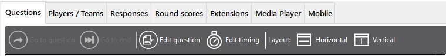

# The Questions view

The ‘Questions’ tab provides an overview of all the questions in the loaded quiz. You can see thumbnails of all the slides, and if you select a question, the question, answers, and documentation are shown in the right pane (note that this is not a full graphical representation).

{ width="582" loading=lazy }

With the toolbar, you can do the following:

- **Go to question: jump to a particular question (only possible when no question is counting down). To do this, click another question in the list, then click ‘Go to question’.**

- **Go to end: jump to the end of the quiz (only possible when no question is counting down). Clicking this button shows the final score overview.**

- **Edit question: just-in-time editing of the selected question (correct spelling, change the correct answer, etc.)**

- **Edit timing**: adjust the timing of your questions (countdown time)

- **Layout Horizontal/Vertical: switch between a horizontal or vertical layout**

The list of questions shows a visual indication of questions that have been visited (green) as well as the current question (yellow).

When the selected slide is a minigame slide, you can double-click that entry to change the stored configuration ‘on the fly’. An example where you could use this is a quiz with several Wheel of Fortune minigames used to give away a set of prizes to round winners: once a prize has been given away, you may want to remove it from the next Wheel of Fortune if you only have one instance of that prize.
