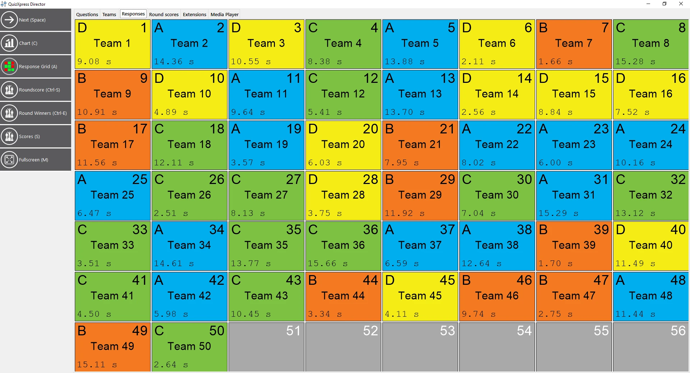

# The Responses view

The ‘Responses’ view provides a ‘real-time’ overview of the responses being received by the system. You can see the keypad number, team/player name, the response given, and at what time (if screen space permits). This is a read-only view with nothing to configure; it helps you during the quiz show, for example, to see which response is still missing. When playing a minigame, you can also see here which choice players made during the game (or which players have not yet made a choice).

{ width="605" loading=lazy }
