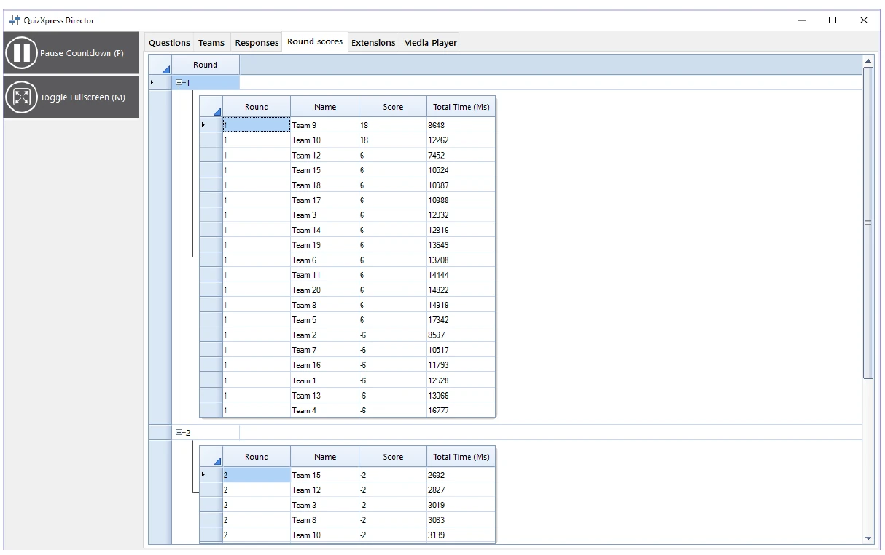

# The Round scores view

If your quiz uses rounds (meaning there is an end-of-round slide somewhere), the ‘Round scores’ tab will be visible in Director.

The Round scores tab shows the total score per round. You can show/hide the scores for each round by expanding/collapsing the round nodes.

{ loading=lazy }
