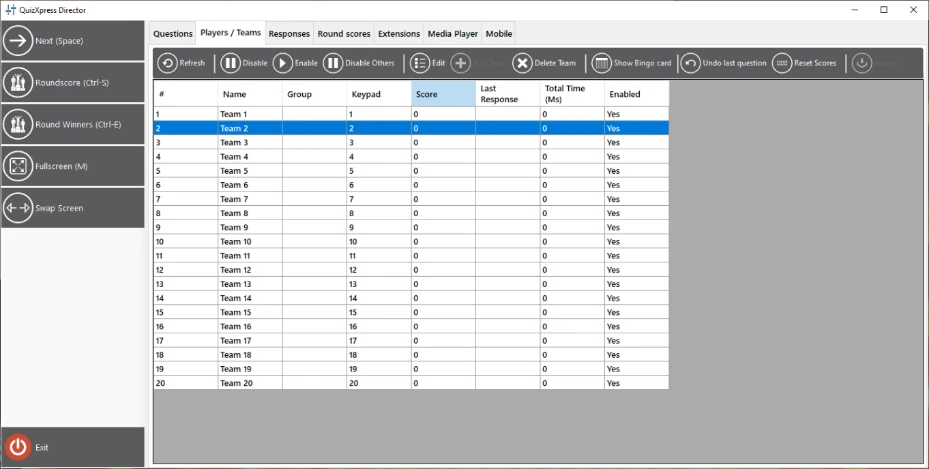
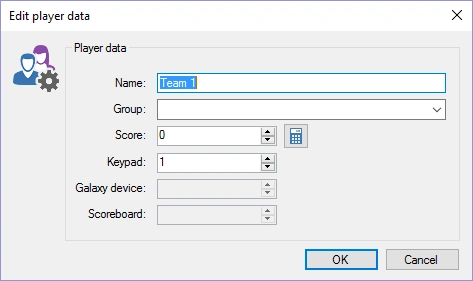
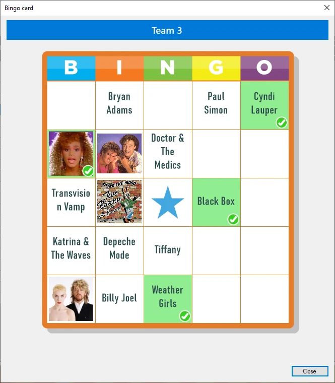
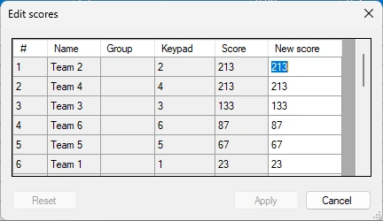
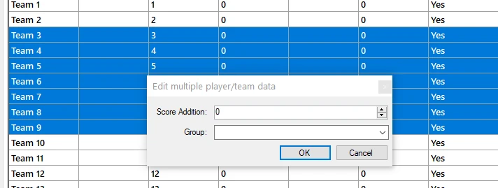

# The Teams view

The ‘Teams’ view provides an overview of all the players/teams currently active on the system. You can see their name, the (optional) group they’re in, assigned keypad, score, last recorded response, and total time spent answering (teams are ranked by score; if scores are equal, the total time spent across all questions is taken into consideration), as well as whether a player is enabled.

{ width="592" loading=lazy }

With the toolbar, you can perform the following actions:

- **Disable/Enable** a player

- **Disable Others – disable all other players except the selected player(s).**

- **Edit the details of a player: shows a window enabling you to modify team name, group (if applicable), keypad, and score. Double-clicking the list also shows the same form:**

> { width="355" loading=lazy }

- **Add a new player/team during a quiz: shows the same window as when editing a team/player. Adding a player may come in handy if a new player needs to be added while the quiz show is already in progress. If the assigned keypad is out of range for the receiver’s current configuration (for example, you cannot add keypad 105 if your keypad configuration states “1-100”), the keypad will be added to the configuration and the receiver will reinitialize.**

- **Delete team: deletes a player/team. Unlike disabling/enabling teams, this permanently removes the team — it will no longer be shown in score overviews.**

- **Show Bingo card: when playing a Bingo round, you can request the Bingo card for the selected player. The played cells are marked green. You cannot see the player’s marked cells.**

> { width="201" loading=lazy }

- **Undo the score changes made during the last question. This can help undo points if, for example, the quiz has an error.**

- **Reset scores**: resets all scores and the total time spent to 0.

- **Edit Scores: easily edit the scores of all teams in a table**

{ width="229" loading=lazy }

- **Import**: import the results (points and keypad assignment) from a previous quiz.

- **Add/subtract points for multiple teams, or group teams dynamically. Select multiple rows using Shift and/or Ctrl+click, then click the Edit button in the toolbar to open the following form:**

> { width="478" loading=lazy }
>
> Enter a group name (or select an existing group from the list) or change the Score Addition field to modify the points of all the selected teams.
>
> When you right-click, you will see a popup menu containing a subset of the buttons shown above, along with some other features, such as:

- Easily add or subtract points (useful, for example, for activity taking place outside the quiz). The add points and subtract points options each have a submenu with preset values. When you choose one of the preset values, the Add and Subtract options shown in the menu are replaced with that value, to be used as a shortcut for future changes.

- The add points and animate option shows a big green checkmark in the center of the screen. Subtract and animate also shows a big red cross centered on the screen.

- The vote option enables you to enter a vote for a player (can, for example, be used for testing)

- If you’re up for some fun, you can let AI ‘roast’ a player publicly after they’ve given a wrong answer. You can select a gentle or mean roast (the ‘meanest’ an AI can do). The generation takes into account the question asked, the player’s name, and the wrong answer given, and is read aloud with an AI-generated voice.

!!! note

    this option requires 5 AI credits (available from our shop) and a working internet connection.*
