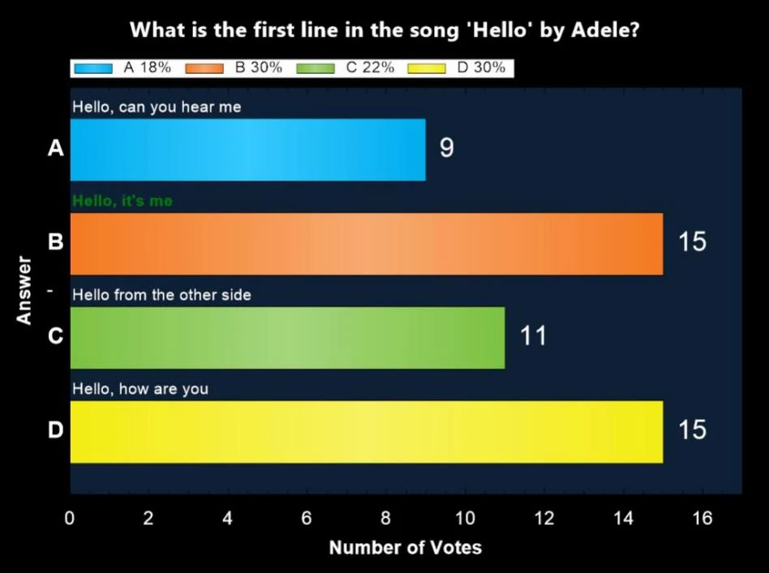

# Chart screen

After a question has ended, pressing ‘C’ shows a chart of the answers chosen, displaying the number of people who chose each answer.

{ width="605" loading=lazy }

If the audience is split into groups, you can press ‘G’ to show a chart displaying the current question’s group scores. Note that the appearance of the chart can be fully customized with skinning.
