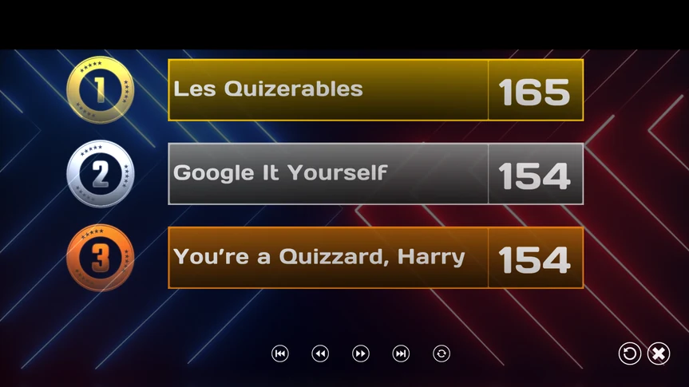
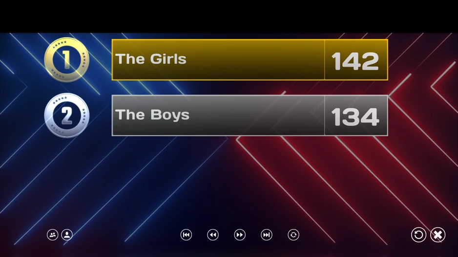

# The final score screen

When the last quiz slide has finished, it's time to announce the final results: a ruffle plays, and the top three teams are shown one by one.

{ width="432" loading=lazy }

At the bottom of the screen, you can see a few buttons that let you navigate through the score list. You can jump one screen ahead or back, or jump straight to the first or last screen. The rightmost of the five small buttons (the rotating arrow) lets the list scroll automatically every few seconds. The button with the ‘cross’ closes QuizXpress Live (or you can hover the mouse over the top right of the screen).

Alternatively, when QuizXpress Director is open, the buttons aren’t visible at the bottom. You can then navigate through the scores using the buttons shown in Director on the left-hand side, the computer keyboard (space/page up/page down), or the remote control.

To create more suspense, activate the following option on the Advanced tab in Quiz Setup:

{ width="341" loading=lazy }

When this setting is activated, initially no scores are shown. By pressing ‘Next’ on the remote control, ‘Next’ in Director, or the spacebar on the computer keyboard, third place is revealed first, then second, then first, then the rest.

In case a quiz contains multiple ‘Demographic’ groups of people (see [Demographic](the-quiz-screen-voting-everybody-answers.md#demographic)), the final score screen looks slightly different.

By default, group scores are shown. You can toggle between group scores and individual scores by pressing the two leftmost buttons at the bottom. Press the button with ‘two heads’ to show group scores. Press the button with ‘one person’/‘two persons’ to toggle between individual and group scores.

{ width="469" loading=lazy }
