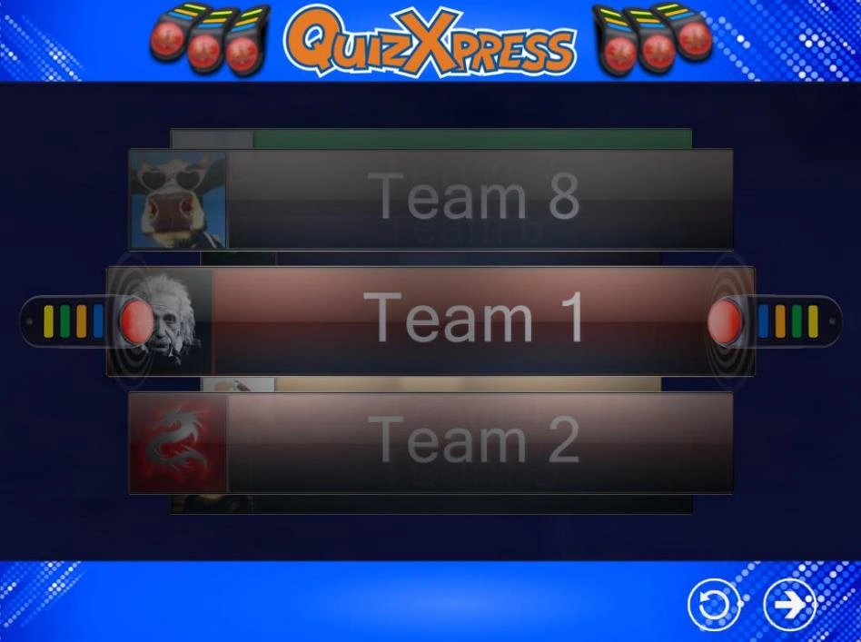
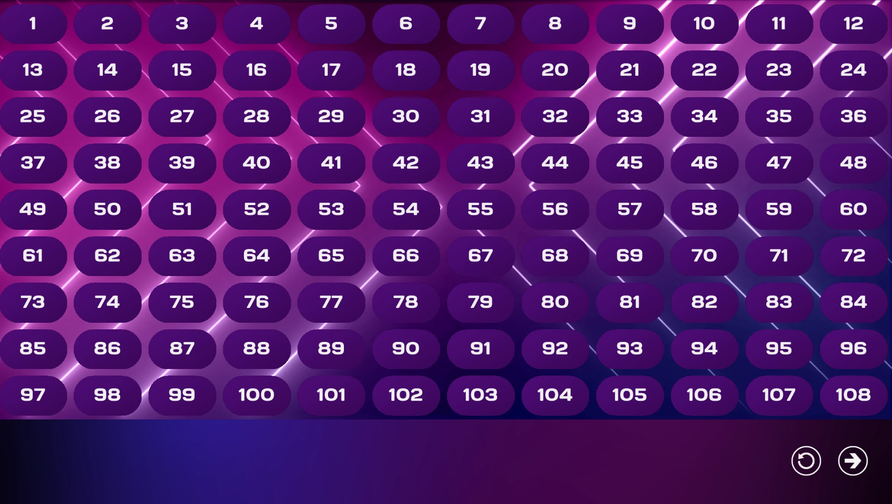
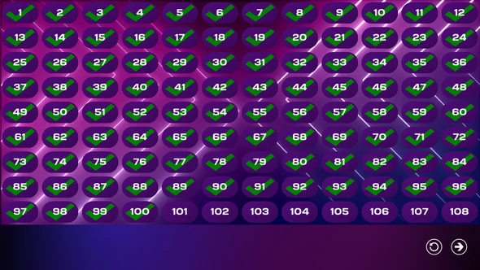

# The keypad and buzzer registration screen

The purpose of the registration screen is to find out which buzzers/keypads are participating in the quiz event. By having participants explicitly register, the software knows how many devices are present. There are three different ‘flavors’ of buzzer assignment screens:

- Sony Buzzer Assignment screen

- Buzzer Assignment screen for fewer than 100 participants

- Buzzer Assignment screen for more than 100 teams

## Sony Buzzer Assignment Screen

When using Sony buzzers, names can be entered in the Quiz Setup program for each participant/team. Because a Sony buzzer does not have an explicit identifier, it is not possible to link a team name to a specific buzzer when defining the team names in Quiz Setup. The Buzzer Assignment screen solves this: it shows the team names one by one, and when a team sees its name appear at the front of the ‘Buzzer Assignment Carousel’, the buzzer should be pressed to register for participation in the quiz. Below you can see a screenshot of the Sony Buzzer Assignment screen.

{ width="605" loading=lazy }

At the bottom, you see two buttons: the left one (the round arrow) resets the data so the buzzer assignment starts over; the rightmost button is the ‘start’ button, which starts the quiz.

## Buzzer Assignment Screen, less than 100 participants

Each Reply/QuizXpress keypad has a unique identifier, which is also used in the QuizXpress Live software to identify a participant (for example, buzzer with ID 1: Team 1). When fewer than 100 buzzers take part in the quiz (as determined by the ‘Keypads’ setting entered in Quiz Setup), a grid is shown with all buzzer identifiers.

When a keypad key is pressed, it is registered as active in the QuizXpress Live system. A tick mark appears in the grid at the number corresponding to the ID of the buzzer pressed.

Strictly speaking, it isn’t necessary for the buzzers to explicitly sign in. However, the QuizXpress Live software needs to know exactly how many teams are participating, so it can determine when all teams have answered a question and stop the countdown.

The button displayed at the bottom of the screen is the ‘start’ button, which starts the quiz. Below you can see two screenshots, one showing the screen before anyone has signed in, and one showing the state of the screen once everybody has signed in.

| { width="293" loading=lazy } | { width="295" loading=lazy } |
|--------------------------------------------------------------------------------|---------------------------------------------------------------------------------|

!!! note

    for testing purposes, you can assign all 100 buzzers at once by pressing F1, or all buzzers configured in Quiz Setup by pressing F2.*

## Buzzer Assignment Screen, more than 100 participants

When more than 100 buzzers are used, a grid becomes increasingly difficult to read. This is why QuizXpress Live uses a different Buzzer Assignment screen in that case. See below for a screenshot.

The button displayed at the bottom of the screen is the ‘start’ button, which starts the quiz.

!!! note

    no buzzer assignment screen is shown when using Keyboard or Game port type buzzers, as these systems have a fixed assignment.*
