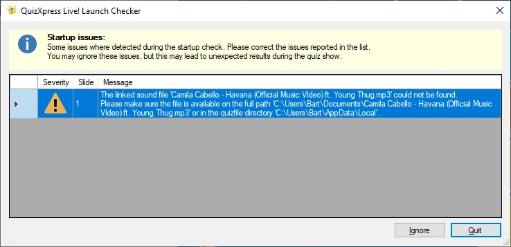

# The launch checker

Before your show starts, QuizXpress Live checks several conditions, such as whether the external videos in the quiz are still available, whether various directories are accessible, and whether all custom sound files can be found. This prevents surprises during the quiz.

When issues are found, the following window appears (actual warning messages may differ):

{ width="591" loading=lazy }

You can decide whether to continue running the quiz (by clicking ‘Ignore’) or stop to fix the issues (by clicking ‘Quit’). Continuing to run the show while there are warnings or errors may result in problems or unexpected behavior during the quiz show.
