# ­The quiz screen: voting (everybody answers)

After the countdown video (which can be turned off and/or replaced with your own video in Quiz Setup), the quiz screen appears. As you can see from the screenshot below, there are some areas that need specific attention, all part of what we call the ‘Information Panel’:

1.  The countdown timer. This timer counts down from the time indicated when creating the quiz in QuizXpress Live until zero. Below the timer, you can see an indication of the position of the question in the quiz, in the format \<question number/total number of questions>.

2.  The teams (participants) that pressed their keypad. This indicator has three stages: first, it shows a grid of squares indicating from which keypad a response was received, giving an overall picture. When only a few keypads are left, it shows the individual keypad numbers. When even fewer are left, it shows the names of the players as set in Quiz Setup, helping the quizmaster identify the last few players still to respond.

3.  The total number of players that already provided an answer.

4.  The number of points to be gained by answering the question correctly. Note that points may decrease over time depending on the slide’s settings as set in Studio.

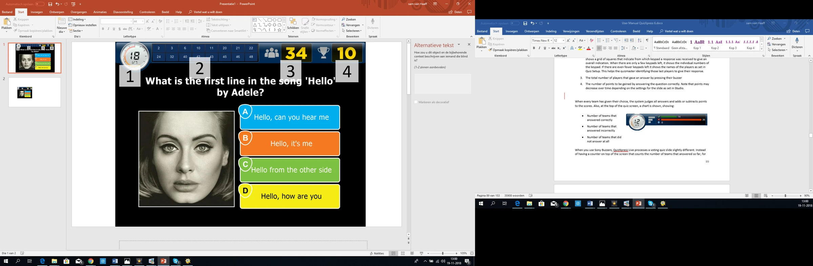{ width="518" loading=lazy }

When every team has made its choice, the system judges all answers and adds or subtracts points from the scores. Also, at the top of the quiz screen, a chart is shown:

<table>
<colgroup>
<col style="width: 36%" />
<col style="width: 63%" />
</colgroup>
<thead>
<tr class="header">
<th><ul>
<li>
Number of teams that answered correctly
</li>
<li>
Number of teams that answered incorrectly
</li>
<li>
Number of teams that did not answer at all
</li>
</ul></th>
<th></th>
</tr>
</thead>
<tbody>
</tbody>
</table>

When you use Sony Buzzers, QuizXpress Live processes a voting quiz slide slightly differently. Instead of a counter at the top of the screen counting the number of teams that have answered so far, a panel pops up with each team’s name and avatar as they answer. After everyone has pressed their buzzer (or the countdown has reached zero), QuizXpress Live shows all the chosen answers, judges them, and displays the total scores of all teams. A visual representation of this sequence is shown below.

| 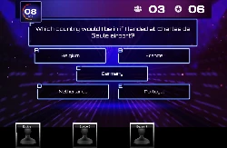{ width="160" loading=lazy } | 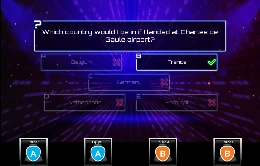{ width="166" loading=lazy } |                                                                                 | 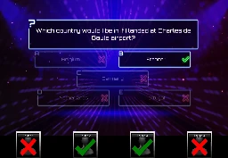{ width="155" loading=lazy } |
|---------------------------------------------------------------------------------|---------------------------------------------------------------------------------|---------------------------------------------------------------------------------|---------------------------------------------------------------------------------|
| 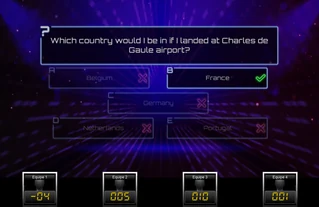{ width="160" loading=lazy } |                                                                                 | 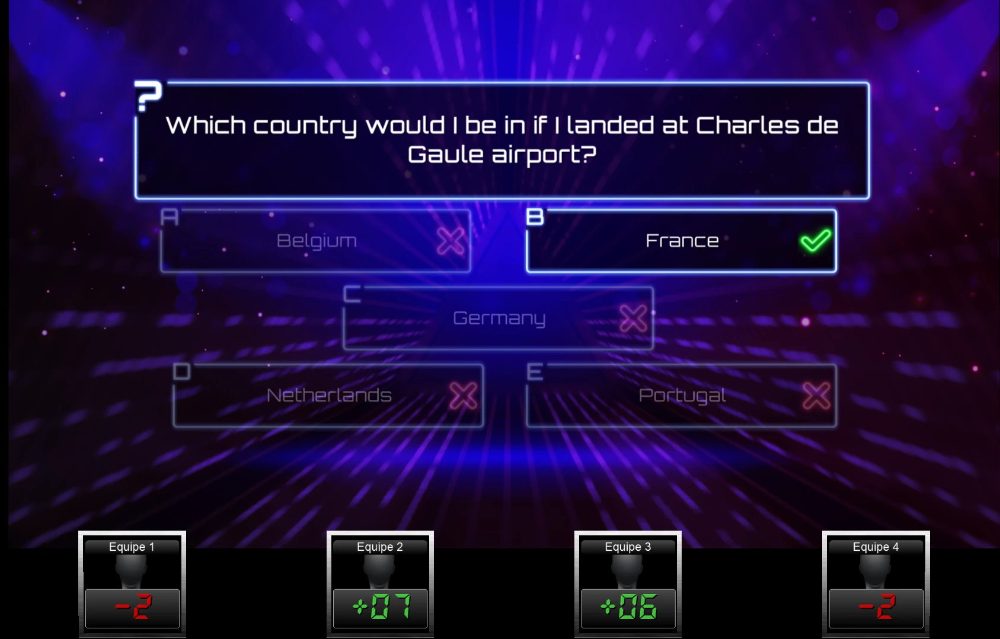{ width="168" loading=lazy } | 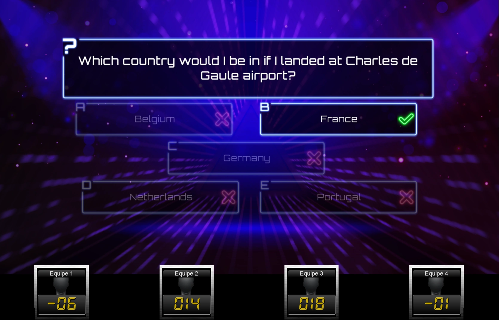{ width="159" loading=lazy } |

Voting is one of the possible modes for a quiz slide. Other variations are described below.

## Fastest Finger/ Lock-out

In the previous section, we discussed the screen for a ‘voting’ question, where everyone can answer. With a fastest-finger question, only the first person to press their buzzer can answer. If they answer incorrectly, points are deducted from their score and the countdown continues. The other players then get a chance to press their buzzer (the player who answered incorrectly can no longer answer the current question).

On the next page you see a picture of a typical fastest finger screen. The most important difference in comparison with a voting screen is that in this screen there is a big bar at the bottom with the team name from the team (or person) that first pressed their buzzer. This bar also shows the answer that was given, the team’s avatar, as well as the points gained/lost. In this case team 17 gave the right answer, by which they earn 10 points. The big green checkmark indicates the question was answered correctly. In this example, the correct answer was set to Answer-‘D’ in QuizXpress Studio, and the ‘autojudge’ (judge question automatically in the menu ribbon bar) option of the Quiz slide was set to true. In this case, QuizXpress automatically judges the answer when a multiple-choice button is pressed on a buzzer. When a buzzer does not have a multiple-choice button (for example the Sparkle poles), the ‘auto judge’ option automatically does not apply. In that case the team\player needs to answer verbally after which the quizmaster should judge the answer by using his remote, the keyboard of the computer or QuizXpress Director. You can read more about quizmaster commands in [Controlling the quiz](../controlling-the-quiz.md).

The fact that ‘Team 17’ pressed first can be verified by checking the ‘Information Panel’ at the top of the screen. This panel shows, in separate boxes, the time each team buzzed in. Each box contains the name of a team that pressed their buzzer, together with the timestamp at which they pressed, ordered from left to right, starting with the fastest team.

| 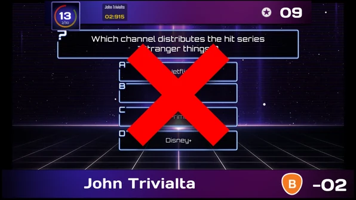{ width="298" loading=lazy } | 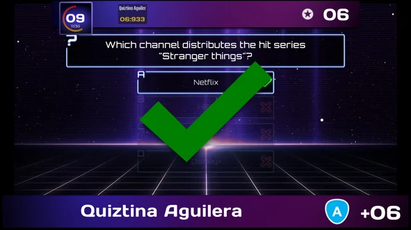{ width="296" loading=lazy } |
|---------------------------------------------------------------------------------|---------------------------------------------------------------------------------|

Note that the Information Panel at the top shows the number of points to be gained (which can diminish over time as explained earlier). Also, there is no indicator of the number of teams that answered, as this is not applicable for a fastest-finger question.

!!! note

    When you use the QuizXpress buzzers (which have both ABCD multiple-choice buttons and a big buzzer button) for multiple-choice questions, keep these two options in mind:*

- *When ‘auto judge’ is ‘true’ in the properties window (menu ribbon bar equivalent: ‘Judge question’ is set to ‘Automatically’), participants need to use the ABCD buttons on the buzzer. QuizXpress automatically judges the answer given.*

- *When ‘auto judge’ is ‘false’ in the properties window (menu ribbon bar equivalent: ‘Judge question’ is set to ‘Manual’), participants need to use the big buzzer button to buzz in. The player who pressed fastest then verbally gives the answer, and the quizmaster judges it.*

## Billboard

A Billboard quiz slide is a quiz slide with which no player interaction is possible — it’s simply a static display. You can design a Billboard slide just like a normal question, using text, colors, pictures, sounds, and videos.

Useful applications of a Billboard slide include:

- Round indication

- Show the question (as a preview) before a voting quiz slide.

- Show marketing information in the form of pictures, sounds, or videos

## End of Round

Within QuizXpress, you can indicate that a quiz slide marks the ‘end of a round’. You do this by setting a quiz slide’s type to ‘End of Round’ in QuizXpress Studio.

When an End of Round slide is shown during a quiz show, no interaction with the participants takes place. For example, you could use it to display the text ‘End of Round 3’. As before, you can design the slide however you like, using video, sound, and pictures.

When setting a slide to ‘End of Round’, there is another option, called ‘end of round action’, that can be set. This can be set to one of the following options:

- Disable one player: automatically dismisses the player with the fewest points. If multiple players are tied at the bottom of the intermediate score list, the quizmaster selects which player will be dismissed, using the arrow keys on the keyboard or the quizmaster remote control. The selected player/team is highlighted with a blinking red light. Pressing the spacebar on the keyboard, or the bottom button on the quizmaster’s remote, dismisses the selected player. Deciding which player to dismiss when multiple teams have the same score is outside the scope of QuizXpress Live — for example, a quizmaster could ask an estimation question and dismiss the player whose answer is furthest from the correct one.

> 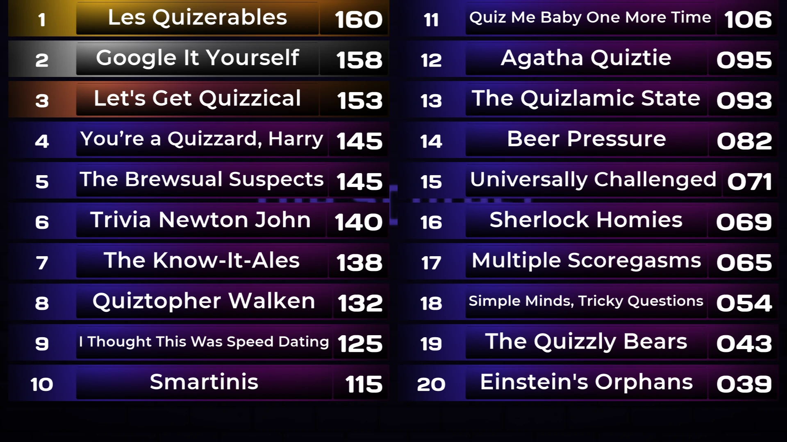{ width="524" loading=lazy }

- Manually dismiss players: the quizmaster can select any number of players to dismiss. They do this one by one, again using the keyboard or the quizmaster remote to select them. An example of an ‘End of Round, quizmaster selects losers’ quiz slide is shown above. The ‘play’ button at the bottom of the screen indicates that the quizmaster has finished dismissing players; pressing it (select it with the keyboard and press space) continues the quiz. The button with the rotating arrow undoes the dismissal process if the quizmaster dismisses someone by mistake, after which they can restart dismissing players.

- Automatically dismiss players: with this option, the system automatically disables a certain number of players (as configured for the slide in Studio), with no visual feedback shown to the audience.

Show scoreboard/Show round scores: the system shows the leaderboard for either the entire quiz or the current round.

Reset scores: resets all scores at the end of the round.

A round is defined as the set of slides between:

- The first slide in the quiz and the first End of Round slide (round 1)

- Two *End of Round* slides

- The slide following the last *End of Round* slide and the last slide of the quiz

Below you can find an example of a quiz with three rounds.

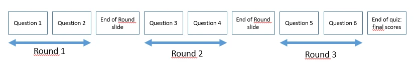{ width="595" loading=lazy }

An ‘End of Round’ slide can also be used for ‘Last Man Standing’ rounds. When ‘Last Man Standing’ questions are used, players who answer incorrectly are dismissed from the quiz and can no longer play along. When an ‘End of Round’ slide is shown, all players who are out of the game because of ‘Last Man Standing’ questions can rejoin.

!!! note

    Players\Teams can also be activated\deactivated from QuizXpress Director. In QuizXpress Director, you can also add new players during a quiz or modify the points of a team. See [QuizXpress Director](../quizxpress-director/index.md)for more information about QuizXpress Director.*

## Test Question

A ‘Test Question’ quiz slide behaves just like a normal quiz slide, except that no points are added/subtracted when the question has been answered. It can be used to demonstrate how the system works and is often used as the first question in a quiz to get the players acquainted with the system.

## Demographic

The quiz slide type ‘Demographic’ enables you to divide all players into different groups competing against each other (examples of these kinds of quizzes include ‘battle of the sexes’, ‘marketing versus finance’, etc.).

To use this functionality, set the type of a quiz slide to ‘Demographic’ in QuizXpress Studio. An entry field then appears in the property grid called ‘Demographic group’, where you can enter a demographic group name (e.g., ‘Males’). For the quiz slide layout, you must select a layout that contains a question and no answers. Enter a question text that tells the players a certain group of people must press their buzzer to become a member of a specific group (e.g., ‘Please press your buzzer if you are male’).

!!! note

    Alternatively, you can divide the audience in groups before a quiz starts in QuizXpress Setup. Here you can define which keypads belong to which group. For more information, please refer to [Grouping keypads](../../setup/setting-up-teams-the-teams-tab-page.md#grouping-keypads)*

## Last Man Standing

A quiz slide of type ‘Last Man Standing’ dismisses any player(s) who answer a question incorrectly from the quiz round. If the dismissal leaves one remaining player, that player wins the round, and the quiz advances to the first End of Round slide it encounters, or to the end of the quiz. If all remaining players answer a question incorrectly, however, none of them is dismissed.

## Audience response questions

This is a type of question that can be used to collect arbitrary data/statistics from your audience. The answers given to an audience response question are recorded but have no impact on the scores. After an audience response question, you can show a chart with the ‘C’ key to display the distribution of the answers given.

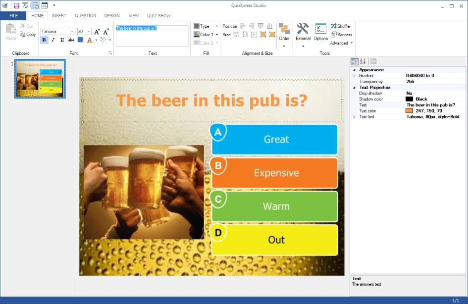{ width="604" loading=lazy }

## Wager question

Wager questions can be used to have the audience place a bet on the outcome of the next question. They allow you to create ‘Jeopardy-style’ questions where people gamble points based on how much they think they know about a subject.

When you set a quiz slide to type ‘Wager’, it looks as follows in QuizXpress Studio:

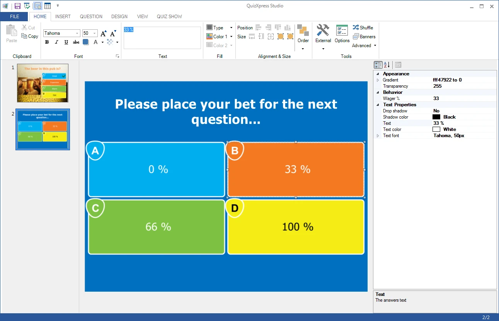{ width="605" loading=lazy }

The question text is by default changed to “Please place your bet for the next question…”, but you can change the text later to whatever you like. The answers to this type of question are used to set the percentage of the score the player can win or lose on the next question. For example, if the player answers ‘C’ to this question, it means they bet 66% of their score on the next question. If they answer the next question correctly, their score increases by 66%. Of course, if you use a slide layout with five answers, the percentages are distributed across five options (0%, 25%, 50%, 75%, and 100%). You can also set the percentage manually by clicking any of the answers and changing the ‘Wager %’ property.

Wagers can also be used with a number of points instead of a percentage.
