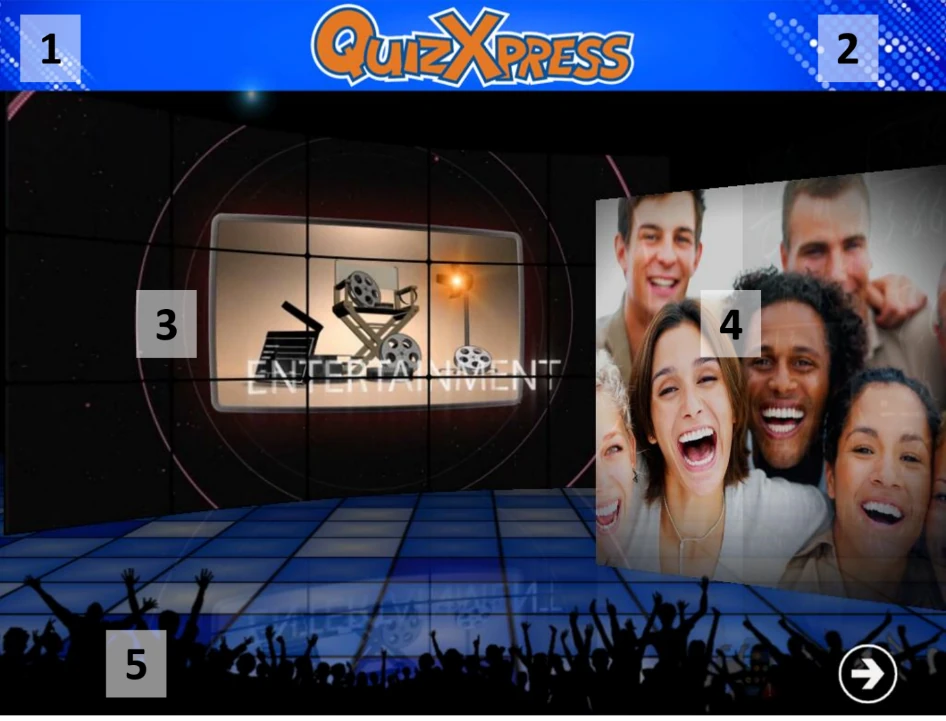

# The Welcome screen

When the application starts, the first screen you see is the Welcome screen, shown in the screenshot below. Various elements on the Welcome screen can be customized using Quiz Setup; the customizable elements are visually marked in the screenshot.

1.  A header text.

2.  A logo is shown next to the header text.

3.  The introduction movie or picture shown.

4.  The pictures shown in the slideshow.

5.  A footer text (if you set a footer text, it will be shown on a blue strip)

> { width="605" loading=lazy }

To advance to the next screen (the buzzer registration screen), press the button at the bottom right of the screen or press the spacebar on the keyboard.

!!! note

    If you see a blinking buzzer/keypad icon at the bottom right of the screen, this means the system did not find the wireless receiver. In this case, check that the hardware is connected properly and that the buzzer configuration is set correctly in Quiz Setup.*
