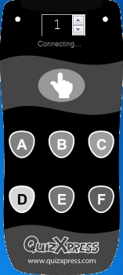
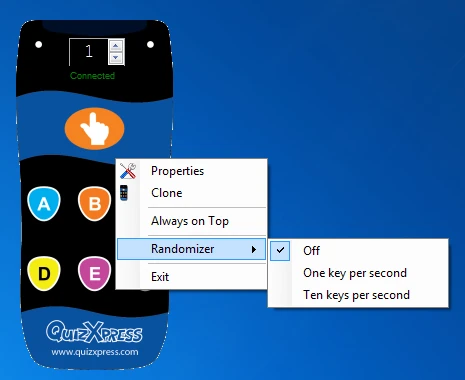

# Testing with Virtual Keypads

The Virtual Keypad is useful for testing your quiz without any external dependencies. It's a software keypad that runs on the same machine as your quiz. You can launch a new Virtual Keypad (VK) either from the External Tools dropdown in Studio or from the Windows Start menu, in the QuizXpress section. Once a Virtual Keypad instance is running, it starts trying to connect to QuizXpress Live. Until it succeeds, the keypad buttons are grayed out.

| { width="107" loading=lazy } | { width="105" loading=lazy } | { width="290" loading=lazy } |
|---------------------------------------------------------------------------------|---------------------------------------------------------------------------------|--------------------------------------------------------------------------------|
| Connecting                                                                      | Connected                                                                       | Virtual Keypad Context menu                                                    |

Once connected, you can change the keypad number on the fly with the spinner. To access the context menu, right-click the keypad screen. The context menu offers the following commands:

| Menu          | Description                                                                              |
|---------------|------------------------------------------------------------------------------------------|
| Properties    | Opens the Properties dialog, where you can see the server IP address and port being used |
| Clone         | Clones a new instance. The keypad ID will increment                                      |
| Always on Top | Keeps the keypad in front of all other applications                                      |
| Randomizer    | Enables/disables a mode where the keypad sends random input for easy testing             |
| Exit          | Closes the Virtual Keypad                                                                |
