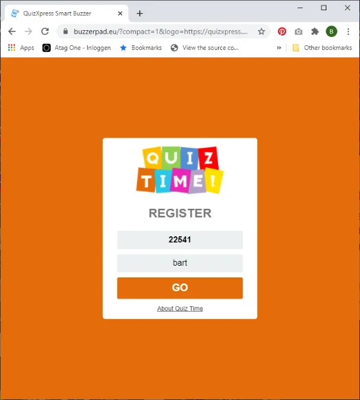

# Branding the buzzerpad website

There are three ways you can create a custom appearance of the QuizXpress buzzerpad website:

1)  We can buy a custom domain for you and create a branded version for you behind that domain. Contact us at info@gameshowcrew.com for details and pricing.

2)  You can pass parameters on the URL to customize the appearance and link to that from your own website (you don’t want your customers to have to work with the long link) or use a website like https://tinyurl.com/ to hide the URL parameters. If you are showing a QR code onscreen (press Q when the quiz is running in the quiz player) for easy access of the players to the web buzzer, you can indicate the branding parameters for the QR code in QuizXpress Director. On the Mobile tab, press Settings and in the configuration dialog that is shown, enter the parameters in the URL Extension field. Please refer to 5.7.8.3 for more information.

3)  Embed the buzzerpad website in an iFrame and pass the parameters from the iFrame

> reference. This also allows you to add your broadcasting stream (like YouTube) on the same
>
> page. If you need more information about this, feel free to contact us at info@gameshowcrew.com.

Customizing with URL parameters

You can pass several parameters to the buzzerpad website to customize its appearance according to your needs. The parameters are:

| **Name**    | **Description**                                                                                           | **Example**                                                 |
|-------------|-----------------------------------------------------------------------------------------------------------|-------------------------------------------------------------|
| name        | Pass the player name                                                                                      | name=John                                                   |
| fname       | Pass the player name and make the input field read-only                                                   | fname=Peter                                                 |
| themecolor  | The main color for the site                                                                               | themecolor=FE5602                                           |
| about       | The about text displayed on the logon page (make sure to use HTML escaping for the space character, etc.) | about=About%20QuizXpress                                    |
| abouturl    | The URL the about text should be linked to                                                                | abouturl=https://www.quizxpress.com                         |
| gotext      | The text on the GO button                                                                                 | gotext=ENTER (note make sure to properly encode the string) |
| compact     | Pass 1 to make the layout of the login screen more compact                                                | compact=1                                                   |
| logo        | URL to your own logo. Make sure the logo is 120 pixels high, with a transparent background                | logo=https://www.quizxpress.com/logo.png                    |
| pin         | Pass the PIN code so the player does not need to enter it                                                 | pin=12345                                                   |
| ticket      | Pass the ticket code                                                                                      | ticket=AG1234F                                              |
| uid         | Pass a fixed user identity as a GUID (hexadecimal format is XXXXXXXX-XXXX-XXXX-XXXX-XXXXXXXXXXXX)         | uid=aed6373a-db53-499d-9428-a7ad22289272                    |
| autoconnect | When passing *fname*, *pin*, and *autoconnect*=1, the keypad will sign in automatically                   | pin=12345&fname=Player1&autoconnect=1                       |

For example:

[https://buzzerpad.eu/?compact=1&logo=https://quizxpress.com/files/quiztime.png&themecolor=E46C0A&about=About%20Quiz%20Time](https://buzzerpad.eu/?compact=1&logo=https://quizxpress.com/files/quiztime.png&themecolor=E46C0A&about=About%20Quiz%20Time%20)

This will look as follows:

{ width="286" loading=lazy }

The ‘quiz time’ logo image was uploaded to the quizxpress.com website so it could be used as a custom logo. Your logo must be stored somewhere on your own website.
