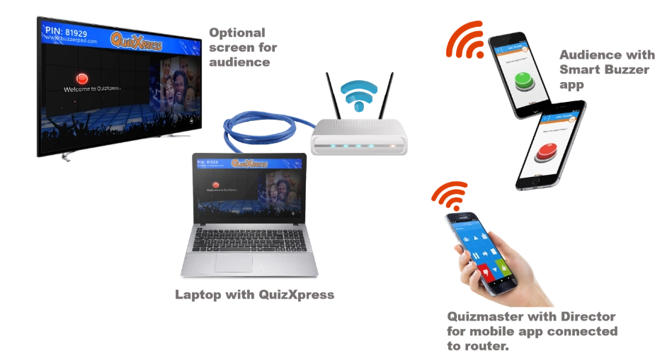

# Setting up the system

As discussed before, there are several different possibilities with the system addressing different scenarios. For more information on configuring QuizXpress for use with Mobile phones please also refer to [Setting up mobile keypad support](../../setup/setting-up-mobile-keypad-support.md).

**Server mode**

When using the system in server mode, you need a **reliable internet connection** with decent speed. The data traffic is not very high for QuizXpress compared to for example a video stream, but an unreliable connection or severe speed drops will have major impact on the system and the overall experience. Of course, when streaming your quiz to the internet at the same time there may be additional requirements for the video stream. It is always advisable to connect your computer to your router using a cable for a more constant and reliable connection. There are two ways your audience can participate in your quiz; using the buzzerpad.com website or by using the Smart Buzzer app. See the next chapters for details. In [Setting up mobile keypad support](../../setup/setting-up-mobile-keypad-support.md) you can read all about how to configure the system for server mode in Quiz Setup.

**Stand-alone Wi-Fi mode**

In a standalone Wi-Fi setup, you connect your laptop to your router using a network cable. The router acts as a local Wi-Fi access point for your players' mobile devices, your device running the remote-control app, and your laptop. See below for a picture of such a setup:

{ width="604" loading=lazy }

The laptop gets an IP address from the local router and doesn't need any internet connection. A standard, decent router supports up to ~50 players; routers that handle more connections are also available. The phones/tablets must connect to the same router, and when launching the Smart Buzzer app, the JOIN WI-FI GAME button is enabled once the device finds the running quiz.

Note that some antivirus packages come with very strict integrated firewalls, and these firewalls need special setup to allow network traffic for QuizXpress. To add an exception for QuizXpress, allow all traffic for the program *qxserver.exe*, found in the QuizXpress installation folder. This is not needed for the standard Windows firewall.
