# Using the QuizXpress mobile apps

QuizXpress Mobile also offers two apps, both available for Android and iOS.

**QuizXpress Smart Buzzer**

This is the app used by the players of the quiz. Before launching your first quiz, instruct your players to download the free QuizXpress Smart Buzzer app from their phone’s app store. Just search for *QuizXpress Smart Buzzer*, install it, and they’re good to go.

{ width="226" loading=lazy }

**QuizXpress Director app**

For the host/presenter of the quiz, we have a separate app available called *QuizXpress Director*. This app lets the host control the quiz (show the next question, reveal the answer, show intermediate scores or charts), manage teams (change scores or team names), start minigames, play sounds through a soundboard, and do many other things!

The following sections describe the apps in more detail.

## QuizXpress Smart Buzzer app

When starting the app, players see the option to join a game by local Wi-Fi or by PIN.

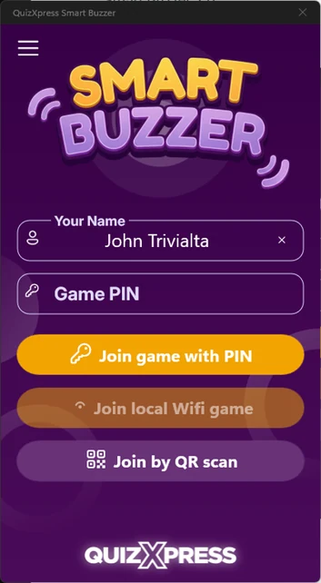{ width="177" loading=lazy }

When running the game with a Wi-Fi router connected to the computer, the ‘Join local Wi-Fi game’ button is enabled. Tapping the button connects to the quiz running on the local Wi-Fi.

When playing without a Wi-Fi router, and therefore connecting remotely over the internet, the quiz player shows a PIN code onscreen. Players can enter this PIN code by pressing ‘Join game with PIN’.

Once logged in, the welcome screen as configured in the Branding section of the settings is displayed (please refer to [Setting up mobile keypad support](../../setup/setting-up-mobile-keypad-support.md)).

If you configured jingles by setting the Jingles folder in the settings, players will be shown a list of all available sound fragments. Each player can choose a jingle to be used during the game in the following situations:

- Bonus points - the sound of the player who was first to give the correct answer is played when the bonus points screen is shown.

- Fastest finger – the sound of the player who pressed first is played, along with the player’s name appearing onscreen in the quiz player.

- Intermediate score overviews – the sound of the player who is ranked first is played when showing the leaderboard.

> As quizmaster, you can always trigger jingle selection manually for a specific device on the Mobile tab in Director.

On the left, you see an example of a ‘first letter’ type question.

You see several elements onscreen:

- On the top left, you see the number assigned to your mobile buzzer.

- The top right displays the player’s name.

- The top bar contains:

  - The index of the current question (in this case first question out of 21)

  - A trophy with the number of points that can be won. If points decrease over time, this will be reflected here. This is an approximate value.

  - A clock counting down, displaying the number of seconds left. For the last 5 seconds, the clock blinks to show that time is running out.

- The letter grid used to answer the question.

QuizXpress Smart Buzzer supports a range of different question types:

| 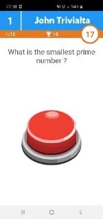{ width="96" loading=lazy }                                                                                               | 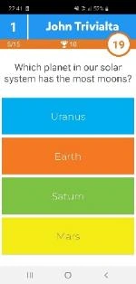{ width="96" loading=lazy }            | 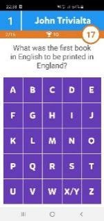{ width="96" loading=lazy }           | 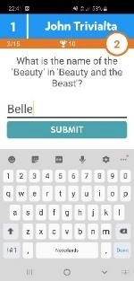{ width="96" loading=lazy }              | 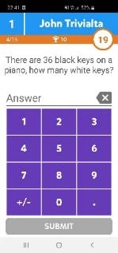{ width="95" loading=lazy }        |
|------------------------------------------------------------------------------------------------------------------------------------------------------------------------------------------------------------------------------|----------------------------------------------------------------------------------------------------------------------------------------------------------------------------------------------------------------------------|---------------------------------------------------------------------------------------------------------------------------------------------------------------------------------------------------------------------------|------------------------------------------------------------------------------------------------------------------------------------------------------------------------------------------------------------------------------|----------------------------------------------------------------------------------------------------------------------------------------------------------------------------------------------------------------------------|
| *Fastest finger*                                                                                                                                                                                                             | *Multiple Choice regular/ordered/multiple answer/eliminator*                                                                                                                                                               | *First Letter*                                                                                                                                                                                                            | *Full text*                                                                                                                                                                                                                  | *Numeric*                                                                                                                                                                                                                  |
| { width="98" loading=lazy } | 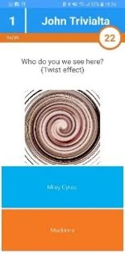{ width="99" loading=lazy } | 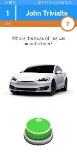{ width="100" loading=lazy } | 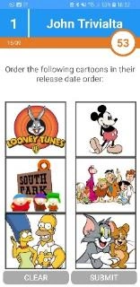{ width="100" loading=lazy } | 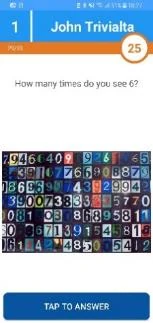{ width="98" loading=lazy } |
| *Multiple Choice with picture*                                                                                                                                                                                               | *Multiple Choice with picture effect*                                                                                                                                                                                      | *Fastest finger with picture*                                                                                                                                                                                             | *Multiple Choice pictures regular/ordered/multiple answer*                                                                                                                                                                   | *Numeric/First letter with picture*                                                                                                                                                                                        |

The Smart Buzzer gives feedback after each question on whether you were right or wrong, and whether you received any bonus points:

| 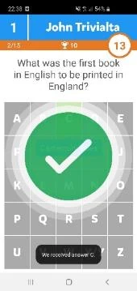{ width="109" loading=lazy } | 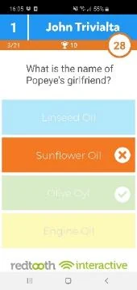{ width="109" loading=lazy } | 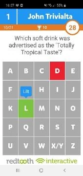{ width="108" loading=lazy } | 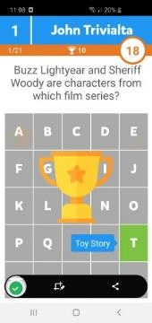{ width="109" loading=lazy } | 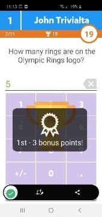{ width="109" loading=lazy } |
|--------------------------------------------------------------------------------------------------------------------------------------|-----------------------------------------------------------------------------------------------------------------------------------------------------------------------------------------------------------------------|----------------------------------------------------------------------------------------------------------------------------------------------------------------------------------------------------------------------|-------------------------------------------------------------------------------------------------------------------------------------------------------------------------------------------------------------------------------|-----------------------------------------------------------------------------------------------------------------------------------------------------------------------------------------------------------------------|
| *Correct answer*                                                                                                                     | *Incorrect answer*                                                                                                                                                                                                    | *Incorrect answer letter*                                                                                                                                                                                            | *Bonus points animation*                                                                                                                                                                                                      | *Bonus points won*                                                                                                                                                                                                    |

Scores are shown on the phone too. The final scores are shown in two or three steps: first an announcement, then your top 3 ranking (if you’re in the top 3), and finally your individual score and rank.

| 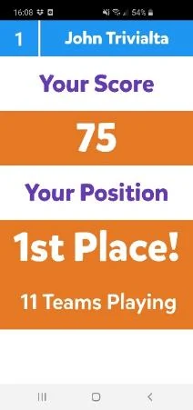{ width="136" loading=lazy } | 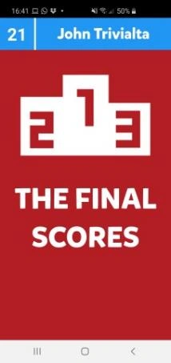{ width="137" loading=lazy } | 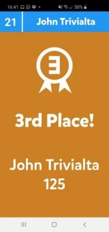{ width="137" loading=lazy } | 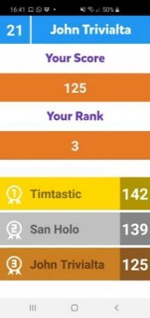{ width="137" loading=lazy } |
|--------------------------------------------------------------------------------------------------------------------------------------|--------------------------------------------------------------------------------------------------------------------------------------------------------------------------------------------------------------------------------|-----------------------------------------------------------------------------------------------------------------------------------------------|-----------------------------------------------------------------------------------------------------------------------------------------------|
| *Intermediate scores*                                                                                                                | *Announcing the final scores*                                                                                                                                                                                                  | *Individual final score top 3*                                                                                                                | *Individual score, rank and top* 3                                                                                                            |

Using the app is mandatory if you intend to run over standalone Wi-Fi. Since QuizXpress 8, the web buzzer on buzzerpad offers the same functionality as the Smart Buzzer app, excluding the local Wi-Fi option and jingle selection.

## Promotions

The Smart Buzzer app supports displaying ‘promotional’ images during the quiz or during a break. The images can be sent from the QuizXpress Director *Media Player* screen. Your image must first be added to the list of available media. To present the image on the Smart Buzzer app, select it from the list and click *Show on Mobile* from the toolbar.

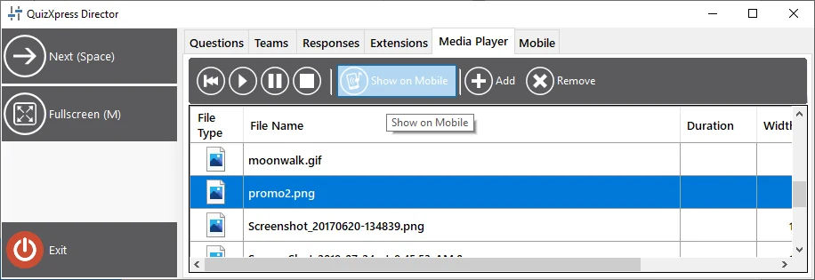{ width="526" loading=lazy }

## Thumbs Up/Thumbs Down

With this game mode, players can earn extra points by voting on the correctness of another player’s verbal answer to an open question. This applies to situations where direct interaction with the players is possible (so not for a streaming setup). It works as follows:

- A fastest-finger question is presented to the players. Buzzers appear on all the Smart Buzzer apps

- One player thinks they know the answer and hits the buzzer; all others are locked out.

- On the Director screen or app, a right/wrong judgment popup appears with *Thumbs Down/Poll/Thumbs Up* buttons.

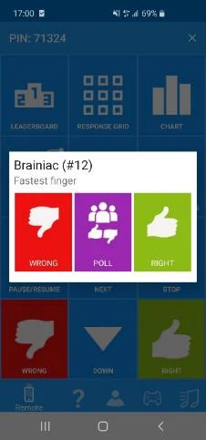{ width="145" loading=lazy }

- The quizmaster engages with the player to hear the verbal answer and can then either judge the answer right or wrong, or poll the rest of the players on whether *they* think the answer given was right or wrong, by tapping the *Poll* button on the Director app.

- On the other players’ devices, a Thumbs Up/Thumbs Down poll popup appears for 10 seconds, and players can give their vote (or abstain, in which case there is no risk of losing points).

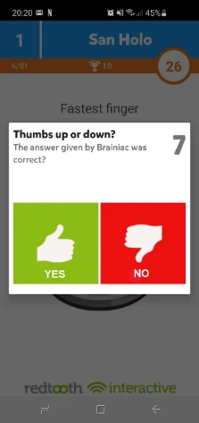{ width="141" loading=lazy }

- The quizmaster now judges the answer given by the fastest-finger player by tapping the ‘Right’ or ‘Wrong’ button on the Director app. As a result, the fastest presser wins or loses points (depending on the question’s settings). The other players win or lose 50% of the question points, depending on whether their judgment of the fastest presser’s answer was correct.

This mode keeps all players engaged in a fastest-finger round, since it’s not only the single fastest player who can win points — everyone participating has a chance to win points.

## Remote control app – Mobile Director

To control the quiz from your tablet or phone, you can use the QuizXpress Director remote control app for iOS and Android. After installing and starting the app, you’ll see the following screen:

You can register the computer you want to control with the QuizXpress Director remote by pressing the yellow ‘plus’ button in the lower right-hand side of your mobile screen.

Once you press the button, a QR code scanner will be show. The QR code that you need to scan is displayed on the Mobile tab in QuizXpress Setup (please refer to [Setting up mobile keypad support](../../setup/setting-up-mobile-keypad-support.md)). Scan the code displayed here and the computer name will be shown in the QuizXpress Director app. You only have to follow this procedure once to register your computer in the app.

After starting a quiz, select the computer you want to control from the list and tap it — the mobile remote app will then be connected to the quiz session.

!!! note

    Please make sure that the server selected in the QuizXpress Director app is the same as the server selected in QuizXpress Setup. Click the menu { .inline-icon width="23" } button on the top left of the app. Click ‘Settings’ and check the ‘Mobile server to connect to’ setting. This setting should match the setting as set in QuizXpress Setup (please refer to [Setting up mobile keypad support](../../setup/setting-up-mobile-keypad-support.md) about information how to set the server (or local Wi-Fi) used by the quiz player).

| **Mobile server to connect to** | **Settings server**                           |
|---------------------------------|-----------------------------------------------|
| Central US                      | [www.buzzerpad.com](http://www.buzzerpad.com) |
| Western Europe                  | [www.buzzerpad.eu](http://www.buzzerpad.eu)   |
| Local Wi-Fi                     | Local Wi-Fi                                   |

After connecting to the running quiz, you’ll see the QuizXpress Director app, which has 5 tabs:

| 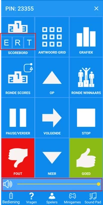{ width="103" loading=lazy } | 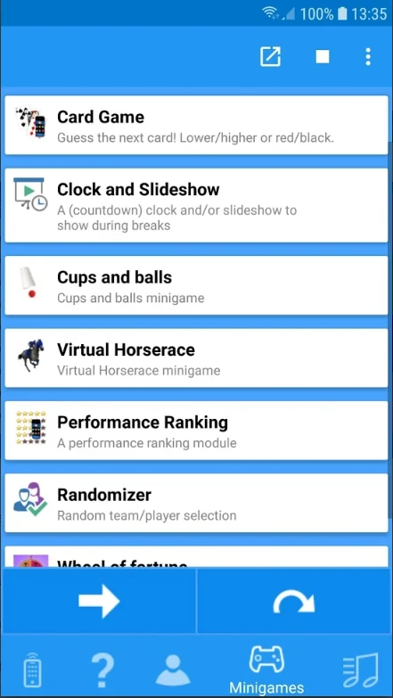{ width="114" loading=lazy } | 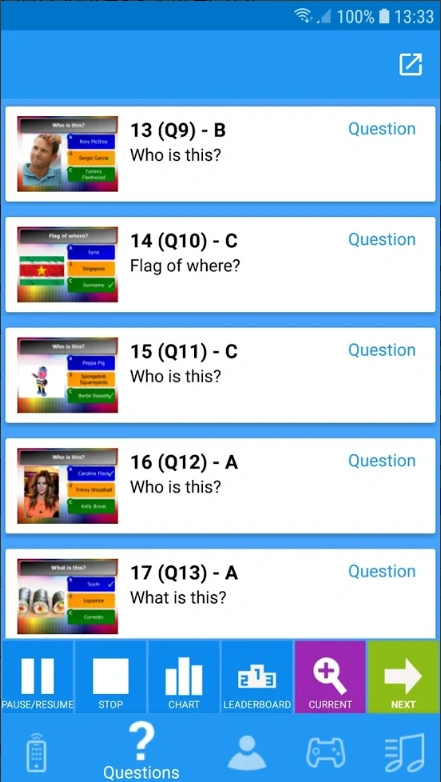{ width="113" loading=lazy } | 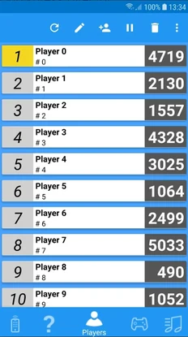{ width="116" loading=lazy } | 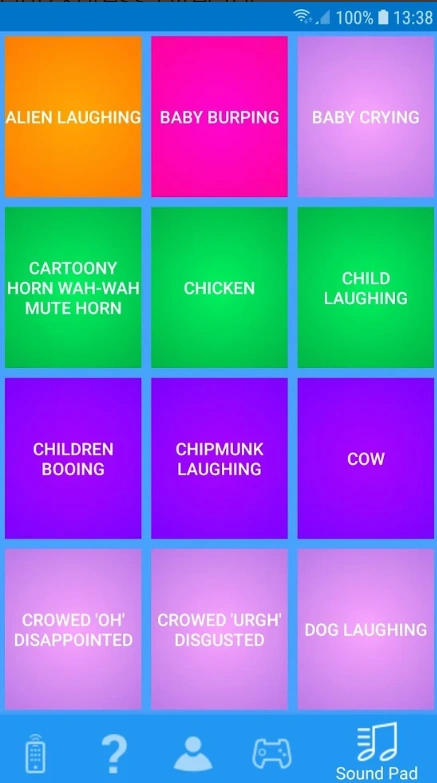{ width="115" loading=lazy } |
|-----------------------------------------------------------------------------------------------------------------------------------------------------------------------------------|---------------------------------------------------------------------------------|---------------------------------------------------------------------------------|---------------------------------------------------------------------------------|---------------------------------------------------------------------------------|
| Remote control                                                                                                                                                                    | Start/stop and control mini games                                               | Navigate the questions in the quiz                                              | Overview of players and scores                                                  | Sound Pad to play random sound effects                                          |

The remote-control tab lets you control the quiz. The following buttons are available:

- Leaderboard – shows the current ranking. The top 22 are shown initially. Pressing the Up and Down buttons scrolls through the scores. Pressing the E,R,T buttons shows the extended score screens (see [Score control screens](../starting-a-quiz/the-leaderboard.md#score-control-screens))

- Response Grid – shows a grid indicating for each player if the player was right/wrong or did not answer the current multiple-choice question.

- Chart – shows a chart with the number of votes for each answer.

- Round Scores – shows the scores for the current round.

- Round Winners – shows the winner for each round.

- Pause/Resume – pauses/resumes the countdown.

- Stop – ends the current question when the clock is paused.

- Up/Down – scrolls the ranking up/down when there are more than 22 players.

- Next – go to the next slide/ to the next step of a mini game / go to next step of end of question actions (for end of question actions please refer to [End of Question actions](../../setup/end-of-question-actions.md))

- Right/Wrong – judge the answer that was given verbally to a fastest-finger question.

- Volume control: change the playback volume of the quiz player in real time remotely

- Filtering quizzes: when using the remote control to connect to Quiz Center, you can now quickly filter the list of available quizzes.

!!! note

    ERT buttons and volume control are currently only available on Android; the iOS version will follow.*

1.  The mini games tab lets you start minigames on the fly. Select a minigame and press the button. Advance through the minigame by clicking the arrow key.

2.  The questions tab shows all questions, correct answers, notes, and a thumbnail of the slides. The following buttons are available on the bottom toolbar:

- **Pause** button - pause and resume countdown.

- **Stop** button - ends a question when the timer is paused.

- **Chart** button – shows a response chart for the current question.

- **Leaderboard** button – shows the current intermediate scores.

- **Current/List** toggle button – toggles between the details of the current question/list of all questions

- **Next** (arrow) button - advance to the next slide

Slides that have been visited are colored yellow; the current question is colored green.

> After each ‘everyone answers’ question, the remote-control app shows the number of players who answered correctly (in green), the number who answered incorrectly (in red), and the number who did not respond at all (in blue).

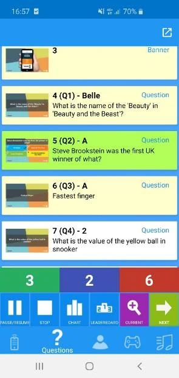{ width="189" loading=lazy }

3.  The players tab shows all players and their scores. The following buttons are available at the top:

- Refresh the page.

- Edit a player - change name, score, keypad number (in case of a physical keypad)

- Add a player - name, score, keypad number (in case of a physical keypad)

- Disable a player.

- Delete a player.

4.  The Sound Pad tab allows you to play up to 12 different sound effects in the quiz player. The sound effects are loaded from a user defined folder that you can configure in QuizXpress Setup (please refer to [Configuring sounds – the Sounds tab page](../../setup/configuring-sounds-the-sounds-tab-page.md) for more information).
