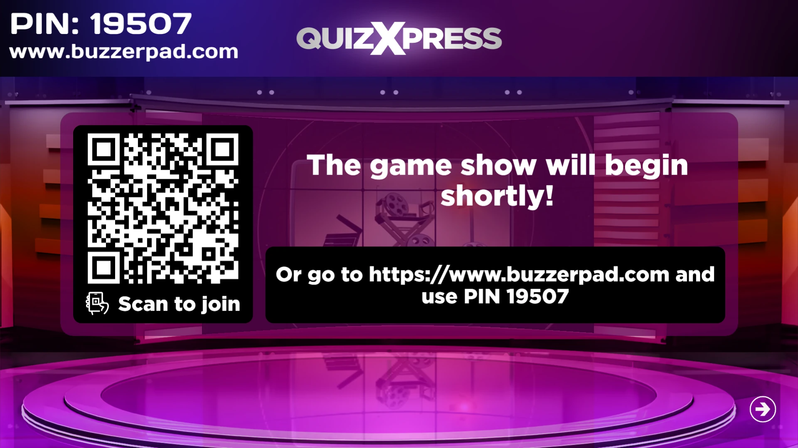
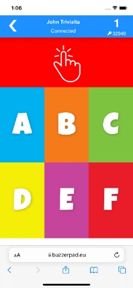
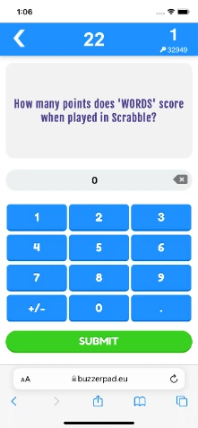
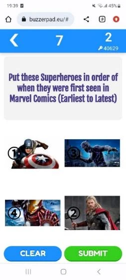
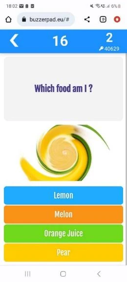
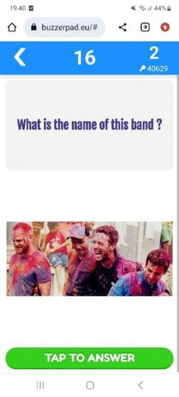

# Using the web based mobile keypad

The web-based keypad can be used in situations where you have internet available and don't want your players to download the Smart Buzzer app. Players can simply join the quiz with a standard web browser by taking the following steps:

- In Quiz Setup on the mobile tab, you indicated which server is used. For example [www.buzzerpad.com](http://www.buzzerpad.com)

- The server's name as well as a 5-digit PIN is shown on screen in QuizXpress Live!

- Players manually navigate to [www.buzzerpad.com](http://www.buzzerpad.com) and enter the pin code shown as well as a their player name

- Alternatively, press ‘Q’ when a quiz is launched to show a QR code on screen that players can scan. Scanning the code takes them to the buzzerpad website automatically and fills in the PIN code for them; they only need to enter a unique player name.

{ loading=lazy }

- Press GO on the phone to connect to the quiz.

Some screens from the web buzzer:

| { width="142" loading=lazy }  | { width="141" loading=lazy }  | { width="141" loading=lazy }  |
|----------------------------------------------------------------------------------|----------------------------------------------------------------------------------|----------------------------------------------------------------------------------|
| Buzzerpad login screen                                                           | Simple web keypad                                                                | Numeric question                                                                 |
| { width="161" loading=lazy } | { width="159" loading=lazy } | { width="158" loading=lazy } |
| Show a promo                                                                     | Ordered question                                                                 | Picture question                                                                 |
| { width="163" loading=lazy }   | { width="158" loading=lazy }   | { width="154" loading=lazy }    |
| Picture effect                                                                   | Text question with picture                                                       | Multiple choice question with pictures                                           |

On the top right side of the keypad, the ID of the keypad is shown. Below the ID, the PIN code of the quiz is shown. Currently, two servers are available: one in Western Europe (buzzerpad.eu) and one in Central US (buzzerpad.com). We recommend using the server nearest to your location/time zone for speed and server maintenance windows. You can configure which server to use in Quiz Setup, on the Mobile tab.

!!! note

    we offer a service to host the app on your private custom domain with your own company’s branding. Please contact us for more information.*
