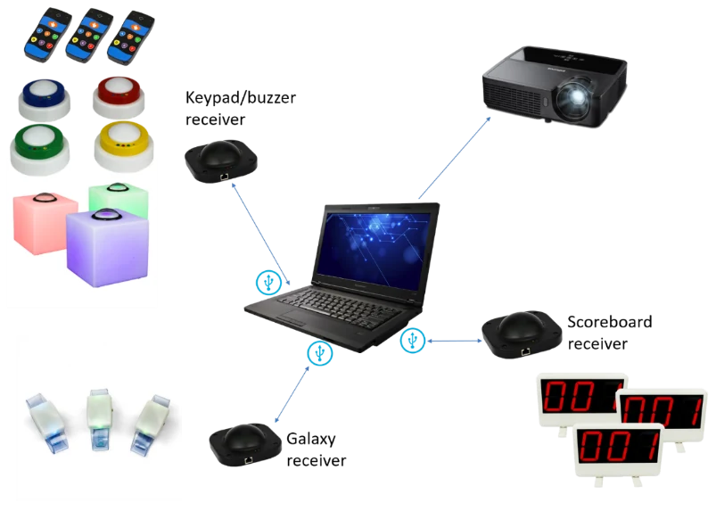
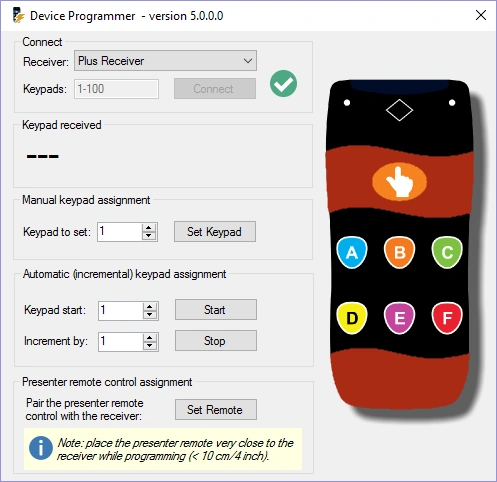
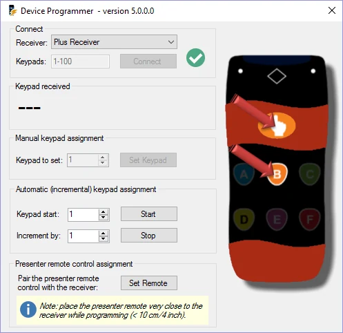
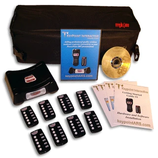
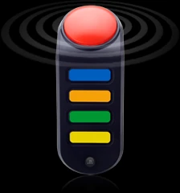

# Using physical devices

A full-blown QuizXpress system setup with hardware might look as follows:

{ width="514" loading=lazy }

In this setup, all QuizXpress-supported hardware elements are used: keypads/buzzers, Galaxy wristbands, and scoreboards. As you can see, a separate receiver is used for each type of device.

Before describing the software in full detail, let's first look at the supported buzzer types and how to use them.

## Using the QuizXpress keypads, buzzers and buzzer poles

Both QuizXpress keypad types, the regular and the Plus keypad, have six buttons and a fastest-finger button. When a question is presented, pressing one of the buttons lights up the red transmission indicator light on the top right-hand side of the keypad, meaning it is sending its choice to the wireless receiver attached to the computer running QuizXpress Live. While the red light on the keypad keeps lighting up, the keypad is trying to send the choice to the receiver. When the top left-hand green light flashes, the signal was successfully processed. If the transmission was unsuccessful, the red LED flashes a few times.

The QuizXpress keypads are paired with a single receiver, and each receiver has a unique serial number (so if you want to order a backup receiver, be sure to provide the serial number). QuizXpress comes with a handy tool for *pairing* a keypad to the connected receiver and assigning it a number. The *QuizXpress Device Programmer* tool can be found in the QuizXpress entry in the Windows Start menu, or under the *Tools* menu in QuizXpress Studio.

| { width="287" loading=lazy } | { width="288" loading=lazy } |
|---------------------------------------------------------------------------------|---------------------------------------------------------------------------------|

To start programming any QuizXpress keypad or buzzer, connect the receiver to the computer and choose the receiver type in the receiver dropdown box. Enter the range of keypads you're going to program and press Connect. A green checkmark should appear to indicate the connection to the receiver was successful.

The programmer tool lets you program the number (id) of a single keypad, or semi-automatically for a whole set of keypads (you still have to press the ‘hand’ and ‘B’ buttons on each keypad). To program a single keypad, set the required number in the ‘Keypad to set’ field, click ‘Set’, and within 4 seconds press both the ‘hand’ and ‘B’ buttons on the keypad (see picture on the right).

Keypads have a unique association with the receiver and first need to be paired with it. When setting a keypad's id, the keypad is also immediately paired with the connected receiver. To pair the QuizXpress remote control, press the ‘Set’ button on the programmer tool and press the Power and Up buttons on the remote at the same time.

To program the QuizXpress buzzers, click the ‘Set Buzzer’ button on the programmer tool. The yellow light on the receiver then lights up. Now press the B button and the big button together. Keep the big button pressed until it flashes. Once it flashes, wait until the yellow light goes off, then press the buzzer. The buzzer's number will now appear in the programmer tool.

To program the QuizXpress Galaxy RGB buzzers, follow the same steps as for the buzzers above, but instead of pressing B and the big button, press C and the big button until the buzzer flashes.

The Sparkle buzzer poles, as well as the Luminous buzzer table, can also be programmed. They use the same receiver as the QuizXpress buzzers.

To program the Sparkle buzzer poles:

- Switch off the buzzer.

- Press the ‘Set Buzzer’ button in the QuizXpress Device Programmer.

- Now press the buzzer button on the Sparkle and turn the Sparkle on again.

- It will now flash, indicating it is programmed to the ID indicated in the programmer application.

To program the Luminous quiz tables:

- { width="106" loading=lazy }Switch off the Luminous.

- Press the ‘Set Buzzer’ button in the QuizXpress Device Programmer.

- Now press the small black button next to the On/Off button on the Luminous and turn the Luminous on again.

- It will now flash, indicating it is programmed to the ID indicated in the programmer tool.

## Using the Fleetwood Reply Systems keypads

| { width="193" loading=lazy } | Fleetwood Reply Mini keypads have five buttons. When a question is shown, pressing one of the buttons lights up the transmission indicator light at the top of the keypad, meaning it is sending its choice to the wireless receiver attached to the computer running Quiz Show. When the light on the keypad turns red, this means the response has not been received by the wireless receiver, and the participant should try submitting their answer again. When the light turns green, the signal has been successfully processed. |
|---------------------------------------------------------------------------------|----------------------------------------------------------------------------------------------------------------------------------------------------------------------------------------------------------------------------------------------------------------------------------------------------------------------------------------------------------------------------------------------------------------------------------------------------------------------------------------------------------------------------------------|

## Using the Sony Buzzers

Sony BuzzTM buzzers come in two flavors: wired and wireless. They have four colored buttons, representing multiple-choice answers A (blue), B (orange), C (green), and D (yellow), and one big red button. The red button can light up.

Within Quiz Show, the multiple-choice answers have the same color as the four colored multiple-choice buttons on the buzzer.

| { width="65" loading=lazy } | Once a question is shown in QuizXpress Live, the red buttons of all buzzers (except for the buzzers of players already dismissed from the game) light up, meaning the buzzers are awaiting input. |
|---------------------------------------------------------------------------------|---------------------------------------------------------------------------------------------------------------------------------------------------------------------------------------------------|

When a question is multiple-choice (either fastest finger or voting; see [Running the show with QuizXpress Live](index.md)), a player needs to press one of the multiple-choice buttons to answer. When a question is ‘open’ (which implies it is always fastest finger), the red button needs to be pressed to answer.

When a question is ‘fastest finger’ and a player is the fastest to press, the red light starts blinking. If the question was an ‘open question’, the player tells their answer to the quizmaster, who judges it. If the question was multiple-choice, the player has already given their answer by pressing one of the four multiple-choice buttons; in this case, Quiz Show automatically judges the answer and adds or subtracts points.

If the answer was wrong, the countdown continues. The player who answered incorrectly can no longer participate in answering the current question, so their buzzer will not light up until the next question is shown.
