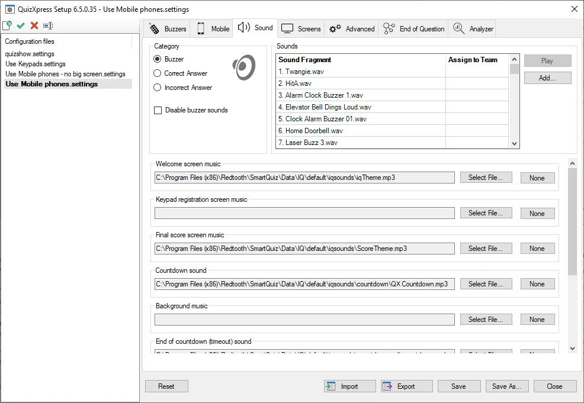
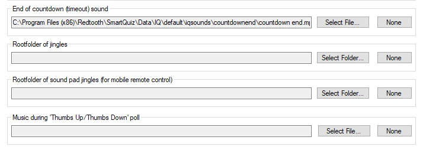

# Configuring sounds – the Sounds tab page

On the sound settings page, you can enter various settings for the sounds played during a quiz. On the left-hand side, in the ‘Category’ group box, first choose a category of sounds you want to change. The ‘sounds list’ on the right-hand side will then be filled with the sounds from the chosen category.

When you select the ‘buzzer sounds’ category, you can assign a sound to the buzzer of a specific team in the list. You can also add your own sounds and assign them to players/teams. This doesn’t apply when using mobile phones, however — for those, the ‘jingles’ mechanism applies, which is explained shortly.

When you select the ‘Right Answer’ category, the list on the right-hand side is filled with sounds that are randomly played during the quiz when a team gives a correct answer. You can include or exclude a sound by setting or removing the checkmark after it. The same applies to the ‘Incorrect Answer’ sounds.

When installing QuizXpress, a set of default sounds is installed for you to choose from.

{ width="605" loading=lazy }

The following sounds/music can be set:

- *Welcome screen music* - the music played when the quiz starts.

- *Keypad registration screen music* – the music played when the keypad registration screen is shown (this screen is not shown by default when mobile phones are used)

- *Final score screen music* - the music played when the final scores are shown.

- *Countdown sound* – the sound played during countdown.

- *Background music* – the music to fill all otherwise silent moments.

> { width="605" loading=lazy }

- *End of countdown music* – the sound played when countdown finishes.

- *Root folder of jingles* – points to a folder containing sound bites that can be selected by players once they connect to the quiz, resulting in each player having its own ‘jingle’. Jingles are used for:

  - Bonus points - the sound of the player who was first to give the correct answer is played when the bonus points screen is shown.

  - Fastest finger – the sound of the player who pressed first is played, along with the player’s name appearing on screen in the quiz player.

  - Intermediate score overviews – the sound of the player who is ranked first is played when showing the leaderboard.

- *Root folder of sound pad jingles (for mobile remote control) – points to a folder containing music or sound effects that will be shown on the ‘Soundboard’ tab in the QuizXpress Director app. This allows the host to play music or sound fragments at any preferred moment.*

- *Music during ‘Thumbs Up/Thumbs Down’ poll* – after a player is first to answer a fastest-finger question, the host can ask the other players whether they agree or disagree with the answer given, giving them a chance to also win (or lose) 50% of the question points. The chosen sound is played while the ‘Thumbs Up/Thumbs Down’ poll is running. A poll can be started from the QuizXpress Director app or from Director on the computer.

Each of these sounds can be ‘cleared’ by pressing the ‘None’ button, in which case no sound will be played.
