# Configuring your hardware – the Buzzers tab page

QuizXpress is designed to operate with different types of input devices. Below is a description of the devices that can be configured on the ‘Buzzers’ tab page in Quiz Setup.

It is also possible to use mobile devices with QuizXpress. Mobile devices can be used as an extension of your existing buzzer or keypad system. You can read more about Mobile keypad support in [Setting up mobile keypad support](setting-up-mobile-keypad-support.md).

When starting Quiz Setup for the first time after installing QuizXpress, ‘None’ is chosen as the buzzer system. Before running a quiz in QuizXpress Live, a buzzer system must be chosen in Quiz Setup. This is also indicated by the help quote shown the first time you start Quiz Setup, as shown below.

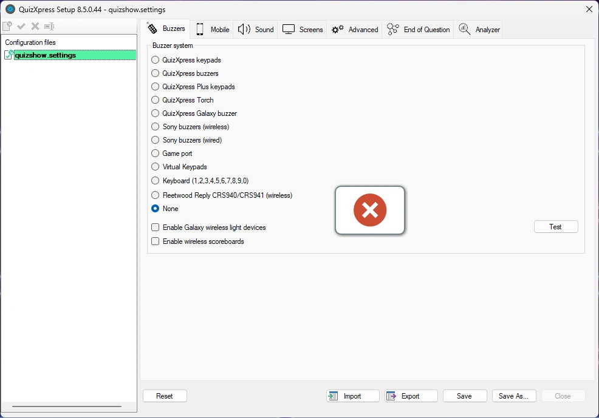{ width="460" loading=lazy }

The help quote also states that ‘Quizmaster hints’ are shown by default when running a quiz show in QuizXpress Live. This is a learning function and should be turned off when running a production show.

!!! note

    after selecting your hardware configuration, you can click the ‘Test’ button to test the connectivity of the connected devices. If the connection succeeds, a green checkmark is shown for each device that connected successfully.*

## Multiple choice buzzer systems

QuizXpress supports a couple of multiple-choice buzzer systems, which are listed in this section. Please note that the availability of multiple-choice buttons enables two features in QuizXpress:

- The option to let people answer a multiple-choice question (voting or audience response)

- The option to let QuizXpress automatically judge multiple-choice answers for a ‘fastest finger’ question (first to buzz in answers). Note that this is optional — you can also let the quizmaster judge the answers given. This can be set in QuizXpress Studio via the ‘auto judge’ flag of a quiz slide.

### QuizXpress basic keypads

The keypads of this system have six multiple-choice buttons and one fastest-finger button. The base station is connected to the PC by a USB cable, has a range of 100 meters/350 feet, and can read up to 100 keypads per second. QuizXpress can be played with up to 400 keypads at once.

The QuizXpress keypad system comes with a Quizmaster remote which can be used by the quizmaster to operate the quiz.

Each QuizXpress keypad has a preprogrammed unique id. When using QuizXpress keypads, enter the ids of the devices used for the quiz into the ‘Keypads:’ entry field in Quiz Setup. For example, if you are using keypads 1 to 10, enter the range ‘1-10’. If you are using keypads 1, 2, 3, 4, and 6, enter the text ‘1,2,3,4,6’.

Please refer to Appendix A for more information about the installation of the QuizXpress keypad system.

!!! note

    when playing the quiz, not all keypads indicated in Quiz Setup have to be used. Before starting the quiz, a keypad sign-on screen is shown. Participating players make themselves known by pressing a key on their keypad during this sign-on screen.*

### QuizXpress Plus keypads

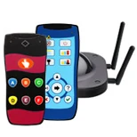{ width="173" loading=lazy }

The QuizXpress Plus keypad system is similar to the basic QuizXpress keypads but has an extended range, is four times faster, and can handle up to 2000 keypads on one receiver. With the Plus system, you get a range of about 350 meters, thanks to the 4 antennas on the receiver, and a polling speed of 400 keypads per second (the basic system does 100 keypads per second).

### QuizXpress buzzers

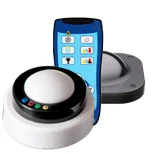{ width="154" loading=lazy }

With the QuizXpress Buzzers, you get a combination of a big button slammer and 4 multiple-choice buttons. The button has a light that flashes when the buzzer is the first one hit. The buzzers are wireless and have a range of 60 meters. They are powered by 2 Duracell D batteries.

### QuizXpress Galaxy RGB Buzzers

The QuizXpress Galaxy RGB buzzers are interactive, rechargeable, wireless buzzers with a fastest-finger button and 4 multiple-choice buttons in 64 colors.

They provide feedback for various things happening in the quiz, such as:

- Indicate who was right (green) or wrong (red) at the end of a question

- Show players’ choices by lighting up the selected answer’s color

- The fastest to press flashes and blocks the others (colors are customizable)

- Randomly select one or more buzzers (light moves through the audience – for example, to pick a winner or participant)

- Assign a color to each buzzer during breaks or make them flash

You can configure various options for the Galaxy Buzzers on the Galaxy tab in QuizXpress Director (see 5.7.9).

### QuizXpress Torches

Light up your audience with the QuizXpress Torch buzzer! The rechargeable torch buzzer has a fastest-finger button, 4 multiple-choice buttons, and internal LED lights supporting 128 possible colors. You can use up to 3000 torches.

The Torch Buzzers can:

- give feedback – who was right, who was wrong, who did not answer

- show the choices made by the audience.

- show who buzzed in first for a fastest-finger question

- can change color once a choice has been made

- can be used to display random lights (fixed or to the beat of music) – nice during breaks!

- can be used to draw someone from the crowd or pick out a lucky winner (or winners)

Basically, the torches are a galaxy device (see 4.1.3) and a buzzer in one. You can configure various options for the Torches on the Galaxy tab in QuizXpress Director (see 5.7.9).

### Fleetwood Reply systems buzzers

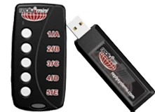{ width="169" loading=lazy }

Fleetwood Reply Systems delivers a variety of portable, interactive audience response and electronic voting tools commonly used in meeting, training, decision-making, and research applications.

QuizXpress operates with Reply® Mini Model CRS5000 and Reply Worldwide wireless keypads, together with a CRS940/CRS941 base station. The base station is connected to the PC by a USB cable. QuizXpress can be played with up to 250 keypads at once.

Each Reply Systems buzzer has a preprogrammed unique id (unlike Sony Buzzers). When using Reply System buzzers, add the ids of the buzzers used for the quiz to the ‘Keypads:’ entry field. For example, if you are using keypads 1 to 10, enter the range ‘1-10’. If you are using keypads 1, 2, 4, and 6, enter the text ‘1,2,4,6’. Also set the channel of the base station by selecting the correct channel from the ‘Channel’ dropdown list.

Please refer to Appendix B for more information about the installation of the Reply system.

!!! note

    when playing the quiz, not all buzzers indicated in Quiz Setup must be used. Before starting the quiz, a buzzer sign-on screen is shown. Participating players make themselves known by pressing a key on their buzzer during this sign-on screen.*

### Virtual Keypads

QuizXpress comes with a virtual, software-based keypad that you can run on the same machine or on other machines in the network. It connects to QuizXpress Live through a TCP/IP connection. Each virtual keypad has a keypad id that you can change instantly.

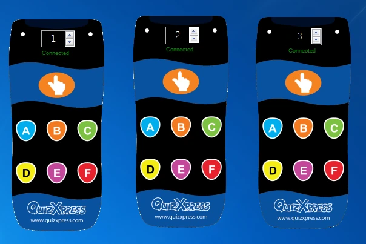{ width="360" loading=lazy }

!!! note

    when you start Live with Virtual Keypads configured, Windows may ask you for confirmation to open a port on the local firewall.*

With the Virtual Keypad, it’s very easy to test your quiz, even if you don’t have any real hardware.

### Sony Buzz™ buzzers

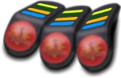{ width="150" loading=lazy }QuizXpress also works with Sony Buzz™ buzzers. The system works with both the wired and wireless versions of these buzzers.

Please note that the wireless version of these buzzers is designed to operate within approximately 10 meters (26 feet) maximum. QuizXpress Home edition works with a maximum of 12 wireless Sony Buzz units. The QuizXpress Pro edition has no limit, although in practice no more than 16 have been used, due to practical limitations (one receiver per 4 buzzers, and distance limitations).

One USB receiver is used for 4 wireless Sony buzzers, so keep in mind that you’ll need enough USB ports available. Also, because the reach of the buzzers is limited, be sure to distribute the receivers strategically inside the quiz arena if possible. This type of device is no longer manufactured and is only available on the secondhand market.

### QuizXpress Luminous and Sparkle

| 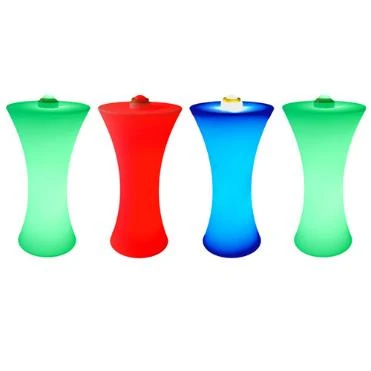{ width="238" loading=lazy } | 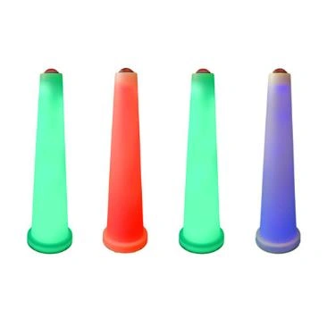{ width="232" loading=lazy } |
|------------------------------------------------------------------------------------------------------------------------------------------------------------------------|-----------------------------------------------------------------------------------------------------------------------------------------------------------------------|
| QuizXpress Luminous lighted stage tables                                                                                                                               | QuizXpress Sparkle buzzer poles                                                                                                                                       |

The Luminous and Sparkle work just like the QuizXpress Buzzers, so that’s the device type to select in Quiz Setup. Note that the Sparkle buzzer pole does not have multiple-choice buttons, so you can use it with *open questions* or with multiple-choice questions set to ‘manual judgment’ (here the player tells the quizmaster verbally which of the multiple-choice answers is right, and the quizmaster judges the answer given). The stage table automatically synchronizes its lights with the paired buzzer.

## Single button buzzer systems

In addition to buzzers with multiple-choice buttons, QuizXpress also supports buzzers with a single button (sometimes referred to as ‘slammers’). With these buttons, the focus really lies on the fastest-finger aspect of the game: whoever slams first answers. In this case, the quizmaster always judges the answer (automatic judgment is not possible, as no multiple-choice buttons are present).

### QuizXpress Cube buzzers

| 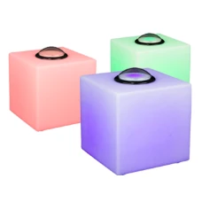{ width="146" loading=lazy } | The buzzer cubes are rechargeable devices with a strong RGB LED and a single button. With this type of buzzer, you can only run fastest-finger-type questions, as there are no multiple-choice buttons. Very well suited for final games. To use this type of buzzer, simply select ‘QuizXpress Buzzers’ as the device type. |
|--------------------------------------------------------------------------------------------------------------------------------------------------------------------------------------------------|------------------------------------------------------------------------------------------------------------------------------------------------------------------------------------------------------------------------------------------------------------------------------------------------------------------------------|

The cubes have three different colors. The following table lists the colors of the buzzers and the meaning of the colors:

| Color            | Meaning                      |
|------------------|------------------------------|
| Green            | Ready, buzzer can be pressed |
| Red              | Out of the game/question     |
| Blue (flashing)  | First person that buzzed in  |
| Green (flashing) | Correct answer was given     |
| Red (flashing)   | Incorrect answer was given   |

### Game Port

QuizXpress also supports standard game port devices (joysticks or other controllers). Each button on a standard game port controller can act as a buzzer. This interface is particularly useful when building custom interactive setups, for example in a museum. Contact us for more details or support.

### Keyboard

| 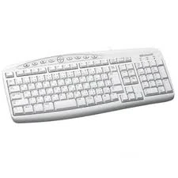{ width="182" loading=lazy } | In addition to the buzzer systems described above, you can also use the keyboard for buzzing in. The keys 1, 2, 3, 4, 5, 6, 7, 8, 9, and 0 correspond to 10 buzzers that can play along. When no buzzers are available, using the keyboard is a good alternative. You can also use this option for other buzzer devices that send keystrokes to the application. |
|------------------------------------------------------------------------------------------------------------------------------------------------------------------------------------|------------------------------------------------------------------------------------------------------------------------------------------------------------------------------------------------------------------------------------------------------------------------------------------------------------------------------------------------------------------|

## QuizXpress wireless Galaxy RGB devices

| 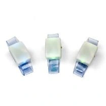{ width="133" loading=lazy }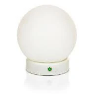{ width="122" loading=lazy }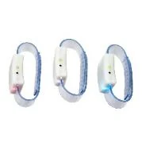{ width="115" loading=lazy }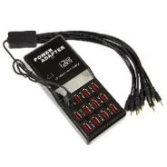{ width="118" loading=lazy } | The Galaxy RGB devices (rechargeable wristbands or table bulbs named Spheres) are fully integrated with QuizXpress and enhance the overall experience of the game show. When enabled, QuizXpress provides feedback to players, such as whether their response was received by the system, whether their last answer was correct or incorrect, and whether they are still in the game during last-man-standing, etc. To enable Galaxy support, connect the additional Galaxy receiver to a USB port on your PC and check the ‘Enable Galaxy devices’ checkbox in Quiz Setup. |
|-------------------------------------------------------------------------------------------------------------------------------------------------------------------------------------------------------------------------------------------------------------------------------------------------------------------------------------------------------------------------------------------------------------------------------------------|-----------------------------------------------------------------------------------------------------------------------------------------------------------------------------------------------------------------------------------------------------------------------------------------------------------------------------------------------------------------------------------------------------------------------------------------------------------------------------------------------------------------------------------------------------------------------------|

The Galaxy devices contain RGB LED lights, meaning they can be any color. Below is an overview of the colors used during a quiz show.

| Event during quiz show              | Color                                                                    |
|-------------------------------------|--------------------------------------------------------------------------|
| QuizXpress start screen             | Random colors are shown                                                  |
| Sign on screen – not signed in yet  | Blue                                                                     |
| Sign on screen – signed in          | Green                                                                    |
| Question – clock starts countdown   | Blue                                                                     |
| Question – vote received            | Purple                                                                   |
| Question – answer incorrect         | Red                                                                      |
| Question – answer correct           | Green                                                                    |
| Last man standing – out of the game | Red; remains red until the last-man-standing round is over               |
| Final score screen                  | Winner: gold; 2nd place: silver; 3rd place: bronze |

## QuizXpress wireless scoreboards

| 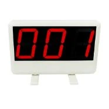{ width="117" loading=lazy }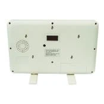{ width="112" loading=lazy } | With the wireless scoreboards, players get immediate feedback on their current score. The scoreboard can display values ranging from -99 to 999. To enable the scoreboards, connect the scoreboard receiver to a USB port on your PC and tick the ‘Enable wireless scoreboard’ checkbox in Quiz Setup. |
|---------------------------------------------------------------------------------------------------------------------------------------------------------------------------------------------------------------------------------------------------------------------------------------------------------------------------------------------------------------------------------------|--------------------------------------------------------------------------------------------------------------------------------------------------------------------------------------------------------------------------------------------------------------------------------------------------------|
