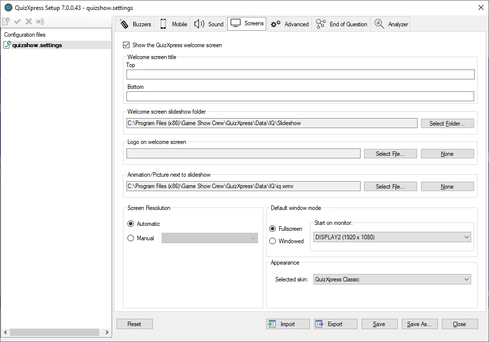
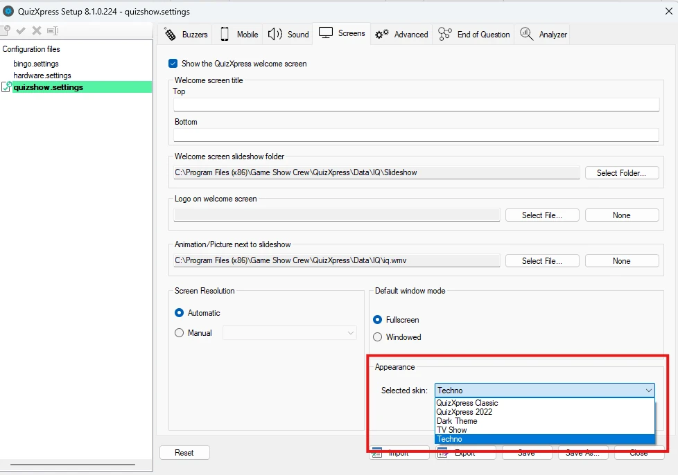
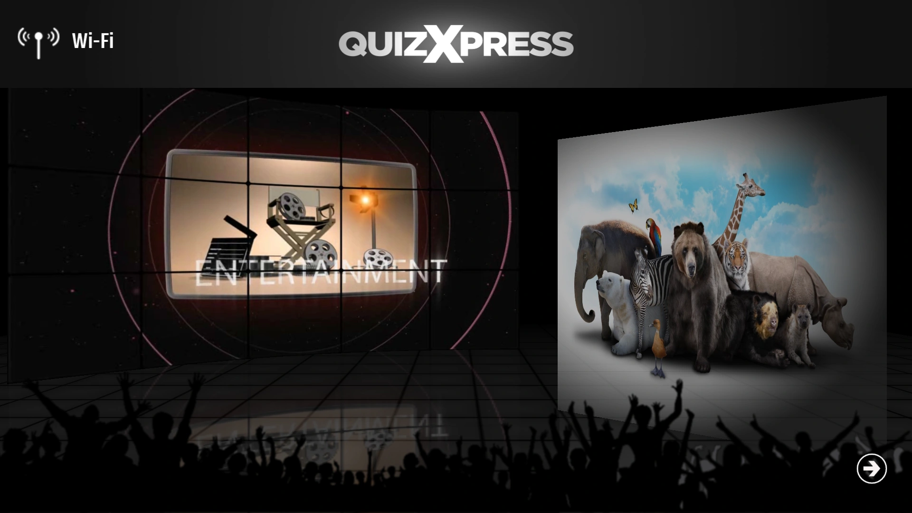
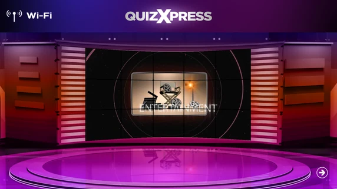
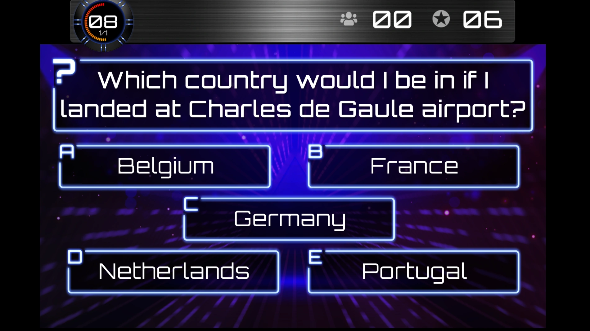

# Customizing the look – the Screens tab page

The ‘Screens’ tab page contains various settings used to customize the welcome screen. It also contains settings related to the various display resolutions/modes of QuizXpress Live.

{ width="593" loading=lazy }

The following settings apply to the welcome screen:

- Welcome screen title, Top and Bottom: text to be displayed on top of the screen and at the bottom of the screen.

- Welcome screen slideshow folder: folder containing the pictures shown in the slideshow played on the welcome screen. A default set of slideshow pictures is installed with QuizXpress.

- Logo on welcome screen: logo that is shown on top of the screen. This logo is shown next to the welcome screen ‘Top text’ (optional; pressing ‘Clear’ shows no logo).

- Animation (movie)/picture shown next to the slideshow (optional; pressing ‘Clear’ shows no movie/picture next to the slideshow).

Please refer to [The launch checker](../live/starting-a-quiz/the-launch-checker.md) to see the settings for the welcome screen in action.

The ‘Screen Resolution’ section lets you specify the resolution at which the system starts. Normally, you can set it to Automatic, but in specific cases you may want to set the resolution manually.

In the ‘Default window mode’ section, you specify how and where the program starts. It can start in full-screen mode or windowed mode (note: you can always toggle this with the M key, or by clicking the button in the top-right corner of the quiz player form). You can also specify the monitor to start on.

The quiz player comes with multiple ‘skins’ (appearances or themes). Each theme has its own colors, music, images, etc. to match your show.

You can switch between the available skins in the Appearance section:

{ width="431" loading=lazy }

| { width="286" loading=lazy }                                                                                                         | { width="286" loading=lazy } |
|-----------------------------------------------------------------------------------------------------------------------------------------------------------------------------------------|---------------------------------------------------------------------------------|
| ‘Dark Theme’ welcome screen                                                                                                                                                             | ‘TV Show’ welcome screen                                                        |
|                                                                                                                                                                                         |                                                                                 |
| { width="280" loading=lazy } |                                                                                 |
| ‘Techno Theme’ quiz screen                                                                                                                                                              |                                                                                 |
