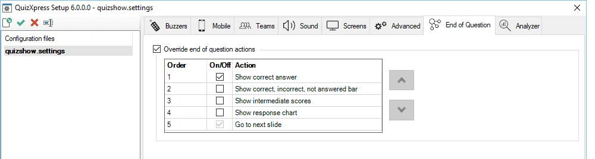
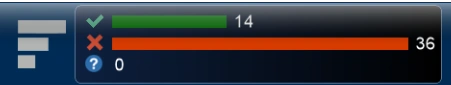

# End of Question actions

On this tab, you can define the actions that are executed (and in which order) when a question finishes (all responses have been received, or a correct answer has been given on an open question).

{ width="604" loading=lazy }

Normally, if the actions are not overridden, a standard sequence of actions is executed, such as highlighting the correct answer and showing statistics in the info panel, etc. When you override the standard actions, the configured actions are executed one by one in the set order whenever you press the OK button on the quizmaster remote control, press the spacebar in Live, or click the ‘Next’ button in Director.

The following actions are available for you to configure:

**Show correct answer**

This action highlights the correct answer on the slide and shows an indicator — usually a checkmark, though this may differ depending on your slide’s style. You can skip this action if you want to show the correct answer some other way (for example, with a shape or a text element on the slide).

**Show correct, incorrect, not answered bar**

Shows the response chart in the top info bar.

{ width="457" loading=lazy }

**Show intermediate scores**

Opens the leaderboard (top 20 overview, normally opened with ‘S’ key)

**Show response chart**

Shows the response bar chart screen.

**Go to next slide**

Advances to the next slide; this action is always on and always executed last.
